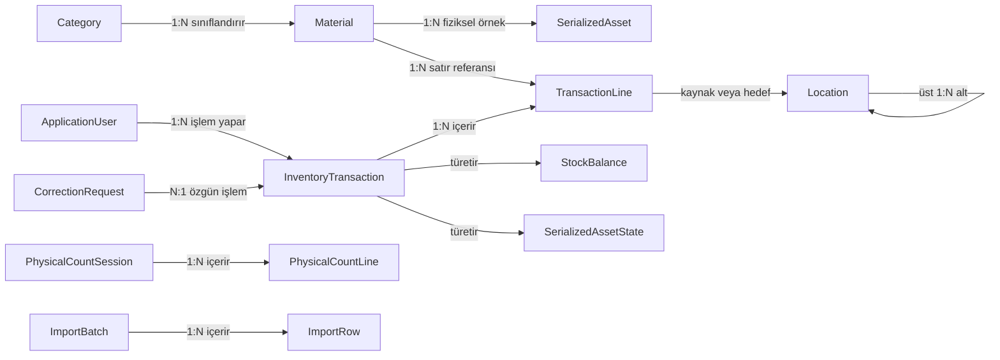
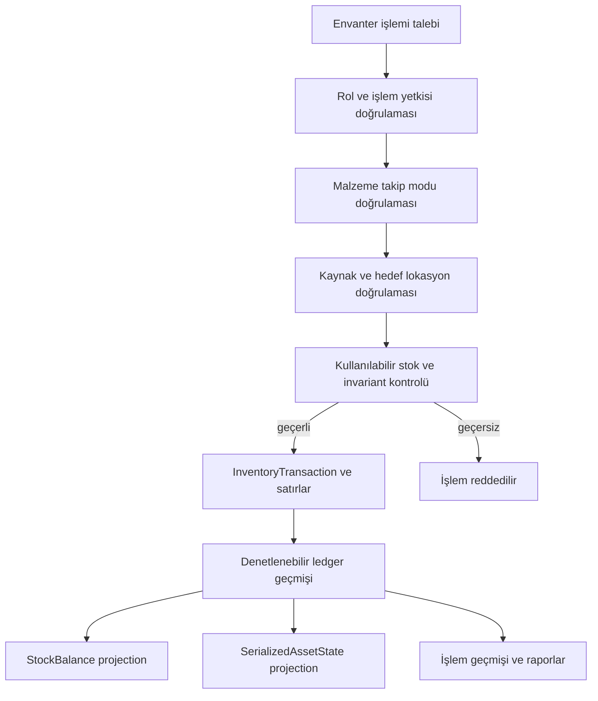
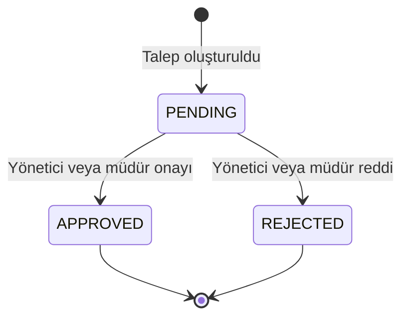

# Domain Model — Elektrik Atölyesi Envanter ve Malzeme Takip Sistemi

## 1. Belge Amacı

Bu belge, `docs/00-PRODUCT.md` ile `docs/01-BUSINESS-RULES.md` içindeki onaylı gereksinim ve iş kurallarını kavramsal bir domain modeline dönüştürür. Amaç, ilişkisel veri modeline ve uygulama mimarisine iş anlamı bakımından güvenilir bir temel sağlamaktır. Gate 0 sonrası karar durumları ve hard gate'ler için kanonik kayıt `docs/06-DECISION-REGISTER.md`dir.

Bu belge:

- SQL şeması, veri tipi, indeks veya veritabanı ürünü seçmez;
- Django modeli, servis veya kullanıcı arayüzü tasarlamaz;
- TBD kararlarını varsayımla kapatmaz;
- V1 için basit bir modüler monolit sınırı önerir;
- envanter geçmişini yetkili doğruluk kaynağı, güncel bakiyeyi ise bu geçmişten türeyen durum olarak ele alır.

## 2. Domain Model Tasarım İlkeleri

1. **Ledger önce gelir:** Tamamlanmış `InventoryTransaction` kayıtları stok değişiminin izlenebilir kaynağıdır. `StockBalance` yetkili geçmişin yerine geçmez.
2. **Tanım ve fiziksel örnek ayrıdır:** `Material` ürün/malzeme tanımıdır; `SerializedAsset` bu tanımın tek bir fiziksel örneğidir.
3. **Takip modları karıştırılmaz:** `QUANTITY` stok miktar ve birimle, `SERIALIZED` stok benzersiz fiziksel varlık kimliğiyle hareket eder.
4. **Hareket ve kondisyon ayrıdır:** `TransactionType` bir iş olayını, `MaterialCondition` ise fiziksel/operasyonel durumu açıklar.
5. **Konum fiziksel doğruluğun parçasıdır:** Mevcut stok geçerli, aktif ve açıkça stok tutma yeteneği olan bir `Location` ile ilişkilidir.
6. **Düzeltme geçmişi yok etmez:** Hata, `CorrectionRequest` ve bunun sonucundaki kontrollü işlemle ele alınır; özgün işlem korunur.
7. **İçe aktarma otorite değildir:** Excel commit'i ledger veya `StockBalance` oluşturmaz. Candidate data staging bilgisidir; fiziksel mutabakat ve `INITIAL_BALANCE` olmadan stok değildir.
8. **Türetilmiş durum açıkça ayrılır:** Bakiye ve serialized current state, ledger'dan doğrulanabilir/rebuild edilebilir `Projection` niteliğindedir.
9. **Sadelik korunur:** V1 için tam event sourcing, mikroservisler ve zorunlu CQRS gerekli değildir.
10. **Gelecek engellenmez:** Kimliklendirme ve modül sınırları gelecekte QR/mobil kullanımına izin verir; çevrimdışı senkronizasyon V1 modeline taşınmaz.

### Kavram türleri

- **Entity:** Zaman içinde kimliğini koruyan domain nesnesi; örnek: `Material`, `SerializedAsset`.
- **Value Object:** Kimliğinden çok değeri ve anlamıyla tanımlanan kavram; örnek: `TrackingMode`, `MaterialCondition`.
- **Aggregate:** Birlikte tutarlı değişmesi gereken entity/value object grubu ve dışarıdan kullanılan kökü.
- **Projection:** Yetkili kayıtlardan türetilen güncel veya raporlama görünümü; örnek: `StockBalance`.
- **Business Event:** Gerçekleşmiş domain olgusunu ifade eden kavramsal bildirim; örnek: `StockIssued`.

## 3. Domain Terminolojisi

| Kavram | Tür | İş anlamı |
|---|---|---|
| `Employee` | Entity / Aggregate Root | Fabrikadaki kişi/çalışan; malzemeyi teslim alan kişi olabilir. |
| `ApplicationUser` | Entity / Aggregate Root | Uygulamaya kimlik doğrulayarak erişebilen kullanıcı. |
| `Role` | Value Object / referans kavramı | Başlangıç şablonları `TECHNICIAN`, `STOREKEEPER`, `ADMIN_MANAGER`; gelecekte ek roller UI ile tanımlanabilir (`DEC-021`). |
| `Category` | Entity / Aggregate Root | Hiyerarşik malzeme sınıflandırması. |
| `Material` | Entity / Aggregate Root | Fiziksel tekil örnek değil, malzeme veya ürün tanımı. |
| `TrackingMode` | Value Object | `QUANTITY` veya `SERIALIZED`. |
| `UnitOfMeasure` | Value Object / referans kavramı | Adet, metre, makara, set, paket gibi ölçüm anlamı. |
| `MaterialCondition` | Value Object | Malzemenin kondisyonu; hareket türünden bağımsızdır. |
| `SerializedAsset` | Entity / Aggregate Root | Bir `Material`ın benzersiz izlenen fiziksel örneği. |
| `Location` | Entity / Aggregate Root | Hiyerarşik fiziksel stok yeri; raf/bin seviyesini destekler. |
| `InventoryTransaction` | Entity / Aggregate Root | Tamamlanmış stok değişiminin değişmez ve denetlenebilir iş olayı. |
| `InventoryTransactionLine` | Entity | Bir işlem içindeki malzeme/miktar veya tekil varlık etkisi. |
| `IssueContext` | Value Object | Stok çıkışının alıcı, üretim hattı ve fiili kullanım yeri bağlamı. |
| `StockBalance` | Projection | Miktar bazlı güncel stok görünümü. |
| `SerializedAssetState` | Projection | Tekil varlığın geçmişten türetilen güncel konum ve kondisyonu. |
| `CorrectionRequest` | Entity / Aggregate Root | Tamamlanmış bir işlemi kontrollü biçimde düzeltme talebi. |
| `Attachment` | Entity | Bir iş bağlamına ait kanıt dosyası; V1'de doğrulanmış kullanım düzeltme fotoğrafıdır. |
| `PhysicalCountSession` | Entity / Aggregate Root | Belirli kapsamda yürütülen fiziksel sayım ve mutabakat çalışması. |
| `PhysicalCountLine` | Entity | Beklenen sistem durumu ile fiziksel sayım sonucunun karşılaştırması. |
| `ImportBatch` | Entity / Aggregate Root | Bir Excel kaynağının kontrollü doğrulama ve aktarım süreci. |
| `ImportRow` | Entity | Kaynak satırın eşleme, doğrulama ve sonuç bilgisi. |
| `BarcodeIdentifier` | Entity | Tek bir domain nesnesine çözülen QR/barkod kimliği. |
| `AuditEvent` | Entity | Stok ledger'ı dışında kalan önemli idari değişikliğin denetim kaydı. |
| `MinimumStockPolicy` | Value Object / politika kavramı | Malzemenin minimum stok eşiği ve henüz kesinleşmemiş değerlendirme kapsamı. |
| `InventoryBaseline` | Entity | Mutabakatı tamamlanmış başlangıç envanterinin yetkili kesim kaydı. |

## 4. Kimlik ve Kullanıcı Domaini

### Employee

`Employee` (`accounts.Employee`), fabrika çalışanını ve malzeme teslim alan kişiyi temsil eden ayrı dedicated entity'dir (`DEC-024`). Bilinen iş kimliği alanları: `employee_number`, `first_name`, `last_name`.

Bir stok çıkışındaki teslim alan kişi, uygulamaya giriş yapan kullanıcı olmak zorunda değildir. `Employee` ile `ApplicationUser` aynı entity olarak modellenmemelidir; authentication actor ile business receiver identity ayrı kalır.

**Sicil numarası (`employee_number`):** Zorunlu string; leading zero korunur; numeric-only veya regex format kısıtı yok; outer trim; case preserved; mevcut Employee satırları arasında globally unique (PostgreSQL case-sensitive); editable. UUID kalıcı Employee kimliğidir; sicil değişince kimlik değişmez. Eski sicil Phase 3.2'de ayrı historical registry ile rezerve edilmez; immutable transaction snapshot'ları tarihsel doğruluğu korur.

**User bağlantısı:** Nullable one-to-one `Employee.user → accounts.User`; ownership Employee tarafında; delete `SET_NULL`. User ve Employee birbirini gerektirmez. Link permission/rol vermez; `TECHNICIAN` bir Employee type değildir. `Employee.active` ve `User.is_active` bağımsızdır.

**Yaşam döngüsü:** Hard-delete application surface yok; active/inactive; create active; inactive okunabilir kalır; inactive yeni ISSUE receiver seçilemez; reactivation UUID/history korur.

### ApplicationUser

`ApplicationUser`, uygulamada kimliği doğrulanabilen ve önemli işlemlerin aktörü olan kullanıcıdır. Başlangıç rol şablonları:

- `TECHNICIAN`
- `STOREKEEPER`
- `ADMIN_MANAGER`

Bu üç kod başlangıç şablonlarıdır; sistemin gelecekte sahip olabileceği tek roller değildir. Runtime authorization permission/policy tabanlı olmalıdır; hard-coded Group adı kontrolü yeterli değildir (`DEC-021`). Phase 2 dinamik rol yönetimi yalnızca güvenli catalog/configuration izinlerini expose eder.

Bir `Employee` isteğe bağlı olarak tam bir `ApplicationUser` kaydına bağlanabilir (`DEC-024`): nullable one-to-one, ownership Employee tarafında. SSO, Active Directory veya LDAP bu modelin varsayımı değildir.

### IssueContext ve tarihsel kişi bilgisi

Bir `ISSUE` işlemi:

- mümkün olduğunda teslim alan `Employee` kaydına referans verebilmeli;
- her durumda teslim anındaki ad, soyad ve sicil numarasının tarihsel kopyasını korumalıdır.

Bu tasarım, çalışan adı veya sicil numarası sonradan değişse dahi eski çıkışın ilk kaydedildiği kimlikle anlaşılmasını sağlar. Gelecek ISSUE contract'ında receiver `Employee` UUID referansı taşır; transaction `employee_number`, `first_name`, `last_name` snapshot'larını korur (`DEC-024`). Tarihsel alıcı bilgilerinin işlem üzerinde korunması ISS-002–ISS-004 nedeniyle zorunludur. ISSUE henüz implement edilmemiştir.

## 5. Malzeme Kataloğu Domaini

### Category

`Category`, üst/alt ilişki kurabilen hiyerarşik bir entity'dir. Başlangıç üst kategorileri:

- Otomasyon malzemeleri
- Elektrik / şalt malzemeleri
- Motorlar
- Komponentler
- X-Ray malzemeleri
- ShapeMeter malzemeleri
- Kablolar

Bir kategori sıfır veya bir üst kategoriye, birden çok alt kategoriye sahip olabilir. Kesin derinlik sınırı yoktur. Kategoriye özgü teknik alanlar gerçek örnekler ve Excel analizi beklediği için **TBD**'dir.

### Material

`Material`, “Schneider LC1D25 kontaktör” veya “ABB 11 kW motor modeli” gibi bir malzeme/ürün tanımıdır. Bir fiziksel seri numaralı motoru temsil etmez.

Kavramsal olarak şunları taşır:

- benzersiz sistem kimliği,
- iş/malzeme kodu,
- ad,
- kategori,
- marka,
- model,
- ölçü birimi,
- takip modu,
- minimum stok politikası/değeri,
- esnek teknik nitelikler,
- aktif/pasif durumu.

Alan adları, zorunlulukları ve veri tipleri ilişkisel model/implementation review konusudur. `Material` üzerinde değiştirilebilir tek bir “yetkili stok miktarı” tutulmamalıdır. Stok geçmişi `InventoryTransaction` üzerinden, güncel miktar `StockBalance` üzerinden ifade edilir.

### TrackingMode

`TrackingMode` iki onaylı değeri ayırır:

- `QUANTITY`
- `SERIALIZED`

Takip modu malzeme bazında belirlenir; kategori kalıcı takip modu dayatmaz. Bir `Material` herhangi bir inventory ledger history'ye sahip olduktan sonra takip modu normal uygulama yollarında değiştirilemez. Gelecekte böyle bir dönüşüm istenirse olağan material edit'i değil, açık iş kararı ve ayrı kontrollü migration projesidir (`DEC-013`).

### UnitOfMeasure

`UnitOfMeasure`, miktarın iş anlamını korur. UUID kararlı kimliktir; `code` yetkili yönetici tarafından düzenlenebilir ve uniqueness korunur (`DEC-021`). Başlangıç seed örnekleri `ADET`, `METRE`, `MAKARA`, `SET`, `PAKET` kapalı whitelist değildir. Domain, uygun malzemelerde ondalıklı miktarı desteklemelidir. Hassasiyet ve dönüşüm kuralları **TBD**'dir (`DEC-OPEN-010`); otomatik dönüşüm ve rounding davranışı varsayılmaz. Referanslı bir UoM deaktive edilebilir: mevcut referanslar korunur, yeni atamalarda inactive UoM sunulmaz.

### Esnek teknik nitelikler

Esnek nitelikler `Material` tanımına aittir; tekil fiziksel varlığın konum/kondisyon geçmişiyle karıştırılmaz. `Material.technical_specs` unrestricted raw JSON editor olarak expose edilmez; kategori-özel teknik alanlar controlled `TechnicalFieldDefinition`-style metadata ile yönetilir (`DEC-021`, `DEC-OPEN-019`). Nitelik şablonu, zorunluluk ve doğrulama modeli Excel ve malzeme örnekleri görülmeden kesinleştirilmez.

## 6. Lokasyon Domaini

`Location`, fiziksel stok yerini ve hiyerarşisini temsil eden entity/aggregate root'tur. Kavramsal özellikleri (`DEC-023`):

- benzersiz kimlik (UUID; kalıcı kimlik),
- iş kodu (`code`; globally unique, case-sensitive, editable),
- görünen ad (`name`; required, non-unique, editable),
- isteğe bağlı üst lokasyon (nullable recursive parent),
- aktif/pasif durum,
- stok tutma yeteneği (`can_hold_stock`; default `False`),
- `created_at` / `updated_at`,
- ileride bağlanabilecek QR/barkod kimliği.

Zorunlu `location_type` / sabit WAREHOUSE/WORKSHOP/SHELF/BIN enum Phase 3.1'de yoktur. Sınıflandırma ileride gerekirse dinamik yapılandırma tercih edilir.

Elektrik Deposu, Alkali Elektrik, Enstrüman Atölyesi ve Bobinaj Atölyesi bilinen örnek / gerçek dünya girdileridir; tahmini hiyerarşi/kod/`can_hold_stock` seed satırı oluşturulmaz.

Location hiyerarşisi dinamik ve arbitrary-depth'tir; hard-coded warehouse/corridor/rack/bin schema seviyeleri zorunlu değildir (`DEC-021`, `DEC-023`). Örnek evrim `site → workshop → warehouse → area → shelf → sub-shelf` olabilir; zorunlu yapı değildir. Generic tree framework tanıtılmaz. Path/depth cache bu fazda persist edilmez. `can_hold_stock` leaf/child/name/depth/type'tan türetilmez. Location foundation Phase 3.1'de implement edilmiştir.

Domain davranışı:

- mevcut fiziksel stok yalnız `active = true` ve `can_hold_stock = true` olan bir `Location` ile ilişkilidir;
- yeni stok yerleşimi aynı `active && can_hold_stock` kuralını gerektirir (inventory logic bu karar kaydında implement edilmez);
- raf seviyesi belirlenebilir olmalıdır;
- lokasyon değişimi `InventoryTransaction` ile izlenir;
- pasif lokasyon yeni operasyonel stok hareketinin hedefi olamaz;
- `can_hold_stock`, lokasyonun leaf olması, çocuk sayısı, adı, derinliği veya type ile türetilmez;
- parent ve child bağımsız olarak stok tutabilir;
- inactive parent'ın active child'ı olabilir; parent status children'a cascade etmez;
- geçmiş bir işlemde kullanılan lokasyon pasif olsa dahi işlem anlaşılabilir kalır;
- self-parent ve descendant/cycle parenting yasaktır; parent sonradan değiştirilebilir;
- hard delete iş operasyonu yoktur;
- yetkili envanter varken non-zero stock'lu Location pasifleştirilemez ve `can_hold_stock` True→False yapılamaz; stok önce taşınmalı/mutabakatla sıfırlanmalıdır (`DEC-023`). Inventory entegrasyonu aynı invariant'ı otoritatif uygular.

## 7. Envanter Domaini

### InventoryTransaction

`InventoryTransaction`, envanter ledger'ının merkezi iş olayı ve aggregate root'udur. Onaylı işlem türleri:

- `RECEIPT`
- `ISSUE`
- `RETURN`
- `TRANSFER`
- `CONTROLLED_CORRECTION`
- `INITIAL_BALANCE` — yalnız reconciled baseline/cutover için kontrollü teknik ledger türü

Satın alma veya bakım işlem türleri eklenmez.

Kavramsal olarak:

- benzersiz kimlik,
- `TransactionType`,
- sistemce kaydedilen işlem zamanı,
- işlemi yapan `ApplicationUser`,
- bir veya daha çok `InventoryTransactionLine`,
- türüne özel iş bağlamı,
- ilgili kaynak işlem veya düzeltme ilişkisi,
- tamamlanma durumunu ayırt edecek yaşam döngüsü bilgisi

taşır. Kesin durum değerleri bu belgede tanımlanmaz; “tamamlanmış” işlemin değişmezliği zorunludur.

Tamamlanmış header ve line kayıtlarının değişmezliği yalnız uygulama convention'ı değildir. PostgreSQL tarafında daha sonra migration ile yönetilecek DB-level immutability guard, committed satırlarda olağan `UPDATE` ve `DELETE` işlemlerini engellemelidir. İstisnai repair/migration yolu explicit, privileged, documented ve audited olmalı; normal uygulamada kalıcı bir bypass flag bulunmamalıdır.

Her inventory-changing command benzersiz `operation_id` ile birlikte semantic payload'un canonical server representation'ından üretilen `request_fingerprint` taşır. Aynı ID ve fingerprint önceki başarılı sonucu verir; aynı ID ve farklı fingerprint conflict'tir. Client tarafından gönderilen fingerprint otorite değildir (`DEC-009`).

### InventoryTransactionLine

Başlık/satır ayrımı önerilir:

- başlık, işlem türü, aktör, zaman ve ortak iş bağlamını bir kez korur;
- satır, etkilenen malzeme, miktar veya tekil varlık, kondisyon ve kaynak/hedef lokasyonu açıklar;
- aynı iş olayındaki birden fazla malzeme tutarlı biçimde gruplanabilir;
- düzeltme ve audit ilişkisi işlem bütününe bağlanabilir.

Bir işlemin bir veya daha çok satıra sahip olması domain kapasitesidir; V1 arayüzünün zorunlu olarak çok satırlı olması gerekmez.

Her satır takip moduna göre iki yoldan yalnızca birini kullanır:

- `QUANTITY`: `Material` + miktar + `UnitOfMeasure` + `MaterialCondition`;
- `SERIALIZED`: tam olarak bir `SerializedAsset` + `MaterialCondition`.

Satır ayrıca işlem türüne göre kaynak ve/veya hedef `Location` taşır. Kanonik ve istisnasız yön semantiği:

- `source_location`, o lokasyondaki stok veya varlık durumunu azaltır;
- `target_location`, o lokasyondaki stok veya varlık durumunu artırır;
- iki alan da doluysa source ve target farklı olmalıdır.

İşlem türü, bu yön anlamını değiştirmez; yalnız hangi source/target kombinasyonunun geçerli olduğunu belirler.

### MaterialCondition

Onaylı kondisyon anlamları:

- `NEW_GOOD`
- `USED_REMOVED_GOOD`
- `DEFECTIVE`
- `USED_REMOVED_DEFECTIVE`

`MaterialCondition`, `TransactionType` değildir. Kondisyon:

- tekil varlığın geçmişten türeyen durumuna;
- miktar bazlı stokta ayrı bakiye bölümlerine

uygulanır. Bozuk kondisyonun kullanılabilir veya minimum stoka dahil olup olmadığı **TBD**'dir.

### Yüksek seviye domain ilişkileri

## 8. Tekil Varlık Domaini

`SerializedAsset`, bir `SERIALIZED` `Material`ın tek fiziksel örneğidir. Örneğin “ABB Motor Model X” bir `Material`, `MTR-00001` ve `MTR-00002` ayrı `SerializedAsset` örnekleridir.

Her `SerializedAsset`:

- tam olarak bir `Material`a aittir;
- sistem içinde benzersiz kimliğe sahiptir;
- seri numarası veya iç varlık kodu gibi iş tanımlayıcıları taşıyabilir;
- konum ve kondisyon değişse de aynı fiziksel kimliği korur;
- aynı anda iki fiziksel lokasyonda bulunamaz;
- güncel konum ve kondisyonunu geçerli işlem geçmişinden türetir.

Seri numarası veya iç varlık kodundan hangisinin zorunlu ve benzersiz olacağı **TBD**'dir.

Tekil varlık bir anonim sayısal bakiye olarak temsil edilmez. `SerializedAssetState`, varlığın son geçerli ledger etkilerinden türetilen mevcut/konum/kondisyon görünümüdür.

## 9. Stok Bakiyesi Kavramı

### Quantity StockBalance

`StockBalance`, miktar bazlı stok için güncel durum `Projection`ıdır. Onaylı kurallara göre asgari ayrım boyutları:

> `Material + Location + MaterialCondition`

Bu anahtar, aynı malzemenin farklı lokasyon ve kondisyonlardaki miktarlarının birbirine karışmasını önler. Bakiye:

- malzemenin kendi `UnitOfMeasure` değeriyle ifade edilir;
- negatif olamaz;
- yalnız `QUANTITY` material ve `active && can_hold_stock` lokasyon için var olabilir;
- tamamlanmış geçerli `InventoryTransactionLine` etkilerinden türetilir;
- performans için kalıcı projection olarak tutulur; ledger ile aynı transaction içinde güncellenir.

Var olmayan bir balance anahtarı `SELECT FOR UPDATE` ile kilitlenemez. İlk oluşturma; composite unique key, güvenli insert/on-conflict, canonical satırı tekrar okuma, row lock, re-read ve bundan sonra mutation sırasını izler. Row lock tek başına yeterli değildir.

Ledger'dan beklenen quantity ve serialized current state'i temporary/in-memory olarak hesaplayıp persisted projection ile karşılaştıran read-only bir doğrulama capability'si zorunludur. Repair/rebuild ayrı privileged, audit edilen ve dry-run sonrası kullanılan operasyondur; varsayılan doğrulama state değiştirmez (`DEC-014`).

“Kullanılabilir bakiye” ayrı bir değerlendirme olabilir; bozuk kondisyonların buna etkisi **TBD**'dir.

### SerializedAssetState

Tekil stok için anonim `StockBalance(quantity=1)` kullanılmaz. Her fiziksel örnek kendi `SerializedAsset` kimliğiyle ve geçmişten türetilen `SerializedAssetState` ile izlenir. Bu görünüm mevcut fiziksel lokasyon, kondisyon ve stokta bulunma durumunu ifade edebilir; kesin durum değerleri ilgili serialized feature gate'inde doğrulanmalıdır.

## 10. Giriş / Çıkış / İade / Transfer Domaini

### İşlem etkileri

Her satırda source azalış, target artış anlamına gelir; aşağıdaki tablo hangi kombinasyonların yasal olduğunu tanımlar:

| İşlem türü | Source | Target | Kavramsal etki / gate |
|---|---|---|---|
| `RECEIPT` | Yok | Zorunlu stock-holding location | Hedefte miktar veya tekil varlık mevcudiyeti oluşturur/artırır. |
| `ISSUE` | Zorunlu stock-holding location | Yok | Kaynak miktarı azaltır veya tekil varlığı stok dışına çıkarır; zorunlu `IssueContext` taşır. |
| `RETURN` | İş kararı bekliyor | İş kararı bekliyor | Yön alanlarının anlamı sabittir fakat legal kombinasyon, prior ISSUE, partial return ve condition kararları verilmeden implement edilemez (`DEC-HG-005`). |
| `TRANSFER` | Zorunlu stock-holding location | Zorunlu, source'dan farklı stock-holding location | Tek atomik olayda source azalır, target artar. |
| `CONTROLLED_CORRECTION` | Azalış düzeltmesinde zorunlu | Artış düzeltmesinde zorunlu | Bir line tek yönlü etki taşır; partial/cumulative ve lineage kuralları `DEC-HG-002` çözülmeden implement edilemez. |
| `INITIAL_BALANCE` | Yok | Zorunlu stock-holding location | Yalnız reconciled baseline üzerinden açılış stoğunu bir kez oluşturur. |

### IssueContext

Her `ISSUE` işlemi aşağıdaki tarihsel iş bağlamını korur:

- teslim alan adı,
- teslim alan soyadı,
- çalışan sicil numarası,
- üretim hattı,
- fiili kullanım yeri,
- sistem işlem zamanı.

Alıcı için `Employee` UUID referansı ve zorunlu kimlik snapshot'ı (`employee_number`, `first_name`, `last_name`) taşınır (`DEC-024`). Üretim hattı ve fiili kullanım yeri iki ayrı zorunlu iş bilgisidir; depo `Location` hiyerarşisine zorla bağlanmaz.

**ProductionLine (`DEC-025`):** Üretim hattı, `inventory` app sahipliği altında dinamik master-data entity'dir. UUID kalıcı kimlik; `code` (globally unique, case-sensitive, editable) ve `name` (non-unique, editable); nullable recursive `parent`; arbitrary depth hierarchy; self-parent ve cycle yasak; Location hiyerarşisinden bağımsız. Active/inactive lifecycle; inactive yeni ISSUE seçiminde kullanılamaz. Gelecek ISSUE, seçilen `ProductionLine` UUID'sini ve `code`/`name` snapshot'larını taşır. Tahmin edilmiş fabrika hatları seed edilmez. ProductionLine foundation Phase 3.3'te implement edilmiştir; ISSUE henüz implement edilmemiştir.

**Fiili kullanım yeri (exact usage place):** V1 future ISSUE ayrı required free-text değer gerektirir. `ProductionLine` structured selectable context sağlar; exact usage place ayrı kalır. `UsagePlace` modeli yoktur; Location veya ProductionLine'dan infer edilmez.

ISSUE data/UI implementation inventory hard gate'leri (`DEC-HG-001`, `DEC-HG-002`, `DEC-HG-005` vb.) çözülene kadar başlamaz.

### Kavramsal işlem akışı

Eşzamanlı mutation PostgreSQL `READ COMMITTED` varsayımıyla önce lock, sonra current state'i re-read ve re-validation sırasını kullanır. Çoklu quantity balance lock sırası `material_id → location_id → condition_id → primary key` şeklindedir. Serialized işlem asset satırını kilitleyip state'i yeniden doğrular. Negatif stok domain invariant'ı değişmez.

## 11. Düzeltme Domaini

`CorrectionRequest`, tamamlanmış bir `InventoryTransaction`ı düzeltmek için oluşturulan ayrı bir aggregate root'tur.

Kavramsal içerik:

- özgün `InventoryTransaction`,
- talep eden `ApplicationUser`,
- açıklama,
- en az bir güncel destekleyici fotoğraf `Attachment`,
- sistemce kaydedilen talep zamanı,
- durum,
- karar veren `ADMIN_MANAGER`,
- karar zamanı,
- ret gerekçesi,
- uygulandığında ortaya çıkan `CONTROLLED_CORRECTION` işlem veya işlemleri.

Onaylı yaşam döngüsü:

Kurallar:

- `PENDING` talep stok değiştirmez;
- yalnızca Yönetici/Müdür onay veya ret kararı verebilir;
- karar veren ve karar zamanı korunur;
- onaylanan sonuç özgün işlemi silmez/değiştirmez;
- özgün işlem, talep, karar ve sonuç işlemi birlikte izlenebilir kalır;
- ret gerekçesinin zorunluluğu yalnızca `PROPOSED` kuraldır;
- talep eden ile karar verenin aynı kişi olup olamayacağı **TBD**'dir;
- sonuç işlemi bağlantısının sahibi `CorrectionRequest`tır; inventory ledger downstream correction modülüne reverse FK taşımaz;
- tek veya cumulative approval, partial correction, original-line linkage, over-correction, sonraki hareketler, correction-of-correction, requester=approver ve yetersiz current stock davranışı `DEC-HG-002` ile hard gate'tir. Bu kararlar verilmeden correction schema/service implementation başlayamaz.

## 12. Fiziksel Sayım ve Mutabakat Domaini

Fiziksel sayım bir liste üzerinde doğrudan stok düzeltme işlemi değildir. `PhysicalCountSession` ve `PhysicalCountLine` ile birinci sınıf domain kavramı olarak modellenmelidir.

### PhysicalCountSession

Kavramsal olarak:

- benzersiz kimlik,
- tanımlı sayım kapsamı,
- sayımı başlatan/gerçekleştiren kullanıcılar,
- başlangıç ve tamamlanma zamanları,
- mutabakat durumu,
- yetkili düzeltme ve/veya başlangıç tabanı ilişkisi

taşır. Kesin durumlar ve onay seviyeleri **TBD**'dir.

### PhysicalCountLine

Her satır:

- sayılan `Material` ve `Location`,
- miktar bazlıysa `MaterialCondition`, beklenen sistem miktarı ve fiziksel miktar,
- tekil bazlıysa beklenen ve fiziksel olarak bulunan `SerializedAsset` varlıkları,
- hesaplanan veya açıkça kaydedilen fark,
- sayımı yapan kullanıcı ve zaman,
- farkı çözen düzeltme ilişkisi

taşır.

Miktar stokta fark sayısal olarak, tekil varlıkta ise var/yok, beklenmeyen varlık veya yanlış konum olarak ifade edilir. Fark, `StockBalance` üzerine sessizce yazılamaz; yetkili kontrollü düzeltmeyle sonuçlanmalıdır.

Sayım sıklığı, kör sayım, tolerans, sorumlular, onay seviyeleri ve “mutabakat tamamlandı” ölçütü **TBD**'dir.

Ek olarak açık bir stock-stability stratejisi zorunlu hard gate'tir (`DEC-HG-001`). Scoped temporary freeze, as-of snapshot + post-snapshot movement replay veya concurrent hareket altında güvenliği kanıtlanmış revalidation/reconfirmation seçeneklerinden biri seçilmeden count/reconciliation schema, service veya UI implementation başlayamaz. Seçimden bağımsız olarak count scope explicit, expected timing tanımlı, reconciliation idempotent, double-apply engelli ve ledger etkisinden önce expected state kilit altında yeniden doğrulanmış olmalıdır.

## 13. Excel Import Domaini

Excel aktarımı doğrudan `StockBalance` veya stok değiştiren `InventoryTransaction` yazan bir işlem değildir. `ImportBatch` ve `ImportRow` ile kontrollü staging süreci olarak temsil edilmelidir. Kontrollü commit doğrulanmış `Material`, `Category` veya `Location` master verisi oluşturabilir; içe aktarılan miktar yalnız non-authoritative candidate/count reference data'dır.

> **CANDIDATE INVENTORY IS NOT LEDGER DATA AND IS NOT STOCK.**

### ImportBatch

Kavramsal içerik:

- kaynak dosya kimliği ve ilgili `Attachment`,
- yükleyen/işlemi başlatan `ApplicationUser`,
- sistem yükleme/işlem zamanı,
- doğrulama durumu,
- ön izleme/commit ayrımı,
- satır sonuçlarının özeti,
- kontrollü commit sonucunda oluşan master-data outcome'ları ve staging-only candidate/count reference data.

### ImportRow

Her kaynak satır:

- kaynak satır kimliği,
- ham kaynak bağlamına izlenebilirlik,
- eşlenen domain hedefleri,
- doğrulama durumu,
- uyarılar ve hatalar,
- commit sonucu ve ilgili domain kaydı

ile temsil edilebilir.

Kesin durum değerleri, eşleme ve hata politikası kaynak Excel görülmeden belirlenmez. Geçersiz veya çözümlenmemiş satırlar sessizce yetkili stoğa dönüşemez.

Import ön izlemesi ile kontrollü master-data commit ayrılır. Import commit'i sıfır authoritative stock etkisi üretir. Gerçek açılış stoğu fiziksel sayım ve mutabakat sonrasında yalnız `InventoryBaseline`a bağlı scoped `INITIAL_BALANCE` işlemleriyle tam bir kez oluşturulur.

## 14. QR / Kimliklendirme Domaini

### Öneri: generic BarcodeIdentifier

`Material`, `SerializedAsset` ve `Location` üzerine tek bir değiştirilebilir QR alanı eklemek yerine basit bir `BarcodeIdentifier` entity'si önerilir. Her identifier:

- benzersiz sistem kimliğine,
- benzersiz taranabilir değere,
- identifier türüne,
- tam olarak bir hedef domain nesnesine,
- aktif/pasif durumuna,
- denetim için oluşturma/değişiklik bağlamına

sahip olur.

Bu yaklaşım:

- malzeme QR'ını,
- lokasyon QR'ını,
- ileride tekil varlık QR'ını,
- olası mevcut barkodları ve yeniden etiketlemeyi

aynı küçük kavramla destekler. V1'de yalnızca doğrulanmış ihtiyaçlar etkinleştirilir; gereksiz identifier alt tipleri oluşturulmaz.

QR payload biçimi, semboloji, etiket ölçüsü, yazıcı entegrasyonu ve yeniden basım kuralları **TBD**'dir. Bir taranabilir kimlik aynı anda birden fazla nesneye çözülemez.

`BarcodeIdentifier` neutral `Identification` boundary'sine aittir. Bu modül `Catalog`, `Inventory` ve `Locations`ı tanıyabilir; bu üç modül core domain operasyonu için `Identification`a bağımlı olmaz. Ayrı Django app ancak QR feature başladığında oluşturulur.

## 15. Attachment ve Audit Domaini

### Attachment

`Attachment`, düzeltme kanıtı metadata'sını temsil eden entity'dir. Onaylı V1 kullanımı `CorrectionRequest` için güncel destekleyici fotoğraftır. Metadata sahipliği `Corrections` boundary'sindedir; binary storage teknik abstraction'ı shared `Core` tarafından sağlanır. V1'de ayrı bir Attachments module zorunlu değildir. Import kaynak dosyası kendi `ImportBatch` metadata'sında izlenir.

Kavramsal metadata:

- dosya kimliği,
- sahibi olan iş bağlamı,
- yükleyen kullanıcı,
- sistem yükleme zamanı,
- dosyayı audit açısından tanımlayacak metadata.

Dosya yolu/depolama yöntemi, boyut/biçim, erişim ve saklama süresi **TBD**'dir. Genel malzeme veya montaj fotoğraf geçmişi V1 gereksinimi değildir.

### AuditEvent

`InventoryTransaction`, stok miktarı, konumu veya tekil varlık durumunu etkileyen ledger kaydıdır. Aynı olayın stok etkisini ikinci kez `AuditEvent` ile ayrı bir envanter geçmişi gibi çoğaltmak gerekmez.

`AuditEvent`, stok ledger'ı dışındaki önemli idari değişiklikler için kullanılır:

- malzeme ana veri değişikliği,
- lokasyon değişikliği/pasifleştirme,
- yetki veya rol değişikliği,
- düzeltme kararı,
- import doğrulama/commit eylemi,
- otorite kesim kararı.

Her audit kaydı asgari olarak aktör, iş olayı ve sistem zamanını; ilgili olduğunda etkilenen nesneyi ve düzeltme/import bağlantısını korur. Teknik audit-log mekanizması ve retention politikası **TBD**'dir.

## 16. Minimum Stok Domaini

`MinimumStockPolicy`, `Material` ile ilişkili bir politika kavramı olarak modellenmelidir. Onaylı bölüm:

- malzeme için yapılandırılabilir bir minimum değer bulunabilir;
- değerlendirilen stok bu değerin altına düştüğünde düşük stok sonucu üretilir;
- sonuç yetkili kullanıcıya görünür.

Politika kavramı yalnızca sayısal eşiği değil, ileride kesinleşecek değerlendirme kapsamını da taşıyabilecek şekilde ayrılmalıdır:

- tüm lokasyon toplamı,
- yalnızca belirli depo/lokasyonlar,
- lokasyon başına,
- yalnızca kullanılabilir kondisyonlar.

Bu seçeneklerden hiçbiri seçilmiş değildir. `MinimumStockStatus`, ledger ve `StockBalance` üzerinden hesaplanan bir projection/rapor sonucudur; tarihsel stok kaynağı değildir.

## 17. Entity Relationships and Cardinalities

### Bilinen ilişkiler

| Kaynak | İlişki | Hedef | Kardinalite / not |
|---|---|---|---|
| `Category` | üst kategoridir | `Category` | Üst `0..1`, alt `0..N`. |
| `Category` | sınıflandırır | `Material` | Bir kategori `0..N` malzeme; her malzemenin kategori zorunluluğu ilişkisel modelde korunur. |
| `Material` | tanımlar | `SerializedAsset` | Bir malzeme `0..N` tekil varlık; her tekil varlık tam `1` malzemeye aittir. |
| `Material` | kullanır | `TrackingMode` | Her malzeme tam `1` takip moduna sahip olmalıdır. |
| `Material` | kullanır | `UnitOfMeasure` | Miktar işlemleri için tam `1`; serialized malzemede zorunluluk **TBD**. |
| `Material` | sahip olur | `MinimumStockPolicy` | `0..1` veya ileride kapsam kararıyla `0..N`; kardinalite **TBD**. |
| `Location` | üstüdür | `Location` | Üst `0..1`, alt `0..N`. |
| `InventoryTransaction` | içerir | `InventoryTransactionLine` | Tamamlanmış işlem `1..N` satır içerir. |
| `InventoryTransaction` | yapan | `ApplicationUser` | Her tamamlanmış işlem tam `1` aktöre bağlıdır; kullanıcı `0..N` işlem yapar. |
| `InventoryTransactionLine` | referans verir | `Material` | Her satır bir malzeme bağlamına sahiptir. |
| `InventoryTransactionLine` | referans verir | `SerializedAsset` | Serialized satır tam `1`, quantity satır `0` varlık taşır. |
| `InventoryTransactionLine` | kaynak/hedef kullanır | `Location` | İşlem türüne göre `0..1` kaynak ve `0..1` hedef; normatif matris Bölüm 10'dadır. |
| `Employee` | isteğe bağlı bağlanır | `ApplicationUser` | Nullable one-to-one; ownership Employee; delete `SET_NULL` (`DEC-024`). |
| `ProductionLine` | üstüdür | `ProductionLine` | Nullable recursive parent; arbitrary depth; Location'dan bağımsız (`DEC-025`). |
| `InventoryTransaction` | taşıyabilir | `IssueContext` | `ISSUE` için tam `1`; diğer türler için yoktur. |
| `IssueContext` | referans verir | `Employee` | Receiver UUID referansı; tarihsel ad/soyad/sicil snapshot zorunlu (`DEC-024`). |
| `IssueContext` | referans verir | `ProductionLine` | Seçilen hat UUID referansı; tarihsel code/name snapshot zorunlu (`DEC-025`). |
| `CorrectionRequest` | düzeltir | `InventoryTransaction` | Her talep tam `1` özgün işleme; işlem `0..N` talebe konu olabilir. Birden çok talep davranışı **TBD**. |
| `CorrectionRequest` | sonuçlanır | `InventoryTransaction` | Onaylı talep `0..N` kontrollü düzeltme işlemine bağlanabilir; kesin mekanizma **TBD**. |
| `CorrectionRequest` | kanıt içerir | `Attachment` | En az `1` güncel destekleyici fotoğraf gerekir. |
| `PhysicalCountSession` | içerir | `PhysicalCountLine` | Bir oturum `1..N` satır içerir. |
| `PhysicalCountLine` | karşılaştırır | `Material` / `SerializedAsset` / `Location` | Takip moduna göre miktar veya tekil varlık karşılaştırılır. |
| `ImportBatch` | içerir | `ImportRow` | Bir batch `1..N` satır içerir. |
| `ImportBatch` | kaynak kullanır | `Attachment` | Bir kaynak dosya zorunlu; yeniden işleme davranışı **TBD**. |
| `BarcodeIdentifier` | tanımlar | `Material` / `SerializedAsset` / `Location` | Her identifier tam `1` hedefe çözülür; hedef `0..N` identifier alabilir. |
| `InventoryBaseline` | kaynaklanır | `ImportBatch` / `PhysicalCountSession` | Bir baseline ilgili staging reference ve mutabakat kanıtlarını referanslar; count cardinality/approval **TBD**. |
| `InventoryBaseline` | downstream-owned link ile sonuçlanır | `InventoryTransaction` | Bir baseline `1..N` scoped `INITIAL_BALANCE` transaction'a bağlanır; inventory baseline modülüne reverse FK taşımaz. |

## 18. Domain Invariants

Bu invariant'lar ilişkisel kısıtlara, servis doğrulamalarına ve otomatik testlere girdi olmalıdır:

- **DI-001:** Miktar değiştiren bir envanter eylemi `InventoryTransaction` veya eşdeğer denetlenebilir iş olayı olmadan var olamaz.
- **DI-002:** Geçerli kullanılabilir miktar hiçbir tamamlanmış işlem sonucunda negatif olamaz.
- **DI-003:** Tamamlanmış işlem geçmişi normal operasyon akışıyla sessizce değiştirilemez veya silinemez.
- **DI-004:** Bir `SerializedAsset` aynı anda iki farklı fiziksel `Location`da bulunamaz.
- **DI-005:** Miktar bazlı `StockBalance`, en az `Material + Location + MaterialCondition` boyutlarıyla ayırt edilebilir olmalıdır.
- **DI-006:** Serialized bir işlem satırı birden çok anonim fiziksel varlığı miktar olarak temsil edemez; tam bir `SerializedAsset` kimliğine referans verir.
- **DI-007:** Düzeltme, özgün `InventoryTransaction` izini yok edemez; özgün işlem, talep, karar ve sonuç ilişkili kalır.
- **DI-008:** Fiziksel stok yalnız `active = true` ve `can_hold_stock = true` `Location` üzerinde bulunabilir; history sonraki pasifleştirmeden etkilenmez. Yetkili envanter varken non-zero stock'lu Location pasifleştirilemez ve `can_hold_stock` True→False yapılamaz (`DEC-023`).
- **DI-009:** Excel import commit'i ledger/`StockBalance` stok etkisi oluşturamaz; candidate data stok değildir.
- **DI-010:** `Material.trackingMode`, işlemin miktar kimliğiyle mi yoksa `SerializedAsset` kimliğiyle mi yürütüleceğini belirler.
- **DI-011:** Bir `InventoryTransactionLine` aynı anda hem anonim miktar hem de serialized varlık etkisi taşıyamaz.
- **DI-012:** `TransactionType` ile `MaterialCondition` birbirinin yerine kullanılamaz.
- **DI-013:** `ISSUE`, alıcı adı, soyadı, sicil numarası, üretim hattı, fiili kullanım yeri ve sistem işlem zamanı olmadan tamamlanamaz.
- **DI-014:** `CorrectionRequest`, talep eden kullanıcı, açıklama ve güncel fotoğraf olmadan `PENDING` duruma gelemez; `PENDING` talep stok değiştiremez.
- **DI-015:** Fiziksel sayım farkı `StockBalance` üzerinde sessiz doğrudan değişiklik oluşturamaz; yetkili düzeltme izi gerekir.
- **DI-016:** Etkin bir `BarcodeIdentifier` tam olarak bir domain nesnesine çözülür ve taranabilir değeri sistem içinde belirsiz olamaz.
- **DI-017:** Asıl işlem zamanı sistem tarafından kaydedilir ve normal kullanıcı tarafından sessizce değiştirilemez.
- **DI-018:** Pasifleştirilen bir `Location`, geçmiş işlem referanslarını anlaşılmaz hâle getiremez.
- **DI-019:** Quantity satırındaki miktar, ilgili `Material`ın geçerli `UnitOfMeasure` kavramıyla uyumlu olmalıdır.
- **DI-020:** `source_location` her zaman azalışı, `target_location` her zaman artışı ifade eder; ikisi doluysa farklı olmalıdır.
- **DI-021:** `SerializedAsset.material` `SERIALIZED` olmalı; `StockBalance` `SERIALIZED` material için var olamaz; serialized line material'ı asset material'ıyla aynı olmalıdır.
- **DI-022:** Inventory history bulunan `Material.tracking_mode` normal uygulama yollarında değiştirilemez.
- **DI-023:** Açılış stoğu yalnız reconciled baseline'ın scoped `INITIAL_BALANCE` işlemleriyle bir kez oluşturulur.

Mevcut kurallardan temiz biçimde sonuçlandırılamayan konular: kullanılabilir stokta kondisyon etkisi, minimum stok kapsamı, iade uygunluğu, sayım onay seviyesi, düzeltme tersleme yöntemi ve kullanım yeri modelidir. Bunlar invariant olarak uydurulmamıştır.

## 19. Aggregate / Module Boundaries

V1 için tek uygulama ve tek dağıtım birimi içinde aşağıdaki modüler monolit sınırları önerilir:

| Modül | Sorumluluk | Önerilen aggregate root'lar / çıktılar |
|---|---|---|
| **Identity** | Çalışan, uygulama kullanıcısı ve roller | `Employee`, `ApplicationUser` |
| **Catalog** | Kategori, malzeme, takip modu, birim ve teknik nitelikler | `Category`, `Material` |
| **Locations** | Fiziksel lokasyon hiyerarşisi ve yaşam döngüsü | `Location` |
| **Inventory** | Ledger işlemleri, satırlar, tekil varlıklar ve güncel durum | `InventoryTransaction`, `SerializedAsset`; `StockBalance` projection |
| **Corrections** | Düzeltme talebi, karar ve sonuç ilişkisi | `CorrectionRequest` |
| **Counting** | Fiziksel sayım ve mutabakat | `PhysicalCountSession` |
| **Imports** | Excel batch/satır doğrulama, controlled master-data commit ve baseline orkestrasyonu | `ImportBatch`, `InventoryBaseline` |
| **Identification** | QR/barkod kimliklerinin nesnelere çözülmesi | `BarcodeIdentifier` |
| **Audit** | Stok dışı idari audit kayıtları | `AuditEvent` |
| **Corrections / Core storage** | Correction attachment metadata / binary storage abstraction | `Attachment` / teknik storage adapter |
| **Reporting** | Haftalık hareket, kullanım, azalış, düşük stok ve Excel çıktı projection'ları | Salt okunur rapor/projection'lar |

### Modül bağımlılıkları

- `Inventory`, kimlikleriyle `Catalog`, `Locations` ve `Identity` kavramlarını kullanır.
- `Corrections`, özgün ve sonuç işlemleri için `Inventory`ye; karar aktörü için `Identity`ye; kanıt metadata'sı için kendi modeline ve binary için `Core` storage abstraction'a bağlıdır.
- `Counting`, beklenen durum için `Inventory`ye ve fark çözümü için `Corrections`a bağlanır.
- `Imports`, `Catalog`, `Locations`, `Inventory`, `Counting` ve `Audit` ile kontrollü entegrasyon kurar; import commit'i ledger veya yetkili bakiye yazmaz. Açılış etkisini yalnız inventory service üzerinden scoped `INITIAL_BALANCE` olarak orkestre eder.
- `Identification`, hedef nesne kimlikleri bakımından `Catalog`, `Locations` ve ileride `Inventory.SerializedAsset`ı tanır.
- `Reporting`, diğer modüllerin denetlenebilir kayıtlarından projection üretir; kaynak kayıtların sahibi olmaz.

Bu sınırlar mikroservis değildir. Modüller aynı modüler monolit içinde açık sorumluluklarla çalışır.

## 20. Conceptual Domain Events

Aşağıdaki olaylar kavramsal domain bildirimleridir:

- `StockReceived`
- `StockIssued`
- `StockReturned`
- `StockTransferred`
- `ControlledCorrectionApplied`
- `CorrectionRequested`
- `CorrectionApproved`
- `CorrectionRejected`
- `PhysicalCountCompleted`
- `InventoryDiscrepancyRecorded`
- `ImportValidated`
- `ImportCommittedAsCandidate`
- `InventoryBaselineEstablished`
- `LocationCreated`
- `LocationUpdated`
- `LocationDeactivated`
- `LocationReactivated`

Bu olaylar modüller arası iş sonucunu ifade edebilir ve rapor/audit güncellemesini tetikleyebilir. V1 için full event sourcing gerekli değildir. `InventoryTransaction` denetlenebilir stok ledger'ıdır; kavramsal event listesi sistemi event store üzerinden yeniden kurma zorunluluğu doğurmaz. Ayrı CQRS altyapısı da bu modelin gereği değildir.

## 21. Authority / Cutover Model

Yetkili başlangıç stok geçişi aşağıdaki aşamalarla temsil edilmelidir:

```mermaid
flowchart LR
    Excel["Mevcut Excel dosyası"] --> ImportBatch["ImportBatch ve ImportRow"]
    ImportBatch --> Validation["Eşleme ve kontrollü doğrulama"]
    Validation --> Candidate["Staging-only candidate/count reference"]
    Candidate --> Count["PhysicalCountSession"]
    Count --> Discrepancy["Farkların kaydı ve yetkili çözümü"]
    Discrepancy --> Baseline["Onaylı InventoryBaseline"]
    Baseline --> Initial["Bir veya daha çok scoped INITIAL_BALANCE"]
    Initial --> Authoritative["Yeni sistem yetkili stok kaynağı"]
```

Gerekli domain kavramları:

- `ImportBatch` ve `ImportRow`: kaynağı, doğrulama sonucunu ve stok olmayan staging/candidate reference data'yı izler;
- `PhysicalCountSession` ve `PhysicalCountLine`: fiziksel gerçeği ve farkı kaydeder;
- `CorrectionRequest` / kontrollü düzeltme ilişkisi: farkın sessiz değişiklik olmadan çözülmesini sağlar;
- `InventoryBaseline`: hangi staging referansı ve sayım kanıtının başlangıcı doğruladığını kaydeder ve `1..N` scoped `INITIAL_BALANCE` transaction'ı downstream-owned link ile toplar;
- `AuditEvent`: kesim kararının aktörünü ve sistem zamanını korur.

Import candidate data hiçbir aşamada ledger veya stok değildir. `InventoryBaseline`, bütün gerekli scope'lar idempotent biçimde commit edilip projection doğrulandıktan sonra `ESTABLISHED` olabilir; aynı cutover context için en fazla bir authoritative established baseline bulunur. Onayı verecek rol/kişi ve tamamlanma ölçütü **TBD**'dir; yeni bir yönetici unvanı veya icra onayı varsayılmaz.

## 22. Open Decisions

### KANONİK KARAR KAYDI

Bu bölüm legacy kaynak kimliklerini korur. Güncel status, owner ve hard gate'lerin tek kanonik kaydı `docs/06-DECISION-REGISTER.md`dir. Aşağıdaki başlıklar tarihsel sınıflandırmadır; Decision Register tarafından `DECIDED`, `OPEN` veya `DEFERRED_WITH_HARD_GATE` olarak güncellenebilir.

### CRITICAL BEFORE RELATED IMPLEMENTATION

İlgili feature'larda gereksiz yeniden tasarımı önlemek için uygulamadan önce karara bağlanması gerekenler:

| Kaynak | Açık karar | Domain etkisi |
|---|---|---|
| OD-001, OD-002, OD-003, OD-027 | Bozuk/çıkma kondisyonlarının kesin anlamı ve kondisyon değişikliğinin iş olayı | `MaterialCondition`, kullanılabilirlik ve işlem satırı semantiği |
| OD-006 | Minimum stok toplam, lokasyon, depo veya kondisyon kapsamı | `MinimumStockPolicy` kardinalitesi ve değerlendirme boyutları |
| OD-008 | Serialized varlığın zorunlu ve benzersiz iş tanımlayıcıları | `SerializedAsset` kimlik kuralları |
| OD-014 | Ondalık hassasiyet, kısmi miktar ve birim dönüşümü | Miktar ve `UnitOfMeasure` kısıtları |
| OD-007 | Üretim hattı `DEC-025` ile kararlı; exact usage place ayrı free text | `ProductionLine`, `IssueContext` referansları ve snapshot |
| OD-026 | `ApplicationUser`–`Employee` ilişkisi `DEC-024` ile kararlı; rol atama `DEC-022` ile kararlı | Kimlik kardinaliteleri kararlı |
| OD-016 | Lokasyon hiyerarşisi/kodu ve stoklu lokasyonun pasifleştirilmesi `DEC-023` ile kararlı | `Location` ilişkileri ve yaşam döngüsü (inventory enforcement sonraki entegrasyon) |
| OD-015 | Olağan değişiklik `DEC-013` ile yasak; exceptional migration istenirse iş kararı | `Material`, ledger ve kontrollü dönüşüm |
| OD-011, OD-012 | Sayım onayı, tolerans, baseline onayı ve otorite kesim ölçütü | `PhysicalCountSession` ve `InventoryBaseline` yaşam döngüsü |
| OD-017 | `DEC-HG-002`: düzeltme bounds, görev ayrılığı, partial/cumulative ve lineage | `CorrectionRequest` kardinalite ve durum geçişleri |
| COR-011 / OD-017 | `DEC-HG-002`: kontrollü düzeltme mekanikleri | Workflow-owned result ilişkisi |
| Gate0-AUD-001 | `DEC-HG-001`: count stock-stability modeli | Count scope, expected timing, reconciliation |
| Gate0-AUD-018 | `DEC-HG-005`: RETURN semantiği | Return schema/service/UI |

### IMPORTANT BEFORE IMPLEMENTATION

| Kaynak | Açık karar | Domain etkisi |
|---|---|---|
| OD-004 | İade edilebilirlik, önceki çıkış bağlantısı, hedef ve kondisyon | `RETURN` satır ve doğrulama davranışı |
| OD-005 | Quantity stokta çoklu lokasyondan seçim/dağıtım | Çıkış ve transfer hizmet davranışı |
| OD-009, OD-013 | Depo Görevlisi operasyonları ve transfer yetkileri | Yetki politikaları |
| OD-010 | Ret gerekçesinin zorunlu olup olmadığı | `CorrectionRequest` karar doğrulaması |
| OD-018 | Fotoğraf güncelliği, dosya koşulları ve erişim | `Attachment` doğrulaması |
| OD-019 | Rapor dönemleri, kullanım tanımı, azalış hesabı ve filtreler | Reporting projection'ları |
| OD-020 | Excel yapısı, eşleme, temizlik ve hata çözümü | `ImportRow` doğrulama modeli |
| OD-021, OD-029 | QR payload/etiket standardı, yazıcı ve teslim zamanlaması | `BarcodeIdentifier` ve etiket yaşam döngüsü |
| OD-022 | `DEC-006`–`DEC-009` ile Gate 0'da kapatıldı | Inventory concurrency ve idempotency contract |
| OD-023 | Fabrika saat dilimi, hafta başlangıcı ve dönem kapanışı | Zaman kaydı ve rapor davranışı |
| OD-025 | Kategoriye özgü teknik alanlar | Esnek nitelik doğrulaması |

### CAN WAIT UNTIL PILOT

| Kaynak | Açık karar | Neden bekleyebilir |
|---|---|---|
| OD-024 | Envanter geçmişi, audit ve fotoğraf retention süreleri | Şema geçmişi koruyacak şekilde tasarlanabilir; silme politikası pilot öncesi kesinleşebilir. |
| OD-028 | Nicel stok doğruluk hedefi ve kabul edilebilir sapma | Temel fiziksel bulunabilirlik hedefi değişmeden pilot ölçümüyle kalibre edilebilir. |
| Ürün TBD-016 | Mevcut etiket yazıcısı ve sarf uyumluluğu | Domain identifier modeli cihazdan bağımsızdır. |
| Ürün TBD-018 | Minimum stok bildirim kanalı | Düşük stok projection'ı bildirim kanalı olmadan da kurulabilir. |
| Ürün TBD-030 | Veri hacmi ve performans hedefleri | Projection kalıcılaştırma ve optimizasyon kararı ölçümle verilebilir. |

### Temsil edilemeyen veya kısmen temsil edilen kurallar

Önerilen model tüm onaylı kritik kuralları kavramsal olarak temsil eder. Aşağıdakiler karar verilmeden tam kısıt hâline getirilemez:

- bozuk kondisyonun “kullanılabilir” stok üzerindeki etkisi;
- minimum stok aggregation kapsamı;
- exact usage place'in ileride ayrı model olup olmayacağı (`UsagePlace`; şimdilik free text);
- iadeye uygunluk;
- sayım ve baseline onay seviyesi;
- düzeltmenin ters/dengeleyici işlem mekaniği;
- tam Depo Görevlisi yetki matrisi;
- retention/silme davranışı.

Ürün ve İş Kuralları belgeleriyle doğrudan çözülemez bir çelişki bulunmamıştır.

## 23. Gate 0 Sonrası Uygulama İçin Girdi

İlişkisel model ve sonraki uygulama aşağıdaki kavramsal kararları korumalıdır:

1. `Employee` ile `ApplicationUser` ayrı entity'lerdir; nullable one-to-one link ownership Employee tarafındadır (`DEC-024`).
2. `Material`, ürün tanımıdır; `SerializedAsset`, bunun tek fiziksel örneğidir.
3. `TrackingMode`, material bazında `QUANTITY` veya `SERIALIZED` seçer.
4. `TransactionType` ve `MaterialCondition` ayrı kavramlardır.
5. Tamamlanmış `InventoryTransaction` ve `InventoryTransactionLine` ledger geçmişini korur.
6. Quantity satırı ile serialized satır aynı kimlik yöntemini birlikte kullanamaz.
7. Quantity `StockBalance`, en az `Material + Location + MaterialCondition` boyutlu projection'dır.
8. Serialized güncel durum anonim sayısal bakiye değil, `SerializedAssetState` projection'ıdır.
9. `IssueContext`, alıcı kimlik snapshot'ını ve iki zorunlu kullanım bağlamını korur.
10. `CorrectionRequest`, özgün işlem, fotoğraf, talep/karar aktörleri ve sonuç işlemiyle ilişkilidir.
11. `PhysicalCountSession` / `PhysicalCountLine`, miktar ve serialized sayımı ayrı anlamlarla destekler.
12. `ImportBatch` / `ImportRow`, Excel'i staging/candidate reference data olarak doğrular; import commit'i ledger veya `StockBalance` yaratmaz.
13. `InventoryBaseline`, fiziksel mutabakat sonrası `1..N` scoped `INITIAL_BALANCE` ile yetki kesimini temsil eder.
14. `BarcodeIdentifier`, tek bir `Material`, `SerializedAsset` veya `Location` nesnesine çözülür.
15. `AuditEvent`, ledger'ı çoğaltmadan idari değişiklikleri izler.
16. `docs/06-DECISION-REGISTER.md` hard gate'leri varsayımla kapatılmamalı; ilgili feature karar verilmeden başlatılmamalıdır.

Phase 1 otomatik başlamaz. Gate 0 remediation sonrası bağımsız re-audit, ilişkisel varlıkların, anahtarların, kardinalitelerin ve kısıt adaylarının bu domain diliyle uyumunu doğrulamalıdır.
