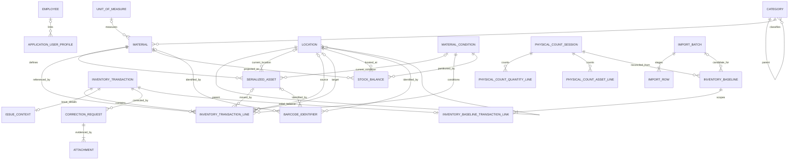

# Data Model — Elektrik Atölyesi Envanter ve Malzeme Takip Sistemi

## 1. Belge Amacı

Bu belge, `docs/02-DOMAIN-MODEL.md` içindeki domain modelini PostgreSQL ve ilerideki Django ORM uygulamasına uygun, üretim odaklı ilişkisel veri modeline dönüştürür. `docs/00-PRODUCT.md` ve `docs/01-BUSINESS-RULES.md` içindeki gereksinim ve invariant'lar bu tasarımın sınırlarıdır.

Belge yürütülebilir SQL, Django modeli veya migration içermez. Tablo ve kısıtlar kavramsaldır; açık iş kararları varsayımla kapatılmaz.

Önerilen uygulama tablosu sayısı **23**'tür. `inventory_baseline_transaction_links` scoped cutover ilişkisi bu sayıya dahildir. Django'nun auth tabloları bu sayıya dahil değildir ve bu belgede yeniden tasarlanmamıştır.

## 2. Veri Modeli İlkeleri

1. `inventory_transactions` ve satırları yetkili stok ledger'ıdır.
2. `stock_balances` yalnızca miktar bazlı güncel durum projection'ıdır.
3. `materials` üzerinde `stock_quantity` benzeri yetkili değişken stok alanı bulunmaz.
4. Quantity ve serialized envanter aynı satırda karıştırılamaz.
5. `transaction_type` ile `material_condition` farklı kavram ve alanlardır.
6. Tamamlanmış ledger kayıtları PostgreSQL DB-level guard ile immutable/no-delete'dir.
7. Düzeltme özgün işlemi değiştirmez; talep ve sonuç işlemiyle ilişkilendirir.
8. Fiziksel sayım farkı doğrudan bakiye üzerine yazılmaz.
9. Excel import commit'i stok ledger'ı veya `StockBalance` oluşturmaz; candidate data staging-only'dir.
10. İş entity'lerinde UUID birincil anahtar, iş zamanlarında timezone-aware timestamp tercih edilir.
11. Tarihsel tablolar hard delete ile kaybedilmez; master kayıtlar referans varsa pasifleştirilir.
12. V1 tasarımı Django ORM ile yönetilebilir kalır; event sourcing veya mikroservis altyapısı gerektirmez.

## 3. Veri Tipi ve Kimlik Standartları

| Konu | Öneri | Gerekçe |
|---|---|---|
| Birincil anahtar | `UUID` | İş/domain entity'lerinde dağıtık üretim ve güvenli dış referans için. |
| Teknik zaman | `TIMESTAMPTZ` | UTC tabanlı saklama ve fabrika yerel saatine güvenli dönüşüm için. |
| Miktar | `NUMERIC(18,3)` | 12.75 metre gibi ondalıklı miktarları ve yeterli endüstriyel aralığı destekler. |
| Kısa kod | `VARCHAR` veya sınırlı `TEXT` | Uzunluk ilgili feature implementation öncesi kesinleştirilir. |
| Açıklama | `TEXT` | İş açıklamalarında yapay kısa sınırdan kaçınır. |
| Esnek veri | `JSONB` | Teknik nitelik ve import staging verisi için. |
| Boolean | `BOOLEAN` | Aktiflik ve fiziksel sayım var/yok değerleri için. |
| Satır sırası | Pozitif `INTEGER` | İşlem veya import içi kararlı sıra için. |

`created_at` kaydın sisteme eklenme, `updated_at` değiştirilebilir master/staging kaydının son güncellenme zamanıdır. Immutable ledger satırlarında `updated_at` önerilmez. `occurred_at`, sistemce kaydedilen iş olayı zamanıdır ve normal kullanıcı tarafından düzenlenemez.

## 4. Identity / Employee Tabloları

### 4.1 `employees`

**Purpose:** Fabrika çalışanı/teslim alan kişi kimliğini temsil eder.

| Column | Conceptual Type | Null | Constraint | Description |
|---|---|---:|---|---|
| `id` | UUID | Hayır | PK | Sistem içi kimlik. |
| `employee_number` | VARCHAR | Hayır | UNIQUE | Çalışan sicil numarası; string; leading zero korunur; case-sensitive global unique; editable (`DEC-024`). |
| `first_name` | VARCHAR | Hayır | Boş olamaz | Güncel ad. |
| `last_name` | VARCHAR | Hayır | Boş olamaz | Güncel soyad. |
| `active` | BOOLEAN | Hayır | Default true | Kullanım durumu. |
| `created_at` | TIMESTAMPTZ | Hayır | Sistem zamanı | Oluşturma zamanı. |
| `user_id` | Auth user PK tipi | Evet | FK, UNIQUE | Nullable one-to-one `accounts.User` bağlantısı; ownership Employee tarafında (`DEC-024`). |
| `updated_at` | TIMESTAMPTZ | Hayır | Sistem zamanı | Son güncelleme zamanı. |

- **Primary Key:** `id`
- **Foreign Keys:** `user_id → accounts.User`; delete `SET_NULL`.
- **Unique Constraints:** `employee_number` globally unique (case-sensitive); `user_id` unique when not null.
- **Check Constraints:** Ad, soyad ve sicil numarası outer trim sonrası boş olamaz.
- **Recommended Indexes:** Unique `employee_number`; unique partial `user_id`; gerektiğinde `last_name, first_name`.
- **Delete Policy:** Hard delete application surface yok; `active/inactive` lifecycle. User silinince link `SET_NULL`. Transaction snapshot'ları çalışan değişikliğinden etkilenmez.
- **Notes / TBD:** Eski sicil numarası ayrı historical registry ile rezerve edilmez; import/matching immutable identity key varsaymamalıdır. Gelecek audit: `accounts.employee.created/updated/deactivated/reactivated`. Permissions: `accounts.view_employee`, `accounts.add_employee`, `accounts.change_employee` (`DEC-024`). Employee foundation Phase 3.2'de implement edilmiştir.

## 5. Catalog Tabloları

### 5.1 `categories`

**Purpose:** Hiyerarşik malzeme kategori ağacını tutar.

| Column | Conceptual Type | Null | Constraint | Description |
|---|---|---:|---|---|
| `id` | UUID | Hayır | PK | Kategori kimliği. |
| `code` | VARCHAR | Evet | Benzersizlik TBD | Opsiyonel iş kodu. |
| `name` | VARCHAR | Hayır | Boş olamaz | Kategori adı. |
| `parent_id` | UUID | Evet | Self FK | Üst kategori. |
| `active` | BOOLEAN | Hayır | Default true | Kullanım durumu. |
| `created_at` | TIMESTAMPTZ | Hayır | Sistem zamanı | Oluşturma zamanı. |
| `updated_at` | TIMESTAMPTZ | Hayır | Sistem zamanı | Son güncelleme zamanı. |

- **Primary Key:** `id`
- **Foreign Keys:** `parent_id → categories.id`, delete restricted.
- **Unique Constraints:** `code` kullanılacaksa global unique önerilir; kod standardı TBD'dir.
- **Check Constraints:** `parent_id <> id`.
- **Recommended Indexes:** `parent_id`, `name`, opsiyonel unique `code`.
- **Delete Policy:** Referans veya alt kategori varsa `SOFT DELETE / DEACTIVATE`; tarihsel bağları bozacak hard delete yok.
- **Notes / TBD:** Daha derin çevrimler servis katmanında engellenmelidir. Recursive DB trigger/constraint V1 için gerekçesiz karmaşıklık oluşturur.

### 5.2 `units_of_measure`

**Purpose:** Malzeme miktarının ölçü birimini referans veri olarak tutar.

| Column | Conceptual Type | Null | Constraint | Description |
|---|---|---:|---|---|
| `id` | UUID | Hayır | PK | Birim kimliği. |
| `code` | VARCHAR | Hayır | UNIQUE | İş kodu; UUID kararlı kimliktir, `code` yetkili yönetici tarafından düzenlenebilir (`DEC-021`). Seed örnekleri kapalı whitelist değildir. |
| `name` | VARCHAR | Hayır | Boş olamaz | Görünen ad. |
| `decimal_places` | SMALLINT | Evet | Provisional 0..3 | Birim için opsiyonel validation ipucu; kesin politika `DEC-OPEN-010`. |
| `active` | BOOLEAN | Hayır | Default true | Yeni kullanım durumu. |
| `created_at` | TIMESTAMPTZ | Hayır | Sistem zamanı | Oluşturma zamanı. |
| `updated_at` | TIMESTAMPTZ | Hayır | Sistem zamanı | Son güncelleme zamanı. |

- **Primary Key:** `id`
- **Foreign Keys:** Yok.
- **Unique Constraints:** `code`.
- **Check Constraints:** Değer kullanılırsa `decimal_places BETWEEN 0 AND 3`; alan kesin precision kararı verilene kadar null olabilir.
- **Recommended Indexes:** Unique `code`; ek indeks gerekmez.
- **Delete Policy:** `SOFT DELETE / DEACTIVATE`; referanslı UoM deaktive edilebilir, mevcut referanslar korunur (`DEC-021`).
- **Notes / TBD:** Birim dönüşüm tablosu önerilmez. `code` değişiklikleri audit edilir; case-insensitive normalization kuralı uydurulmaz. `decimal_places` semantik olarak `DEC-OPEN-010` altında çözülmemiş kalır; rounding/conversion davranışı oluşturulmaz. Seed UoM'ler özel koruma almaz. Phase 2 catalog master data için optimistic locking zorunlu değildir (last-write-wins).

### 5.3 `material_conditions`

**Purpose:** Hareket türünden bağımsız malzeme kondisyon referans verisini tutar.

| Column | Conceptual Type | Null | Constraint | Description |
|---|---|---:|---|---|
| `id` | UUID | Hayır | PK | Kondisyon kimliği. |
| `code` | VARCHAR | Hayır | UNIQUE | Kararlı iş kodu. |
| `name` | VARCHAR | Hayır | Boş olamaz | Görünen ad. |
| `active` | BOOLEAN | Hayır | Default true | Yeni işlemlerde kullanılabilirlik. |
| `sort_order` | INTEGER | Hayır | `>= 0` | Görüntüleme sırası. |
| `created_at` | TIMESTAMPTZ | Hayır | Sistem zamanı | Oluşturma zamanı. |
| `updated_at` | TIMESTAMPTZ | Hayır | Sistem zamanı | Son güncelleme zamanı. |

- **Primary Key:** `id`
- **Foreign Keys:** Yok.
- **Unique Constraints:** `code`.
- **Check Constraints:** `sort_order >= 0`.
- **Recommended Indexes:** Unique `code`; `active, sort_order` yalnızca listeleme ihtiyacı doğrulanırsa.
- **Delete Policy:** `SOFT DELETE / DEACTIVATE`.
- **Notes / TBD:** Referans tablo, DB enum'a göre isim/sıra/aktiflik ve kontrollü gelecek genişlemesi sağlar. Başlangıç kodları seed varsayılanlarıdır; kapalı whitelist değildir. Condition label/reference metadata gelecekte dinamik olabilir; availability effect ve allowed transition'lar code/policy controlled kalır (`DEC-021`). Movement semantic type'lar code-controlled kalır. Kondisyonun kullanılabilir stoğa etkisi TBD'dir.

### 5.4 `materials`

**Purpose:** Malzeme/ürün tanımını tutar; fiziksel serialized örnek veya yetkili stok miktarı değildir.

| Column | Conceptual Type | Null | Constraint | Description |
|---|---|---:|---|---|
| `id` | UUID | Hayır | PK | Malzeme kimliği. |
| `material_code` | VARCHAR | Hayır | Benzersizlik TBD | İş/malzeme kodu. |
| `name` | VARCHAR | Hayır | Boş olamaz | Malzeme adı. |
| `category_id` | UUID | Hayır | FK | Malzeme kategorisi. |
| `brand` | VARCHAR | Evet | — | Marka. |
| `model` | VARCHAR | Evet | — | Model. |
| `unit_id` | UUID | Evet | FK; QUANTITY için zorunlu | Temel ölçü birimi; serialized material zorunluluğu TBD. |
| `tracking_mode` | VARCHAR | Hayır | CHECK | `QUANTITY` veya `SERIALIZED`. |
| `minimum_stock_value` | NUMERIC(18,3) | Evet | `>= 0` | Basit malzeme geneli eşik; kapsam TBD. |
| `technical_specs` | JSONB | Hayır | Default empty object | Esnek teknik nitelikler; unrestricted raw JSON editor olarak expose edilmez (`DEC-021`). |
| `active` | BOOLEAN | Hayır | Default true | Yeni işlemlerde kullanılabilirlik. |
| `created_at` | TIMESTAMPTZ | Hayır | Sistem zamanı | Oluşturma zamanı. |
| `updated_at` | TIMESTAMPTZ | Hayır | Sistem zamanı | Son güncelleme zamanı. |

- **Primary Key:** `id`
- **Foreign Keys:** `category_id → categories.id`; nullable `unit_id → units_of_measure.id`; delete restricted.
- **Unique Constraints:** `material_code` için global unique tercih edilir, ancak Excel analizi ve iş doğrulaması olmadan kesinleştirilmez.
- **Check Constraints:** `tracking_mode IN (QUANTITY, SERIALIZED)`; `minimum_stock_value IS NULL OR minimum_stock_value >= 0`; `technical_specs` JSON object olmalıdır.
- **Recommended Indexes:** `material_code`, `name`, `category_id`, `active`. GIN yalnızca gerçek JSONB arama ihtiyacı ölçüldüğünde.
- **Delete Policy:** Referans varsa `SOFT DELETE / DEACTIVATE`; history sonrası hard delete yok.
- **Notes / TBD:** `stock_quantity` alanı kesinlikle yoktur. Bir material herhangi bir inventory ledger history'ye sahip olduktan sonra `tracking_mode` normal uygulama yollarında immutable'dır (`DEC-013`). Exceptional veri dönüşümü ayrı iş kararı ve migration projesidir. Material code benzersizliği ve kategori teknik şemaları TBD'dir. Kategori-özel teknik alanlar controlled `TechnicalFieldDefinition`-style metadata ile yönetilir (`DEC-021`, `DEC-OPEN-019`).

## 6. Location Tabloları

### 6.1 `locations`

**Purpose:** Raf/bin seviyesine kadar genişleyebilen hiyerarşik fiziksel stok yerlerini tutar. Phase 3.1 onaylı minimal şekil (`DEC-023`).

| Column | Conceptual Type | Null | Constraint | Description |
|---|---|---:|---|---|
| `id` | UUID | Hayır | PK | Kalıcı lokasyon kimliği. |
| `code` | VARCHAR | Hayır | UNIQUE, case-sensitive | İş lokasyon kodu; UUID kalıcı kimliktir, `code` editable'dır. |
| `name` | VARCHAR | Hayır | Boş olamaz; unique değil | Görünen ad; editable. |
| `parent_id` | UUID | Evet | Self FK | Üst lokasyon; root'ta null. |
| `active` | BOOLEAN | Hayır | Default true | Yeni operasyonel harekete uygunluk. |
| `can_hold_stock` | BOOLEAN | Hayır | Default false; explicit capability | Lokasyonun fiziksel stok tutup tutamayacağı. |
| `created_at` | TIMESTAMPTZ | Hayır | Sistem zamanı | Oluşturma zamanı. |
| `updated_at` | TIMESTAMPTZ | Hayır | Sistem zamanı | Son güncelleme zamanı. |

- **Primary Key:** `id`
- **Foreign Keys:** `parent_id → locations.id`, delete restricted.
- **Unique Constraints:** `code` globally unique; case-sensitive. Dış boşluk trim edilir; blank yasaktır. Regex format ve forced upper/lowercase yoktur.
- **Check Constraints:** `parent_id <> id`.
- **Recommended Indexes:** `parent_id`, unique `code`, `name`, `active`; stok seçicileri için ihtiyaç doğrulanırsa `(active, can_hold_stock)`.
- **Delete Policy:** Hard delete iş operasyonu yoktur; `SOFT DELETE / DEACTIVATE`. FK'ler restricted.
- **Notes:** `location_type` Phase 3.1'de yoktur; `WAREHOUSE`/`WORKSHOP`/`SHELF`/`BIN` sabit enum implement edilmez. Hiyerarşi dinamik recursive parent ile arbitrary depth'tir; path/depth cache persist edilmez; generic tree framework yoktur. Self-parent ve descendant/cycle parenting servis katmanında engellenir. Parent sonradan değiştirilebilir. Parent status children'a cascade etmez; inactive parent'ın active child'ı olabilir. `can_hold_stock` leaf/child/name/depth/type'tan türetilmez; parent ve child bağımsız `True` olabilir. Yeni fiziksel stok yalnız `active=true AND can_hold_stock=true` lokasyona bağlanabilir; sonraki pasifleştirme historical FK'leri geçersiz yapmaz. Yetkili envanter varken non-zero stock pasifleştirme ve `can_hold_stock` True→False yasaktır (`DEC-023`); inventory entegrasyonu bunu otoritatif uygular. Tahmini fabrika Location satırları seed edilmez.

## 6A. ProductionLine Tabloları (inventory app)

Module owner: `inventory`. Location hiyerarşisinden bağımsız ayrı domain yapısıdır (`DEC-025`). ProductionLine foundation Phase 3.3'te implement edilmiştir; ISSUE henüz implement edilmemiştir.

### 6A.1 `production_lines`

**Purpose:** Üretim hattı / fabrika operasyonel bağlamını dinamik master data olarak tutar.

| Column | Conceptual Type | Null | Constraint | Description |
|---|---|---:|---|---|
| `id` | UUID | Hayır | PK | Kalıcı ProductionLine kimliği. |
| `code` | VARCHAR | Hayır | UNIQUE, case-sensitive | İş kodu; UUID kalıcı kimliktir, `code` editable'dır. |
| `name` | VARCHAR | Hayır | Boş olamaz; unique değil | Görünen ad; editable. |
| `parent_id` | UUID | Evet | Self FK | Üst hat/bölüm; root'ta null. |
| `active` | BOOLEAN | Hayır | Default true | Yeni ISSUE seçimine uygunluk. |
| `created_at` | TIMESTAMPTZ | Hayır | Sistem zamanı | Oluşturma zamanı. |
| `updated_at` | TIMESTAMPTZ | Hayır | Sistem zamanı | Son güncelleme zamanı. |

- **Primary Key:** `id`
- **Foreign Keys:** `parent_id → production_lines.id`, delete restricted.
- **Unique Constraints:** `code` globally unique; case-sensitive; outer trim; blank yasak; regex/forced case yok.
- **Check Constraints:** `parent_id <> id`.
- **Recommended Indexes:** `parent_id`, unique `code`, `name`, `active`.
- **Delete Policy:** Hard delete application surface yok; `SOFT DELETE / DEACTIVATE`. Status children'a cascade etmez.
- **Notes:** Hiyerarşi dinamik recursive parent ile arbitrary depth'tir; fixed type enum yok; path/depth cache yok; generic tree framework yoktur. Self-parent ve cycle servis katmanında engellenir. Inactive ProductionLine yeni ISSUE seçiminde kullanılamaz. Gelecek ISSUE `production_line_id` + code/name snapshot taşır. Tahmin edilmiş fabrika hatları seed edilmez. Planlanan permissions: `inventory.view_productionline`, `inventory.add_productionline`, `inventory.change_productionline`.

## 7. Serialized Asset Tabloları

### 7.1 `serialized_assets`

**Purpose:** `SERIALIZED` takip modundaki bir `Material`ın tek fiziksel örneğini ve ledger'dan türeyen güncel projection/cache alanlarını tutar.

| Column | Conceptual Type | Null | Constraint | Description |
|---|---|---:|---|---|
| `id` | UUID | Hayır | PK | Tekil varlık sistem kimliği. |
| `material_id` | UUID | Hayır | FK | Ait olduğu material. |
| `internal_asset_code` | VARCHAR | Evet | UNIQUE öneri | İç varlık kodu. |
| `serial_number` | VARCHAR | Evet | Scope TBD | Üretici seri numarası. |
| `current_location_id` | UUID | Evet | FK | Ledger'dan türetilen mevcut fiziksel lokasyon. |
| `current_condition_id` | UUID | Evet | FK | Ledger'dan türetilen mevcut kondisyon. |
| `current_state_code` | VARCHAR | Hayır | Değer seti TBD | Stokta/çıkarılmış vb. projection durumu. |
| `state_version` | BIGINT | Hayır | `>= 0` | Atomik state güncelleme/optimistic kontrol sürümü. |
| `active` | BOOLEAN | Hayır | Default true | Master kayıt yaşam durumu. |
| `created_at` | TIMESTAMPTZ | Hayır | Sistem zamanı | Oluşturma zamanı. |
| `updated_at` | TIMESTAMPTZ | Hayır | Sistem zamanı | Projection/master son değişiklik zamanı. |

- **Primary Key:** `id`
- **Foreign Keys:** `material_id → materials.id`; `current_location_id → locations.id`; `current_condition_id → material_conditions.id`; delete restricted.
- **Unique Constraints:** `internal_asset_code` global unique önerilir. `serial_number` benzersizlik scope'u TBD'dir.
- **Check Constraints:** `state_version >= 0`; en az bir iş tanımlayıcısının zorunlu olup olmadığı TBD olduğu için şimdilik check önerilmez.
- **Recommended Indexes:** `material_id`, unique `internal_asset_code`, `serial_number`, `current_location_id`, `current_condition_id`.
- **Delete Policy:** Ledger history sonrası `IMMUTABLE IDENTITY / NO HARD DELETE`; yalnızca pasifleştirme.
- **Notes / TBD:** **B seçeneği önerilir:** güncel lokasyon/kondisyon projection olarak persisted tutulur ve ledger işlemiyle aynı DB transaction içinde atomik güncellenir. Ledger her zaman yetkilidir; projection yeniden üretilebilir. Material'ın `SERIALIZED` olması servis katmanında zorunlu doğrulanır ve kritik cross-table corruption'a karşı targeted PostgreSQL DB integrity guard/constraint trigger ile korunur; exact migration mekanizması implementation review konusudur. `current_state_code` sözlüğü BLOCKS IMPLEMENTATION kararıdır.

## 8. Inventory Ledger Tabloları

### 8.1 `inventory_transactions`

**Purpose:** Tamamlanmış envanter değişikliklerinin immutable/auditable ledger başlığıdır.

| Column | Conceptual Type | Null | Constraint | Description |
|---|---|---:|---|---|
| `id` | UUID | Hayır | PK | Ledger işlem kimliği. |
| `operation_id` | UUID | Hayır | UNIQUE | Güvenli tekrar/idempotency anahtarı. |
| `request_fingerprint` | CHAR(64) | Hayır | Server-generated SHA-256 | Canonical semantic command payload özeti. |
| `transaction_number` | VARCHAR | Evet | UNIQUE öneri | İnsan okunur referans; gereksinimi TBD. |
| `transaction_type` | VARCHAR | Hayır | CHECK | Onaylı ledger olay türü. |
| `occurred_at` | TIMESTAMPTZ | Hayır | Sistem zamanı, immutable | İşlem zamanı. |
| `created_at` | TIMESTAMPTZ | Hayır | Sistem zamanı | Ledger'a kayıt zamanı. |
| `acting_user_id` | Auth user PK tipi | Hayır | FK | İşlemi yapan uygulama kullanıcısı. |
| `source_transaction_id` | UUID | Evet | Self FK | İade/düzeltme gibi ilişkili kaynak işlem. |
| `notes` | TEXT | Evet | — | İş notu; zorunluluk yok. |

- **Primary Key:** `id`
- **Foreign Keys:** `acting_user_id → auth user`; `source_transaction_id → inventory_transactions.id`. Correction ve baseline sonuç ilişkileri downstream workflow tabloları/linkleri tarafından sahiplenilir; inventory downstream app'lere reverse FK taşımaz.
- **Unique Constraints:** `operation_id`; opsiyonel `transaction_number`.
- **Check Constraints:** `transaction_type IN (RECEIPT, ISSUE, RETURN, TRANSFER, CONTROLLED_CORRECTION, INITIAL_BALANCE)`; self source kendi işlemine eşit olamaz.
- **Recommended Indexes:** `occurred_at`, `transaction_type, occurred_at`, `acting_user_id, occurred_at`, `source_transaction_id`; unique `operation_id`. Fingerprint tek başına lookup anahtarı değildir.
- **Delete Policy:** `IMMUTABLE / NO DELETE`; PostgreSQL DB-level immutability guard zorunludur.
- **Notes / TBD:** Ledger yalnızca tamamlanmış işlemleri içerdiği için mutable `status` alanı önerilmez. Taslak/validasyon import veya istek bağlamında tutulur. Committed header/line `UPDATE` ve `DELETE`, daha sonra Django migration ile yönetilecek PostgreSQL trigger-class guard tarafından reddedilmelidir; application/admin/ORM/raw application SQL bypass edemez. Exceptional repair/migration privileged, documented ve audited'dir. `INITIAL_BALANCE`, yalnızca onaylı `InventoryBaseline` üzerinden reconciled başlangıç stoğunu ledger'a alan kontrollü olaydır; serbest doğrudan stok yazımı değildir.

### 8.2 `inventory_transaction_lines`

**Purpose:** Bir ledger işleminin quantity veya tekil varlık bazındaki stok etkisini tutar.

| Column | Conceptual Type | Null | Constraint | Description |
|---|---|---:|---|---|
| `id` | UUID | Hayır | PK | Satır kimliği. |
| `transaction_id` | UUID | Hayır | FK | Ledger başlığı. |
| `line_number` | INTEGER | Hayır | `> 0`, işlem içinde unique | Kararlı satır sırası. |
| `material_id` | UUID | Hayır | FK | Etkilenen material. |
| `serialized_asset_id` | UUID | Evet | FK | Serialized satırda tam bir asset. |
| `quantity` | NUMERIC(18,3) | Evet | `> 0` quantity satırda | Pozitif hareket büyüklüğü; yön type/lokasyon semantiğinden gelir. |
| `unit_id` | UUID | Evet | FK | Quantity satırda zorunlu, serialized satırda null. |
| `condition_id` | UUID | Hayır | FK | Hareketten ayrı kondisyon. |
| `source_location_id` | UUID | Evet | FK | Kaynak fiziksel lokasyon. |
| `target_location_id` | UUID | Evet | FK | Hedef fiziksel lokasyon. |
| `created_at` | TIMESTAMPTZ | Hayır | Sistem zamanı | Immutable satır kayıt zamanı. |

- **Primary Key:** `id`
- **Foreign Keys:** Başlık, material, asset, unit, condition ve source/target location FK'leri; tamamı historical delete restricted.
- **Unique Constraints:** `(transaction_id, line_number)`. Gerekirse aynı işlemde aynı serialized asset tekrarını engelleyen `(transaction_id, serialized_asset_id)` koşullu unique.
- **Check Constraints:** Ya `(serialized_asset_id IS NULL AND quantity > 0 AND unit_id IS NOT NULL)` ya da `(serialized_asset_id IS NOT NULL AND quantity IS NULL AND unit_id IS NULL)`; ikisi birlikte olamaz. `(source_location_id IS NULL OR target_location_id IS NULL OR source_location_id <> target_location_id)`.
- **Recommended Indexes:** `transaction_id`, `material_id`, `serialized_asset_id`, `source_location_id`, `target_location_id`, `condition_id`.
- **Delete Policy:** `IMMUTABLE / NO DELETE`.
- **Notes / TBD:** Serialized satırda `quantity` **NULL** önerilir; `1` saklamak anonim quantity anlamını davet eder. Asset'ın `material_id` ile line material eşleşmesi ve tracking mode uyumu serviste zorunlu doğrulanır; catastrophic cross-table corruption için targeted PostgreSQL constraint trigger/guard gerekir. Sırf composite FK için redundant tracking-mode kolonu eklenmez; exact DB mekanizması implementation review konusudur. İşlem türüne göre source/target matrisi Bölüm 19'da sınıflandırılır.

## 9. Stock Balance Projection

### 9.1 `stock_balances`

**Purpose:** Yalnızca quantity malzemeler için hızlı, güncel stok projection'ı/cache'idir; historical truth değildir.

| Column | Conceptual Type | Null | Constraint | Description |
|---|---|---:|---|---|
| `id` | UUID | Hayır | PK | Projection satır kimliği. |
| `material_id` | UUID | Hayır | FK | `QUANTITY` material. |
| `location_id` | UUID | Hayır | FK | Fiziksel stok lokasyonu. |
| `condition_id` | UUID | Hayır | FK | Kondisyon partition'ı. |
| `quantity` | NUMERIC(18,3) | Hayır | `>= 0` | Güncel miktar. |
| `updated_at` | TIMESTAMPTZ | Hayır | Sistem zamanı | Son projection güncellemesi. |

- **Primary Key:** `id`
- **Foreign Keys:** `material_id → materials.id`; `location_id → locations.id`; `condition_id → material_conditions.id`; delete restricted.
- **Unique Constraints:** `(material_id, location_id, condition_id)`.
- **Check Constraints:** `quantity >= 0`.
- **Recommended Indexes:** Composite unique anahtar; `location_id`; düşük stok sorguları doğrulanınca ek indeks değerlendirilir.
- **Delete Policy:** `SYSTEM-REBUILDABLE PROJECTION`; kullanıcı hard delete/direkt edit yapamaz. Ledger'dan kontrollü yeniden üretilebilir.
- **Notes / TBD:** Yalnızca `QUANTITY` tracking mode ve yalnız `active && can_hold_stock` location kabulü serviste zorunlu doğrulanır; catastrophic cross-table ihlal için targeted PostgreSQL DB integrity guard/constraint trigger gerekir. Değişiklikler ledger yazımıyla aynı DB transaction içinde pessimistic row lock altında yapılır. Kullanılmayan optimistic `version` kolonu tutulmaz. Var olmayan row için lock tek başına yeterli değildir; Bölüm 22'deki unique + conflict + lock contract uygulanır.

## 10. Issue Context

### 10.1 `issue_contexts`

**Purpose:** Yalnızca `ISSUE` transaction'a ait zorunlu alıcı ve kullanım bağlamını bir-bir tabloda tarihsel snapshot olarak tutar.

| Column | Conceptual Type | Null | Constraint | Description |
|---|---|---:|---|---|
| `transaction_id` | UUID | Hayır | PK, FK, UNIQUE | İlgili `ISSUE` transaction. |
| `receiver_employee_id` | UUID | Hayır | FK | Teslim alan Employee UUID referansı (`DEC-024`). |
| `receiver_first_name_snapshot` | VARCHAR | Hayır | Boş olamaz | Teslim anındaki ad. |
| `receiver_last_name_snapshot` | VARCHAR | Hayır | Boş olamaz | Teslim anındaki soyad. |
| `receiver_employee_number_snapshot` | VARCHAR | Hayır | Boş olamaz | Teslim anındaki sicil no. |
| `production_line_id` | UUID | Hayır | FK | Seçilen ProductionLine UUID referansı (`DEC-025`). |
| `production_line_code_snapshot` | VARCHAR | Hayır | Boş olamaz | Teslim anındaki hat kodu. |
| `production_line_name_snapshot` | VARCHAR | Hayır | Boş olamaz | Teslim anındaki hat adı. |
| `usage_location_text` | VARCHAR | Hayır | Boş olamaz | Zorunlu fiili kullanım yeri (exact usage place; ayrı free text). |
| `created_at` | TIMESTAMPTZ | Hayır | Sistem zamanı | Snapshot kayıt zamanı. |

- **Primary Key:** `transaction_id`
- **Foreign Keys:** `transaction_id → inventory_transactions.id`; `receiver_employee_id → employees.id`; `production_line_id → production_lines.id`; delete restricted.
- **Unique Constraints:** PK transaction başına en fazla bir issue context sağlar.
- **Check Constraints:** Snapshot ve iki kullanım alanı normalize edildikten sonra boş olamaz.
- **Recommended Indexes:** `receiver_employee_id`, gerekirse `receiver_employee_number_snapshot`; transaction PK indeksi yeterlidir.
- **Delete Policy:** İlgili transaction gibi `IMMUTABLE / NO DELETE`.
- **Notes / TBD:** Ayrı tablo; ISSUE dışı işlemlerde gereksiz nullable kolonları önler. Servis `transaction_type = ISSUE` olmasını ve her ISSUE için context bulunmasını atomik doğrular. ProductionLine foundation `DEC-025` ile kararlıdır; Employee foundation `DEC-024` ile kararlıdır. ISSUE data/UI inventory hard gate'leri çözülene kadar implement edilmez. `usage_location_text` exact usage place olarak ayrı required free text kalır; `UsagePlace` modeli yoktur; Location veya ProductionLine'dan infer edilmez.

## 11. Correction Tabloları

### 11.1 `correction_requests`

**Purpose:** Tamamlanmış ledger işlemi için kontrollü düzeltme talebi ve kararını tutar.

| Column | Conceptual Type | Null | Constraint | Description |
|---|---|---:|---|---|
| `id` | UUID | Hayır | PK | Talep kimliği. |
| `original_transaction_id` | UUID | Hayır | FK | Düzeltilecek özgün ledger işlemi. |
| `requested_by_user_id` | Auth user PK tipi | Hayır | FK | Talep eden kullanıcı. |
| `explanation` | TEXT | Hayır | Boş olamaz | Zorunlu açıklama. |
| `status` | VARCHAR | Hayır | CHECK | `PENDING`, `APPROVED`, `REJECTED`. |
| `requested_at` | TIMESTAMPTZ | Hayır | Sistem zamanı | Talep zamanı. |
| `decided_by_user_id` | Auth user PK tipi | Evet | FK | Karar veren Yönetici/Müdür. |
| `decided_at` | TIMESTAMPTZ | Evet | — | Sistem karar zamanı. |
| `rejection_reason` | TEXT | Evet | PROPOSED | Ret gerekçesi. |
| `created_at` | TIMESTAMPTZ | Hayır | Sistem zamanı | Teknik oluşturma zamanı. |
| `updated_at` | TIMESTAMPTZ | Hayır | Sistem zamanı | Karar öncesi/karar güncelleme zamanı. |

- **Primary Key:** `id`
- **Foreign Keys:** Özgün transaction ve iki auth user FK'si; delete restricted.
- **Unique Constraints:** Bir transaction için birden fazla talebin davranışı TBD olduğundan 1:1 unique konmaz.
- **Check Constraints:** Status değer seti; `APPROVED/REJECTED` ise decider ve decided_at dolu, `PENDING` ise ikisi null. Ret gerekçesi DB'de zorunlu yapılmaz.
- **Recommended Indexes:** `status, requested_at`, `original_transaction_id`, `requested_by_user_id`, `decided_by_user_id`.
- **Delete Policy:** Gönderim sonrası `IMMUTABLE / NO HARD DELETE`; yalnızca kontrollü durum geçişi.
- **Notes / TBD:** Sonuç transaction ilişkisinin sahibi correction workflow'dur; ledger üzerinde reverse `correction_request_id` yoktur. Association shape, aynı kişinin talep/karar verip veremeyeceği, tek/cumulative sonuç, partial correction, original-line linkage, over-correction, sonraki hareket ve yetersiz current stock davranışı `DEC-HG-002` hard gate'i çözülmeden correction schema/service implementation başlayamaz. `rejection_reason` zorunluluğu yalnızca PROPOSED'dır.

## 12. Attachment Tabloları

### 12.1 `attachments`

**Purpose:** V1'de düzeltme talebinin zorunlu güncel fotoğraf kanıtını tutar.

| Column | Conceptual Type | Null | Constraint | Description |
|---|---|---:|---|---|
| `id` | UUID | Hayır | PK | Dosya metadata kimliği. |
| `correction_request_id` | UUID | Hayır | FK | Sahibi olan düzeltme talebi. |
| `original_filename` | VARCHAR | Hayır | Boş olamaz | Kullanıcının dosya adı. |
| `storage_key` | VARCHAR | Hayır | UNIQUE | Depolama sağlayıcısındaki anahtar/ad. |
| `content_type` | VARCHAR | Hayır | Fotoğraf policy TBD | MIME türü. |
| `size_bytes` | BIGINT | Hayır | `> 0` | Dosya boyutu. |
| `checksum` | VARCHAR | Evet | — | Bütünlük/duplicate tespiti için önerilir. |
| `uploaded_by_user_id` | Auth user PK tipi | Hayır | FK | Yükleyen kullanıcı. |
| `uploaded_at` | TIMESTAMPTZ | Hayır | Sistem zamanı | Yükleme zamanı. |

- **Primary Key:** `id`
- **Foreign Keys:** `correction_request_id → correction_requests.id`; `uploaded_by_user_id → auth user`; delete restricted.
- **Unique Constraints:** `storage_key`.
- **Check Constraints:** `size_bytes > 0`.
- **Recommended Indexes:** `correction_request_id`, `uploaded_by_user_id`, opsiyonel `checksum`.
- **Delete Policy:** Submitted request sonrası retention kararı verilene kadar `NO HARD DELETE`.
- **Notes / TBD:** V1 için doğrudan FK, generic polymorphic attachment'tan daha basit ve güvenlidir. Metadata model ownership `corrections` app'indedir; binary handling `core` storage abstraction'ı üzerinden yürür, ayrı attachments app gerekmez. Import kaynak dosyası kendi batch metadata'sında tutulur. Sensitive evidence public `MEDIA_URL` ile değil permission/object-checked application path ile servis edilir. Fotoğraf formatı, boyut sınırı, güncellik ve retention TBD'dir.

## 13. Physical Count Tabloları

Tek tabloda quantity ve serialized alanları tutmak çok sayıda nullable kolon ve kırılgan çapraz check üretir. İki uzmanlaşmış satır tablosu önerilir.

### 13.1 `physical_count_sessions`

**Purpose:** Belirli kapsamda fiziksel sayım ve mutabakat oturumunu tutar.

| Column | Conceptual Type | Null | Constraint | Description |
|---|---|---:|---|---|
| `id` | UUID | Hayır | PK | Oturum kimliği. |
| `reference_number` | VARCHAR | Hayır | UNIQUE | İnsan okunur sayım referansı. |
| `scope_location_id` | UUID | Evet | FK | Sayım kapsamının kök lokasyonu. |
| `status` | VARCHAR | Hayır | Tasarım değeri | Önerilen yaşam döngüsü. |
| `reconciliation_status` | VARCHAR | Hayır | Tasarım değeri | Fark çözüm durumu. |
| `started_by_user_id` | Auth user PK tipi | Hayır | FK | Başlatan kullanıcı. |
| `started_at` | TIMESTAMPTZ | Hayır | Sistem zamanı | Başlangıç. |
| `completed_by_user_id` | Auth user PK tipi | Evet | FK | Tamamlayan kullanıcı. |
| `completed_at` | TIMESTAMPTZ | Evet | — | Tamamlama zamanı. |
| `baseline_candidate` | BOOLEAN | Hayır | Default false | Cutover adayı olup olmadığı. |
| `created_at` | TIMESTAMPTZ | Hayır | Sistem zamanı | Oluşturma. |
| `updated_at` | TIMESTAMPTZ | Hayır | Sistem zamanı | Son yaşam döngüsü güncellemesi. |

- **Primary Key:** `id`
- **Foreign Keys:** Scope location ve auth user FK'leri; delete restricted.
- **Unique Constraints:** `reference_number`.
- **Check Constraints:** Tamamlanmış state için completed user/time birlikteliği; kesin status sözlüğü onaydan sonra.
- **Recommended Indexes:** `status`, `reconciliation_status`, `scope_location_id`, `started_at`.
- **Delete Policy:** Başlatıldıktan sonra `RETAIN / NO HARD DELETE`.
- **Notes / TBD:** `DRAFT`, `IN_PROGRESS`, `COMPLETED`, `RECONCILED` aday teknik state'lerdir; onaylı iş akışı değildir. `DEC-HG-001` gereği explicit scope ve expected timing semantiği ile stock-stability strategy (freeze, as-of replay veya güvenliği kanıtlanmış revalidation/reconfirmation) seçilmeden count/reconciliation schema/service/UI implementation başlayamaz. Reconciliation idempotent ve double-apply korumalı olmalı; expected state ledger etkisinden önce lock altında yeniden doğrulanmalıdır. Sayım onay seviyeleri ayrıca TBD'dir.

### 13.2 `physical_count_quantity_lines`

**Purpose:** Quantity material için beklenen ve fiziksel sayılan miktarı karşılaştırır.

| Column | Conceptual Type | Null | Constraint | Description |
|---|---|---:|---|---|
| `id` | UUID | Hayır | PK | Sayım satırı kimliği. |
| `session_id` | UUID | Hayır | FK | Sayım oturumu. |
| `material_id` | UUID | Hayır | FK | `QUANTITY` material. |
| `location_id` | UUID | Hayır | FK | Sayılan lokasyon. |
| `condition_id` | UUID | Hayır | FK | Sayılan kondisyon partition'ı. |
| `expected_quantity` | NUMERIC(18,3) | Hayır | `>= 0` | Sayım başlangıcındaki sistem snapshot'ı. |
| `counted_quantity` | NUMERIC(18,3) | Evet | `>= 0` | Fiziksel sonuç; sayılana kadar null. |
| `counted_by_user_id` | Auth user PK tipi | Evet | FK | Sayımı yapan. |
| `counted_at` | TIMESTAMPTZ | Evet | — | Sayım zamanı. |
| `correction_request_id` | UUID | Evet | FK | Fark çözüm talebi. |
| `created_at` | TIMESTAMPTZ | Hayır | Sistem zamanı | Satır oluşturma zamanı. |

- **Primary Key:** `id`
- **Foreign Keys:** Session, material, location, condition, user ve correction request FK'leri.
- **Unique Constraints:** `(session_id, material_id, location_id, condition_id)`.
- **Check Constraints:** Beklenen miktar negatif değil; sayılmışsa miktar negatif değil ve counted user/time birlikte dolu.
- **Recommended Indexes:** Composite unique anahtar; `material_id`, `location_id`, `correction_request_id`.
- **Delete Policy:** `RETAIN / NO HARD DELETE`.
- **Notes / TBD:** Fark `counted_quantity - expected_quantity` olarak türetilir; ayrıca mutable kolon önerilmez. Material tracking mode servis katmanında doğrulanır.

### 13.3 `physical_count_asset_lines`

**Purpose:** Serialized varlığın beklenen ve fiziksel var/yok durumunu karşılaştırır.

| Column | Conceptual Type | Null | Constraint | Description |
|---|---|---:|---|---|
| `id` | UUID | Hayır | PK | Sayım satırı kimliği. |
| `session_id` | UUID | Hayır | FK | Sayım oturumu. |
| `serialized_asset_id` | UUID | Hayır | FK | Sayılan tekil varlık. |
| `location_id` | UUID | Hayır | FK | Kontrol edilen fiziksel lokasyon. |
| `expected_present` | BOOLEAN | Hayır | — | Sistem snapshot'ında beklenme. |
| `counted_present` | BOOLEAN | Evet | — | Fiziksel sonuç; sayılana kadar null. |
| `expected_condition_id` | UUID | Evet | FK | Sayım başlangıcındaki kondisyon snapshot referansı. |
| `observed_condition_id` | UUID | Evet | FK | Fiziksel gözlem kondisyonu. |
| `counted_by_user_id` | Auth user PK tipi | Evet | FK | Sayımı yapan. |
| `counted_at` | TIMESTAMPTZ | Evet | — | Sayım zamanı. |
| `correction_request_id` | UUID | Evet | FK | Fark çözüm talebi. |
| `created_at` | TIMESTAMPTZ | Hayır | Sistem zamanı | Satır oluşturma zamanı. |

- **Primary Key:** `id`
- **Foreign Keys:** Session, asset, location, beklenen/gözlenen condition, user ve correction request FK'leri.
- **Unique Constraints:** `(session_id, serialized_asset_id, location_id)`.
- **Check Constraints:** Sayılmışsa counted user/time birlikte dolu.
- **Recommended Indexes:** Composite unique anahtar; `serialized_asset_id`, `location_id`, `correction_request_id`.
- **Delete Policy:** `RETAIN / NO HARD DELETE`.
- **Notes / TBD:** Beklenmeyen bulunan asset `expected_present=false, counted_present=true`; eksik asset tersiyle temsil edilir. `expected_condition_id`, sayım sonrasında asset projection'ı değişse bile başlangıç karşılaştırmasını korur. Yanlış lokasyonun tek veya iki satırla gösterimi servis iş akışında kesinleşir.

## 14. Import Tabloları

### 14.1 `import_batches`

**Purpose:** Excel kaynak dosyasının yükleme, doğrulama, ön izleme ve kontrollü commit sürecini tutar.

| Column | Conceptual Type | Null | Constraint | Description |
|---|---|---:|---|---|
| `id` | UUID | Hayır | PK | Batch kimliği. |
| `source_filename` | VARCHAR | Hayır | Boş olamaz | Orijinal dosya adı. |
| `source_storage_key` | VARCHAR | Hayır | UNIQUE | Kaynak dosya saklama anahtarı. |
| `source_checksum` | VARCHAR | Evet | İndeks öneri | Kaynak bütünlük/duplicate ipucu. |
| `uploaded_by_user_id` | Auth user PK tipi | Hayır | FK | Yükleyen kullanıcı. |
| `uploaded_at` | TIMESTAMPTZ | Hayır | Sistem zamanı | Yükleme zamanı. |
| `status` | VARCHAR | Hayır | CHECK | Staging yaşam döngüsü. |
| `validation_summary` | JSONB | Hayır | Default object | Toplam hata/uyarı özeti. |
| `committed_by_user_id` | Auth user PK tipi | Evet | FK | Kontrollü commit aktörü. |
| `committed_at` | TIMESTAMPTZ | Evet | — | Commit zamanı. |
| `operation_id` | UUID | Hayır | UNIQUE | Import commit idempotency anahtarı. |
| `request_fingerprint` | CHAR(64) | Hayır | Server-generated SHA-256 | Master-data commit semantic payload özeti. |
| `created_at` | TIMESTAMPTZ | Hayır | Sistem zamanı | Oluşturma. |
| `updated_at` | TIMESTAMPTZ | Hayır | Sistem zamanı | Son staging güncellemesi. |

- **Primary Key:** `id`
- **Foreign Keys:** Upload/commit auth user FK'leri.
- **Unique Constraints:** `source_storage_key`, `operation_id`.
- **Check Constraints:** Committed state için committed user/time birlikte dolu; kesin status değerleri tasarım kararıdır.
- **Recommended Indexes:** `status`, `uploaded_at`, `source_checksum`.
- **Delete Policy:** Commit edilmiş batch ve referansları `RETAIN`; staging retention süresi TBD.
- **Notes / TBD:** Aday status'ler `UPLOADED`, `VALIDATING`, `INVALID`, `VALIDATED`, `COMMITTING`, `COMMITTED` olabilir; exact state implementation review'da kesinleştirilir. Commit satırı lock edilip state tekrar doğrulanır; concurrent double commit unique operation/fingerprint ve locked transition ile engellenir. Import commit yalnız controlled master-data etkisi oluşturabilir; ledger veya `StockBalance` etkisi yoktur.

### 14.2 `import_rows`

**Purpose:** Her Excel satırını yetkili tablolardan ayrı staging/doğrulama kaydı olarak tutar.

| Column | Conceptual Type | Null | Constraint | Description |
|---|---|---:|---|---|
| `id` | UUID | Hayır | PK | Staging satır kimliği. |
| `import_batch_id` | UUID | Hayır | FK | Sahibi batch. |
| `source_row_number` | INTEGER | Hayır | `> 0` | Excel satır numarası. |
| `raw_data` | JSONB | Hayır | — | Kaynak satır snapshot'ı. |
| `mapped_data` | JSONB | Evet | — | Aday domain eşlemesi. |
| `validation_status` | VARCHAR | Hayır | CHECK | Satır doğrulama durumu. |
| `errors` | JSONB | Hayır | Default array | Doğrulama hataları. |
| `warnings` | JSONB | Hayır | Default array | Doğrulama uyarıları. |
| `resulting_material_id` | UUID | Evet | FK | Commit sonucu material. |
| `master_data_outcomes` | JSONB | Hayır | Default object | Oluşturulan/güncellenen kontrollü master-data referans ve outcome metadata'sı. |
| `created_at` | TIMESTAMPTZ | Hayır | Sistem zamanı | Oluşturma. |
| `updated_at` | TIMESTAMPTZ | Hayır | Sistem zamanı | Son doğrulama güncellemesi. |

- **Primary Key:** `id`
- **Foreign Keys:** Batch ve resulting material FK'leri. Import row hiçbir stock transaction'a FK vermez.
- **Unique Constraints:** `(import_batch_id, source_row_number)`.
- **Check Constraints:** `source_row_number > 0`; errors/warnings JSON array olmalıdır.
- **Recommended Indexes:** `import_batch_id, validation_status`, `resulting_material_id`.
- **Delete Policy:** Commit edilmiş satırlar `RETAIN`; commit edilmemiş staging retention TBD.
- **Notes / TBD:** `raw_data`/`mapped_data` staging içindir; stok/history kaynağı değildir. Imported quantity karşılaştırma/count hazırlığı için `mapped_data` içinde kalabilir. Geçersiz satır yetkili tablo etkisi oluşturamaz. **CANDIDATE INVENTORY IS NOT LEDGER DATA AND IS NOT STOCK.** Gerçek açılış stoğu yalnız reconciled baseline'ın scoped `INITIAL_BALANCE` transaction'larıyla oluşturulur.

## 15. Barcode / QR Tabloları

### 15.1 `barcode_identifiers`

**Purpose:** Material, serialized asset veya location için generic fakat FK-güvenli QR/barkod kimliği sağlar.

| Column | Conceptual Type | Null | Constraint | Description |
|---|---|---:|---|---|
| `id` | UUID | Hayır | PK | Identifier kimliği. |
| `identifier_type` | VARCHAR | Hayır | Namespace/type | İç QR, mevcut barkod vb. tür. |
| `identifier_value` | VARCHAR | Hayır | Composite UNIQUE | Taranan değer. |
| `material_id` | UUID | Evet | FK | Hedef material. |
| `serialized_asset_id` | UUID | Evet | FK | Hedef asset. |
| `location_id` | UUID | Evet | FK | Hedef location. |
| `active` | BOOLEAN | Hayır | Default true | Çözümlemede kullanılabilirlik. |
| `created_at` | TIMESTAMPTZ | Hayır | Sistem zamanı | Oluşturma. |
| `updated_at` | TIMESTAMPTZ | Hayır | Sistem zamanı | Aktivasyon/metadata güncellemesi. |

- **Primary Key:** `id`
- **Foreign Keys:** Üç açık hedef FK'si; delete restricted.
- **Unique Constraints:** `(identifier_type, identifier_value)`.
- **Check Constraints:** `material_id`, `serialized_asset_id`, `location_id` alanlarından tam olarak biri dolu olmalıdır.
- **Recommended Indexes:** Composite unique identifier; dolu hedef FK'leri için üç koşullu indeks.
- **Delete Policy:** Kullanımdan kaldırmada `SOFT DELETE / DEACTIVATE`; tarihsel audit varsa hard delete yok.
- **Notes / TBD:** Generic content-type polymorphism kullanılmaz. Model sahibi neutral `identification` boundary'sidir; bu module `catalog`, `inventory` ve `locations`a bağımlı olabilir, tersi core operation için yasaktır. Django app QR feature başladığında oluşturulur. Payload, identifier type namespace'leri, semboloji ve yeniden basım politikası TBD'dir.

## 16. Audit Tabloları

### 16.1 `audit_events`

**Purpose:** Inventory ledger'ını çoğaltmadan ana veri, rol, düzeltme kararı, import ve cutover gibi idari eylemleri denetlenebilir kılar.

| Column | Conceptual Type | Null | Constraint | Description |
|---|---|---:|---|---|
| `id` | UUID | Hayır | PK | Audit event kimliği. |
| `event_type` | VARCHAR | Hayır | Kontrollü sözlük | İdari olay türü. |
| `actor_user_id` | Auth user PK tipi | Hayır | FK | Olay aktörü. |
| `occurred_at` | TIMESTAMPTZ | Hayır | Sistem zamanı | Olay zamanı. |
| `entity_type` | VARCHAR | Hayır | Kontrollü sözlük | Hedef entity türü. |
| `entity_id` | UUID | Hayır | Service-validated | Hedef business entity kimliği. |
| `before_data` | JSONB | Evet | — | Gerekli alanların önceki snapshot'ı. |
| `after_data` | JSONB | Evet | — | Gerekli alanların sonraki snapshot'ı. |
| `metadata` | JSONB | Hayır | Default object | İlişkili karar/import bağlamı. |

- **Primary Key:** `id`
- **Foreign Keys:** `actor_user_id → auth user`. Generic hedef için DB FK yoktur.
- **Unique Constraints:** Yok; idempotent idari olay gerekiyorsa gelecekte operation key eklenebilir.
- **Check Constraints:** `event_type` ve `entity_type` boş olamaz; JSONB alanları object olmalıdır.
- **Recommended Indexes:** `occurred_at`, `actor_user_id, occurred_at`, `(entity_type, entity_id)`, `event_type, occurred_at`.
- **Delete Policy:** `IMMUTABLE / NO DELETE`; retention süresi TBD.
- **Notes / TBD:** Typed generic reference basit ve tüm master tablolar için ayrı nullable FK'lardan daha yönetilebilirdir; DB referans bütünlüğü vermez. Servis hedefi doğrular, audit kaydı hedef silinse bile kalır. Inventory işlemleri ayrıca kopyalanmaz; ledger zaten audit kaynağıdır.

## 17. Inventory Baseline

### 17.1 `inventory_baselines`

**Purpose:** Reconciled başlangıç envanterinin kontrollü olarak yetkili kaynak hâline geldiği cutover kaydını tutar.

| Column | Conceptual Type | Null | Constraint | Description |
|---|---|---:|---|---|
| `id` | UUID | Hayır | PK | Baseline kimliği. |
| `reference` | VARCHAR | Hayır | UNIQUE | İnsan okunur cutover referansı. |
| `import_batch_id` | UUID | Evet | FK | Staging/count-reference data'nın import kaynağı; stock authority değildir. |
| `physical_count_session_id` | UUID | Evet | FK; provisional single-session shape | Mutabakat kanıtı; tek/çok session cardinality kararı bekleniyor. |
| `status` | VARCHAR | Hayır | Controlled lifecycle | Hazırlık ve authoritative establishment durumu. |
| `established_by_user_id` | Auth user PK tipi | Evet | FK | Cutover işlemini tamamlayan yetkili kullanıcı. |
| `established_at` | TIMESTAMPTZ | Evet | Sistem zamanı | Yetki başlangıç zamanı. |
| `notes` | TEXT | Evet | — | Açıklama. |
| `created_at` | TIMESTAMPTZ | Hayır | Sistem zamanı | Kayıt zamanı. |

- **Primary Key:** `id`
- **Foreign Keys:** Import batch, provisional physical count session ve auth user FK'leri; delete restricted. Initial transaction ilişkisi Bölüm 17.2 downstream-owned link tablosundadır.
- **Unique Constraints:** `reference`; aynı cutover context için en fazla bir authoritative `ESTABLISHED` baseline sağlayan partial unique strateji implementation review'da kesinleştirilir.
- **Check Constraints:** `ESTABLISHED` ise established actor/time dolu, değilse ikisi null; cross-table count reconciliation ve scope-completion kuralları service + targeted DB guard'dadır.
- **Recommended Indexes:** `physical_count_session_id`, `import_batch_id`, `established_at`.
- **Delete Policy:** `IMMUTABLE / NO DELETE`.
- **Notes / TBD:** Açık bir baseline tablosu justified'dır; import commit ile otorite cutover'ını ayırır ve hangi sayımın başlangıcı doğruladığını korur. Baseline ancak bütün gerekli scoped `INITIAL_BALANCE` işlemleri commit edilip projection verify başarılı olduktan sonra `ESTABLISHED` olabilir. `physical_count_session_id` yalnız provisional one-session shape'tir; bir baseline birden çok count session'a bağlanacaksa baseline implementation'dan önce downstream-owned count-session link tablosuyla değiştirilir. Cardinality ve onay yetkisi `DEC-OPEN-008` çözülmeden baseline schema implementation başlayamaz.

### 17.2 `inventory_baseline_transaction_links`

**Purpose:** Bir baseline'ın tek dev transaction zorunluluğu olmadan bir veya daha çok scoped `INITIAL_BALANCE` ledger işlemini downstream-owned ilişkiyle toplamasını sağlar.

| Column | Conceptual Type | Null | Constraint | Description |
|---|---|---:|---|---|
| `id` | UUID | Hayır | PK | Link kimliği. |
| `inventory_baseline_id` | UUID | Hayır | FK | İlişkinin sahibi baseline. |
| `inventory_transaction_id` | UUID | Hayır | FK, UNIQUE | İlgili `INITIAL_BALANCE` transaction. |
| `scope_key` | VARCHAR | Hayır | Baseline içinde UNIQUE | Lokasyon/sayım scope'unu kararlı biçimde tanımlayan teknik anahtar. |
| `operation_id` | UUID | Hayır | UNIQUE | Scope establishment idempotency anahtarı. |
| `created_at` | TIMESTAMPTZ | Hayır | Sistem zamanı | Bağlantı zamanı. |

- **Primary Key:** `id`
- **Foreign Keys:** `inventory_baseline_id → inventory_baselines.id`; `inventory_transaction_id → inventory_transactions.id`; delete restricted.
- **Unique Constraints:** `inventory_transaction_id`, `operation_id`, `(inventory_baseline_id, scope_key)`.
- **Check Constraints:** Transaction type'ın `INITIAL_BALANCE` olması row-local değildir; service doğrulaması ve targeted PostgreSQL constraint trigger/guard gerektirir.
- **Recommended Indexes:** `(inventory_baseline_id, scope_key)` unique; transaction/operation unique indeksleri.
- **Delete Policy:** Baseline establishment sonrası `IMMUTABLE / NO DELETE`.
- **Notes / TBD:** `scope_key` iş hiyerarşisi uydurmaz; seçilen count/cutover scope'unun stable teknik kimliğidir. Inventory ledger bu linke veya baseline'a reverse FK taşımaz.

## 18. Relationship Matrix

| Parent / Source | Child / Target | Cardinality | FK / Not |
|---|---|---|---|
| `employees` | Django auth user | 0..1 : 0..1 | `employees.user_id` nullable one-to-one; ownership Employee; delete `SET_NULL` (`DEC-024`). |
| `production_lines` | child `production_lines` | 1 : 0..N | `parent_id`; Location'dan bağımsız (`DEC-025`). |
| `categories` | child `categories` | 1 : 0..N | `parent_id`. |
| `categories` | `materials` | 1 : 0..N | Her material bir category'ye bağlı. |
| `units_of_measure` | `materials` | 1 : 0..N | QUANTITY material için temel unit zorunlu; serialized material unit zorunluluğu TBD. |
| `materials` | `serialized_assets` | 1 : 0..N | Asset yalnızca serialized material için. |
| `locations` | child `locations` | 1 : 0..N | `parent_id`. |
| `inventory_transactions` | `inventory_transaction_lines` | 1 : 1..N | Tamamlanmış başlık en az bir satır içerir. |
| `materials` | `inventory_transaction_lines` | 1 : 0..N | Her satır tam bir material'a bağlı. |
| `serialized_assets` | `inventory_transaction_lines` | 1 : 0..N | Quantity satırda null. |
| `locations` | source transaction lines | 1 : 0..N | `source_location_id`. |
| `locations` | target transaction lines | 1 : 0..N | `target_location_id`. |
| `material_conditions` | transaction lines | 1 : 0..N | Hareket türünden ayrı. |
| `inventory_transactions` | `issue_contexts` | 1 : 0..1 | Yalnızca ISSUE için zorunlu 1:1. |
| `employees` | `issue_contexts` | 1 : 0..N | Receiver UUID referansı; snapshot zorunlu (`DEC-024`). |
| `production_lines` | `issue_contexts` | 1 : 0..N | Hat UUID referansı; code/name snapshot zorunlu (`DEC-025`). |
| `inventory_transactions` | `correction_requests` | 1 : 0..N | Birden çok talep davranışı TBD. |
| `correction_requests` | `attachments` | 1 : 1..N | Gönderilmiş talepte en az bir fotoğraf servis invariant'ı. |
| `correction_requests` | result transactions | 1 : 0..N | Downstream-owned association; exact shape `DEC-HG-002` ile gated. Ledger reverse FK taşımaz. |
| `physical_count_sessions` | quantity lines | 1 : 0..N | Oturum en az bir quantity veya asset satırına sahip olmalı. |
| `physical_count_sessions` | asset lines | 1 : 0..N | Uzmanlaşmış serialized sayım satırı. |
| `correction_requests` | count lines | 1 : 0..N | Fark çözümü bağlantısı. |
| `import_batches` | `import_rows` | 1 : 1..N | Batch satırları staging'dir. |
| `materials` | `stock_balances` | 1 : 0..N | Yalnızca QUANTITY material. |
| `locations` | `stock_balances` | 1 : 0..N | Yalnız `active && can_hold_stock` lokasyon. |
| `material_conditions` | `stock_balances` | 1 : 0..N | Kondisyon partition'ı. |
| `materials/assets/locations` | `barcode_identifiers` | 1 : 0..N | Her identifier tam bir hedef seçer. |
| `import_batches` | `inventory_baselines` | 1 : 0..N TBD | Tekrar/cutover politikası açık. |
| `physical_count_sessions` | `inventory_baselines` | 1 : 0..N TBD | Tercih edilen üst sınır bir baseline'dır; iş kararı olmadan unique uygulanmaz. |
| `inventory_baselines` | `inventory_baseline_transaction_links` | 1 : 1..N | Establishment için bütün required scope'lar bağlı olmalı. |
| `inventory_transactions` | `inventory_baseline_transaction_links` | 1 : 0..1 | Link yalnız `INITIAL_BALANCE` transaction kabul eder. |

## 19. Constraints

### Constraint sınıflandırması

| Rule | DB | Service | Reason |
|---|:---:|:---:|---|
| `stock_balances.quantity >= 0` | Evet | Evet | DB son savunma, servis iş hatası mesajı ve atomik akış sağlar. |
| StockBalance composite uniqueness | Evet | Evet | DB duplicate partition'ı önler; servis doğru satırı kilitler. |
| Unique `operation_id` | Evet | Evet | DB yarışta duplicate'i keser; servis önceki sonucu döndürür. |
| Quantity/serialized line XOR | Evet | Evet | Satır check'i yapısal karışmayı önler; servis tracking mode'u doğrular. |
| Serialized line quantity NULL | Evet | Evet | Anonim quantity kullanımını önler. |
| Asset material = line material | Targeted DB guard | Evet | Catastrophic cross-table corruption; service + PostgreSQL constraint trigger/guard. |
| Material tracking mode compatibility | Targeted DB guard | Evet | SerializedAsset yalnız SERIALIZED; StockBalance yalnız QUANTITY. |
| Source != target when both present | Evet | Evet | Type'tan bağımsız row-local check güvenli ve ucuzdur. |
| Type-specific source/target requirements | Kısmen | Evet | Type başlıkta, lokasyon satırda; karmaşık cross-table check yerine servis. |
| Location `active && can_hold_stock` eligibility | Uygunsa targeted DB guard | Evet | Current master state cross-table kontrolüdür; historical referans sonradan bozulmamalı. |
| Negatif stok eşzamanlılık altında önlenir | Kısmen | Evet | DB transaction/row lock ve non-negative check birlikte gerekir. |
| Tamamlanmış transaction immutable | PostgreSQL trigger guard | Evet | ORM/Admin/raw application SQL UPDATE/DELETE yolunu DB keser. |
| ISSUE için tam bir IssueContext | Kısmen | Evet | Cross-table ve type-specific zorunluluk atomik serviste. |
| Correction approval role/state transition | Kısmen | Evet | State check DB'de; rol ve geçiş yetkisi serviste. |
| Serialized asset tek current location | Yapısal | Evet | Tek FK bir anda tek location tutar; ledger/state uyumu atomik serviste. |
| Count discrepancy doğrudan bakiye yazamaz | Yetki/policy | Evet | Yalnızca kontrollü inventory service bakiye değiştirebilir. |
| Import yetki bypass edemez | Yetki/policy | Evet | Staging'in ledger/balance'a doğrudan yazması yasaktır. |
| Barcode tam bir hedefe bağlı | Evet | Evet | Exactly-one check ve hedef aktiflik doğrulaması. |
| Correction kararı decider/time birlikteliği | Evet | Evet | Satır içi check uygundur; rol serviste. |
| Baseline yalnız reconciled count'tan kurulur | Targeted DB guard | Evet | Cross-table status/authority kontrolüdür. |
| Baseline link yalnız INITIAL_BALANCE type'a gider | Targeted DB guard | Evet | Link–transaction cross-table kuralı. |
| History sonrası tracking_mode değişmez | Targeted DB guard | Evet | Normal master update catastrophic history mismatch üretmemeli. |

### Normatif işlem yönü ve lokasyon doğrulama matrisi

Her transaction line için `source_location_id` o lokasyondaki stok/state'i **azaltır**, `target_location_id` o lokasyondaki stok/state'i **artırır**. Bu anlamın transaction-type-specific istisnası yoktur. Transaction type yalnız legal null/dolu kombinasyonunu belirler.

| Transaction type | Source | Target | Uygulama yeri |
|---|---|---|---|
| `RECEIPT` | Null | Zorunlu `active && can_hold_stock` target | Service + satır null check'leri |
| `ISSUE` | Zorunlu `active && can_hold_stock` source | Null; kullanım yeri `issue_contexts`te | Service |
| `RETURN` | `DEC-HG-005` bekliyor | `DEC-HG-005` bekliyor | Direction sabit; legal kombinasyon karar verilene kadar implement edilemez |
| `TRANSFER` | Zorunlu stock-holding source | Zorunlu, farklı stock-holding target | Source!=target DB row check + service |
| `CONTROLLED_CORRECTION` | Azalış line'ında zorunlu | Artış line'ında zorunlu | Bounds/lineage `DEC-HG-002`; direction semantiği sabit |
| `INITIAL_BALANCE` | Null | Zorunlu stock-holding target | Yalnız baseline-owned scoped link ve inventory service |

Return ve controlled correction semantics kesinleşmeden DB'ye yanlış zorunluluk gömülmez.

## 20. Index Strategy

Önerilen başlangıç indeksleri:

- `employees(employee_number)`
- `categories(parent_id)`, `categories(code)` karar sonrası unique
- `units_of_measure(code)` unique
- `material_conditions(code)` unique
- `materials(material_code)`, `materials(name)`, `materials(category_id)`, `materials(active)`
- `locations(parent_id)`, `locations(code)`, `locations(active)`
- `serialized_assets(internal_asset_code)` unique, `serialized_assets(serial_number)`, `serialized_assets(material_id)`, `serialized_assets(current_location_id)`
- `inventory_transactions(operation_id)` unique
- `inventory_transactions(occurred_at)`
- `inventory_transactions(transaction_type, occurred_at)`
- `inventory_transactions(acting_user_id, occurred_at)`
- `inventory_transaction_lines(transaction_id)`
- `inventory_transaction_lines(material_id)`
- `inventory_transaction_lines(serialized_asset_id)`
- `inventory_transaction_lines(source_location_id)` ve `(target_location_id)`
- `stock_balances(material_id, location_id, condition_id)` unique
- `correction_requests(status, requested_at)`, `(original_transaction_id)`
- `physical_count_sessions(status)`, `(reconciliation_status)`, `(scope_location_id)`
- `import_batches(status)`, `(source_checksum)`
- `import_rows(import_batch_id, validation_status)`
- `barcode_identifiers(identifier_type, identifier_value)` unique
- `audit_events(occurred_at)`, `(entity_type, entity_id)`
- `inventory_baseline_transaction_links(inventory_baseline_id, scope_key)` unique ve transaction/operation unique indeksleri

`technical_specs` için GIN, fuzzy name araması için trigram veya rapora özel indeksler gerçek sorgu ve veri hacmi ölçülmeden eklenmemelidir.

## 21. Delete / Retention Strategy

| Table | Strategy | Rationale / retention |
|---|---|---|
| `employees` | SOFT DELETE / DEACTIVATE | Hard delete surface yok; User link `SET_NULL`; issue snapshot'ları korunur (`DEC-024`). |
| `production_lines` | SOFT DELETE / DEACTIVATE | Hard delete surface yok; inactive yeni ISSUE seçiminde kullanılamaz (`DEC-025`). |
| `categories` | SOFT DELETE / DEACTIVATE | Material ve alt kategori bağları korunur. |
| `units_of_measure` | SOFT DELETE / DEACTIVATE | Tarihsel miktar anlamı korunur. |
| `material_conditions` | SOFT DELETE / DEACTIVATE | Ledger kondisyon geçmişi korunur. |
| `materials` | SOFT DELETE / DEACTIVATE | Ledger/asset geçmişi korunur. |
| `locations` | SOFT DELETE / DEACTIVATE | Eski transaction ve sayımlar anlaşılır kalır. |
| `serialized_assets` | NO HARD DELETE AFTER HISTORY | Fiziksel varlık kimliği ve geçmişi korunur. |
| `inventory_transactions` | IMMUTABLE / NO DELETE | Yetkili ledger. |
| `inventory_transaction_lines` | IMMUTABLE / NO DELETE | Yetkili ledger ayrıntısı. |
| `stock_balances` | SYSTEM-REBUILDABLE | Projection; kullanıcı düzenleme/silme yetkisi yok. |
| `issue_contexts` | IMMUTABLE / NO DELETE | Tarihsel alıcı ve kullanım snapshot'ı. |
| `correction_requests` | NO HARD DELETE AFTER SUBMISSION | Talep ve karar izi korunur. |
| `attachments` | RETENTION TBD / NO DELETE UNTIL POLICY | Kanıt fotoğrafı. |
| `physical_count_sessions` | RETAIN / NO HARD DELETE | Mutabakat kanıtı. |
| `physical_count_quantity_lines` | RETAIN / NO HARD DELETE | Sayım snapshot ve fark izi. |
| `physical_count_asset_lines` | RETAIN / NO HARD DELETE | Tekil sayım izi. |
| `import_batches` | RETENTION TBD; COMMITTED RETAIN | Kaynak/commit denetimi. |
| `import_rows` | RETENTION TBD; COMMITTED RETAIN | Satır doğrulama izi. |
| `barcode_identifiers` | SOFT DELETE / DEACTIVATE | Yeniden etiketleme geçmişi/audit. |
| `audit_events` | IMMUTABLE; RETENTION TBD | İdari denetim izi. |
| `inventory_baselines` | IMMUTABLE / NO DELETE | Otorite cutover kanıtı. |
| `inventory_baseline_transaction_links` | IMMUTABLE / NO DELETE | Scoped başlangıç ledger lineage'i. |

FK silme davranışı tarihsel tablolarda genel olarak `RESTRICT` olmalıdır. `CASCADE`, yalnızca henüz iş etkisi oluşturmamış geçici staging alt kayıtlarında retention politikası kesinleşince değerlendirilebilir.

## 22. Concurrency and Idempotency

Production transaction isolation assumption PostgreSQL default **`READ COMMITTED`**dır. Bütün inventory mutation'larda correctness sırası:

> **LOCK FIRST → CURRENT STATE'İ RE-READ → INVARIANT'LARI RE-VALIDATE → WRITE**

Lock öncesi validation yalnız erken kullanıcı feedback'idir; current-state correctness otoritesi değildir.

### Locking-sensitive alanlar

- **StockBalance değişikliği:** İlgili `(material, location, condition)` satırları aynı DB transaction içinde row-level lock ile okunup güncellenmelidir.
- **SerializedAsset state:** Asset satırı kilitlenmeli; ledger ve projection aynı transaction içinde güncellenmelidir.
- **Correction approval:** `PENDING` talep satırı kilitlenmeli; iki kararın eş zamanlı verilmesi engellenmelidir.
- **Import commit:** Batch kilitlenmeli; yalnızca doğrulanmış batch bir kez commit edilmelidir.
- **Physical reconciliation/baseline:** Count session ve baseline adayı kilitlenmeli; duplicate cutover engellenmelidir.

Birden fazla quantity balance satırı `material_id → location_id → condition_id → primary key` sırasıyla kilitlenir. Serialized operation ilgili `SerializedAsset` satırını kilitler ve current location/condition/state'i lock sonrasında yeniden doğrular. Correction, import, reconciliation ve baseline kendi lifecycle/guard satırlarını lock altında yeniden doğrular.

Var olmayan `StockBalance` satırı `SELECT FOR UPDATE` ile kilitlenemez. Yeni `(material_id, location_id, condition_id)` anahtarı için kanonik kavramsal akış:

1. `BEGIN`;
2. composite `UNIQUE` koruması altında insert-with-conflict handling ile canonical satırın varlığını güvenceye al;
3. canonical satırı yeniden bul ve `SELECT ... FOR UPDATE` ile kilitle;
4. quantity/current state'i yeniden oku ve invariant'ları doğrula;
5. ledger'ı oluştur, projection'ı güncelle;
6. `COMMIT`.

Exact Django implementation savepoint + `IntegrityError`, PostgreSQL `INSERT ... ON CONFLICT` veya eşdeğer güvenli yöntem kullanabilir. Row locking tek başına nonexistent row yarışını çözmez. İki valid concurrent first receipt, aynı canonical balance row üzerinde birer kez etkili olmalıdır.

PostgreSQL/Django uygulama yönü:

- açık database transaction;
- uygun satırlarda `SELECT ... FOR UPDATE` / Django row-level locking;
- stok satırı yoksa yukarıdaki unique + conflict + re-lock stratejisi;
- DB check/unique kısıtlarının transaction sonunda son savunma olarak kullanılması;
- deadlock riskini azaltmak için kararlı lock order;
- beklenmeyen deadlock/transaction hatasında tam rollback; kısmi ledger/projection etkisi yok.

### Idempotency

Her envanter değiştiren komut `operation_id UUID` ve sunucunun semantic command payload'dan ürettiği `request_fingerprint` taşımalıdır.

- `inventory_transactions.operation_id` unique'dir.
- `request_fingerprint`, canonical server representation üzerinde SHA-256 hexadecimal digest'tir; client-supplied fingerprint güvenilmez.
- Fingerprint işlem türü, gerekli actor/context, material/asset, quantity, condition, source/target ve diğer semantic alanları içerir; operation ID, server timestamp ve presentation-only değerleri dışlar.
- Aynı `operation_id` + aynı fingerprint retry'ı ikinci etki yaratmadan önceki başarılı sonucu döndürür.
- Aynı `operation_id` + farklı fingerprint conflict üretir ve stok etkisi oluşturmaz.
- Concurrent same-ID submission'da DB uniqueness arbiter'dır; loser winning record'ı okuyup fingerprint'i karşılaştırır.
- Commit edilmiş transaction oluşmadan önceki failure retry için güvenlidir.
- Import master-data commit'i için `import_batches.operation_id` ve server fingerprint aynı korumayı sağlar; stock transaction üretmez.
- Bu yapı gelecekte mobil/zayıf bağlantı retry'ını destekler; offline sync protokolü tanımlamaz.

### Projection doğrulama ve repair

`StockBalance` ve `SerializedAsset` current state'in ledger ile uyumu teorik değil, işletilebilir olmalıdır:

- `verify_inventory_projection` benzeri read-only operation ledger'dan expected current state'i temporary/in-memory olarak kurar, persisted projection ile karşılaştırır ve fark raporlar;
- doğrulama varsayılan olarak veri değiştirmez;
- repair/rebuild ayrı privileged action'dır, önce dry-run gerekir, audit event üretir ve öncesinde backup önerilir;
- exact command name bağlayıcı değildir; capability inventory engine gate'inden ve kesinlikle pilot'tan önce zorunludur;
- automated testler ledger-derived ve persisted projection eşitliğini doğrular.

## 23. Historical Snapshot Strategy

### Zorunlu snapshot

`issue_contexts` aşağıdaki teslim anı değerlerini immutable saklar:

- `receiver_first_name_snapshot`
- `receiver_last_name_snapshot`
- `receiver_employee_number_snapshot`
- `production_line`
- `usage_location_text`

`receiver_employee_id` güncel kişi kaydına navigasyon sağlar; snapshot tarihsel anlamın kaynağıdır.

### Material ve Location

Material/lokasyon kod ve adlarını her transaction satırında tekrar etmek V1 için önerilmez:

- UUID FK ve hard delete yasağı referansın varlığını korur;
- master değişiklikleri `audit_events` ile izlenir;
- deactivation eski işlemi bozmaz;
- gereksiz kopyalar tutarsızlık ve depolama yükü oluşturur.

İş birimi eski raporların “o günkü görünen ad/kodla” bire bir basılması gerektiğini doğrularsa seçilmiş snapshot kolonları ayrıca eklenebilir. Bu gereksinim şu anda onaylı değildir.

## 24. Flexible Technical Attributes

`materials.technical_specs JSONB` önerilir:

- farklı elektrik malzemelerinin heterojen niteliklerini tek katalogda destekler;
- marka, model, kod, kategori, birim ve tracking mode gibi temel aranabilir alanlar relational kalır;
- kategori örnekleri görülmeden EAV tablo karmaşıklığı oluşturmaz.

`technical_specs`:

- stok miktarı,
- lokasyon,
- serialized current state,
- işlem geçmişi,
- yetki veya audit verisi

içeremez. JSON schema/doğrulama kuralları gerçek malzeme örnekleri ve Excel analizi sonrası belirlenir. GIN indeks yalnızca doğrulanmış arama path'leri için eklenir.

## 25. Minimum Stock Design

### Option A — `materials.minimum_stock_value`

Artıları:

- V1 için en basit yapı;
- mevcut “malzeme başına minimum stok” gereksinimini karşılar;
- Django ORM ve raporlama için nettir.

Eksileri:

- lokasyon/kondisyon bazlı birden fazla eşik desteklemez;
- aggregation semantics yine servis/reporting kararıdır.

### Option B — `minimum_stock_policies`

Olası alanlar material, location, condition scope, threshold ve active state olurdu. Ancak toplam/depo/lokasyon/kondisyon seçeneklerinden hangisinin iş kuralı olduğu bilinmediği için şu anda tablo tasarlamak varsayım ve gereksiz karmaşıklık üretir.

### Öneri

V1 başlangıcı için **Option A** önerilir. `minimum_stock_value` nullable ve non-negative tutulur; değerlendirme scope'u karar verilene kadar düşük stok hesaplaması tamamlanmış kabul edilmez.

İş kararı per-location veya çoklu policy gerektirirse:

1. ayrı `minimum_stock_policies` tablosu eklenir;
2. mevcut material değeri global/default policy'ye kontrollü taşınır;
3. geçiş sonrası material kolonu kaldırma kararı migration planında verilir.

Bu yol, açık iş semantiğini şimdi uydurmadan gelecekteki genişlemeyi mümkün kılar.

## 26. ER Diagram

`BARCODE_IDENTIFIER` için üç çizgi alternatif hedefleri gösterir; exactly-one-target kuralı check constraint ile uygulanır. `AUDIT_EVENT` generic typed reference ile çalışır ve inventory ledger ilişkisini kopyalamaz.

## 27. Open Decisions

### BLOCKS IMPLEMENTATION

Bu legacy tablo güncel karar statüsünün kanonik kaydı değildir. `docs/06-DECISION-REGISTER.md` resolved kararları, open kararları ve hard gate'leri eşler.

| ID | Decision | Etkilenen model |
|---|---|---|
| DM-B01 | `employee_number` global unique, editable, eski numara ayrı registry ile rezerve edilmez (`DEC-024`); `material_code` remainder açık | Unique constraints, import duplicate yönetimi |
| DM-B02 | Serialized asset için hangi iş tanımlayıcısı zorunlu ve seri numarası hangi scope'ta unique? | `serialized_assets` |
| DM-B03 | `current_state_code` sözlüğü ve issued/stockta/unknown state'leri nedir? | Serialized projection |
| DM-B04 | Bozuk/çıkma kondisyon kullanılabilir ve minimum stoğa dahil mi? | `stock_balances`, reporting, service |
| DM-B05 | Minimum stok toplam, depo, lokasyon veya kondisyon bazında mı? | Material column veya policy table |
| DM-B06 | Ondalık hassasiyet, kısmi miktar ve unit conversion davranışı nedir? | `NUMERIC` doğrulaması, UoM |
| DM-B07 | ProductionLine `DEC-025` ile kararlı dynamic entity; exact usage place ayrı free text; ISSUE henüz implement edilmez | `production_lines`, `issue_contexts` |
| DM-B08 | `ApplicationUser`–`Employee` nullable one-to-one ownership Employee (`DEC-024`); rol atama/onay `DEC-022` ile kararlı | Identity FK/unique ve permissions |
| DM-B09 | Location type/hiyerarşi/kod ve stoklu deactivation `DEC-023` ile kararlıdır. Inventory aynı lifecycle invariant'ını otoritatif uygulamak zorundadır. | `locations` |
| DM-B10 | Olağan değişiklik `DEC-013` ile yasak; exceptional migration istenirse ayrı iş kararı gerekir. | `materials`, ledger validation |
| DM-B11 | Return eligibility, source/target, kondisyon ve özgün issue ilişkisi nedir? | Ledger service/FK kuralları |
| DM-B12 | Transfer yetkileri ve zorunlu iş senaryoları nelerdir? | Permissions ve line validation |
| DM-B13 | `DEC-HG-002`: Correction bounds/lineage ve aynı kişi talep/karar kuralları | `correction_requests`, downstream-owned transaction association |
| DM-B14 | `DEC-HG-001`: Count stability; ayrıca tolerans, approver ve tamamlanma ölçütü | Count session, baseline |
| DM-B15 | Bir baseline bir mi birden çok count session'a mı bağlanır? | `inventory_baselines` cardinality |
| DM-B16 | `DEC-006`–`DEC-009` ile Gate 0'da kapatıldı: unique + conflict + lock, READ COMMITTED, lock order, fingerprint | StockBalance concurrency |

### CAN IMPLEMENT WITH SAFE DEFAULT

| ID | Safe technical default | Açık kalan iş kararı |
|---|---|---|
| DM-S01 | UUID PK ve `TIMESTAMPTZ` kullan. | İş anlamını değiştirmez. |
| DM-S02 | `NUMERIC(18,3)` kullan; unit'e göre daha dar validation sonradan ekle. | Kesin decimal policy DM-B06. |
| DM-S03 | Master kayıtlarda deactivation, ledger'da no-delete kullan. | Retention süreleri ayrı karar. |
| DM-S04 | `technical_specs JSONB` kullan, GIN ekleme. | Teknik nitelik şeması Excel sonrası. |
| DM-S05 | Serialized current state'i ledger ile atomik projection olarak persist et. | State vocabulary DM-B03. |
| DM-S06 | Generic content-type yerine barcode için üç nullable FK + exactly-one check kullan. | Payload/type sözlüğü açık. |
| DM-S07 | Rejection reason nullable kalsın. | Zorunluluk hâlâ PROPOSED. |
| DM-S08 | Material/location ad-kod snapshot'ı alma; FK + deactivation + audit kullan. | Eski görünen değerle rapor ihtiyacı doğrulanırsa eklenir. |
| DM-S09 | Import row verisini JSONB staging'de tut; validated commit dışında domain yazımı yapma. | Excel mapping açık. |
| DM-S10 | Transaction ledger'a yalnız completed event yaz; mutable draft status tutma. | UI taslak ihtiyacı ayrıca değerlendirilebilir. |

### CAN WAIT UNTIL PILOT

| ID | Decision | Reason |
|---|---|---|
| DM-P01 | Inventory, audit, attachment ve import retention süreleri | Şema no-delete güvenli yönle başlayabilir. |
| DM-P02 | QR payload, semboloji, yazıcı ve etiket ayrıntıları | Generic identifier modeli cihazdan bağımsızdır. |
| DM-P03 | Rapor indeksleri, JSONB GIN ve name-search optimizasyonu | Gerçek sorgu/veri hacmiyle ölçülmelidir. |
| DM-P04 | Nicel stok doğruluk hedefi ve kabul sapması | Pilot ölçümüyle kalibre edilebilir. |
| DM-P05 | Minimum stok uyarı kanalı | Projection, bildirim kanalından bağımsızdır. |
| DM-P06 | Fotoğraf ve import dosyası storage teknolojisi | Storage key soyutlaması seçimi erteler. |

### Kaynak belgelerle uyum

Gate 0 remediation ile `INITIAL_BALANCE` Domain Model'e baseline-only teknik ledger türü olarak eklenmiş, candidate inventory staging-only olarak netleştirilmiş ve reverse workflow FK'leri kaldırılmıştır. Açık iş kararlarının kanonik statüsü `docs/06-DECISION-REGISTER.md`de tutulur.

## 28. Gate 0 Sonrası Uygulama İçin Girdi

Sonraki uygulama ve schema implementation review aşağıdaki tasarım kararlarını korumalıdır:

1. Önerilen 23 uygulama tablosu ve Django auth ile link sınırı.
2. UUID PK, timezone-aware timestamps, `NUMERIC(18,3)` quantity ve kontrollü JSONB kullanımı.
3. `materials` üzerinde yetkili mutable stok alanı bulunmaması.
4. Immutable `inventory_transactions` / `inventory_transaction_lines` ledger modeli.
5. Quantity/serialized XOR satır kısıtı ve serialized quantity'nin null olması.
6. `stock_balances` için `(material_id, location_id, condition_id)` unique key ve non-negative check.
7. Serialized current location/condition'ın ledger-authoritative, atomik persisted projection olması.
8. `issue_contexts`te zorunlu alıcı snapshot alanları.
9. Düzeltmenin özgün transaction'ı koruması ve sonucu yeni kontrollü ledger etkisine bağlaması.
10. Quantity ve serialized fiziksel sayım satırlarının ayrı tutulması.
11. Import commit'in sıfır stock ledger/`StockBalance` etkisi; candidate data'nın staging-only olması.
12. `INITIAL_BALANCE`ın yalnız `InventoryBaseline` üzerinden `1..N` scoped kontrollü ledger olayı olması.
13. Barcode exactly-one-target ve identifier uniqueness kısıtları.
14. Ledger, balance, correction, import ve baseline için transaction/locking/idempotency gereksinimleri.
15. `docs/06-DECISION-REGISTER.md` içindeki hard gate'lerin varsayımla kapatılmaması.

Phase 1 otomatik başlamaz. Gate 0 remediation bağımsız re-audit ile doğrulanmadan yürütülebilir model/migration üretilmemelidir.
