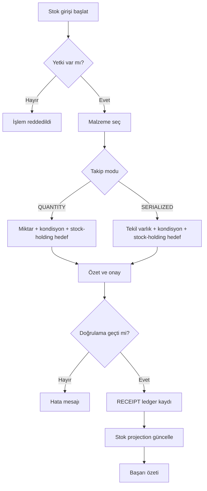
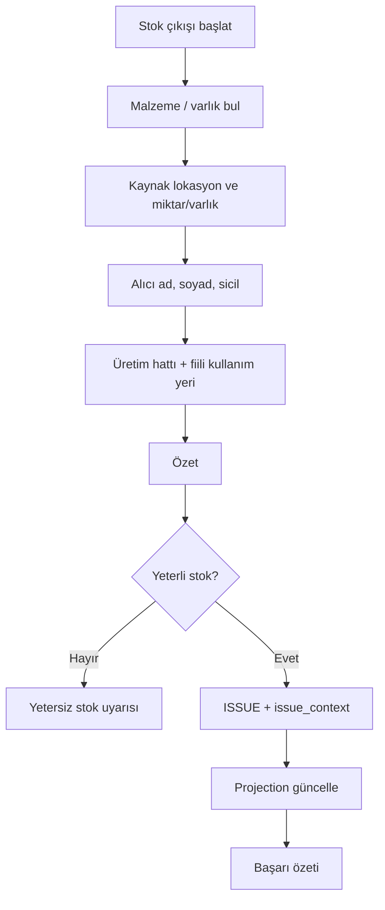
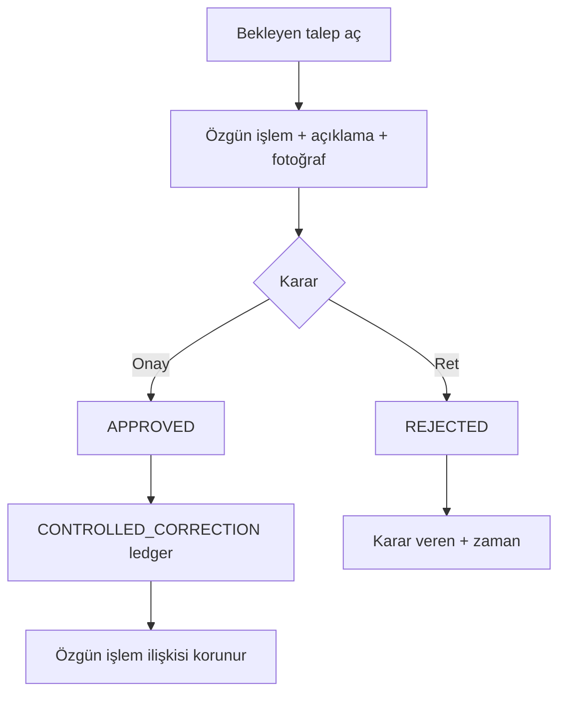
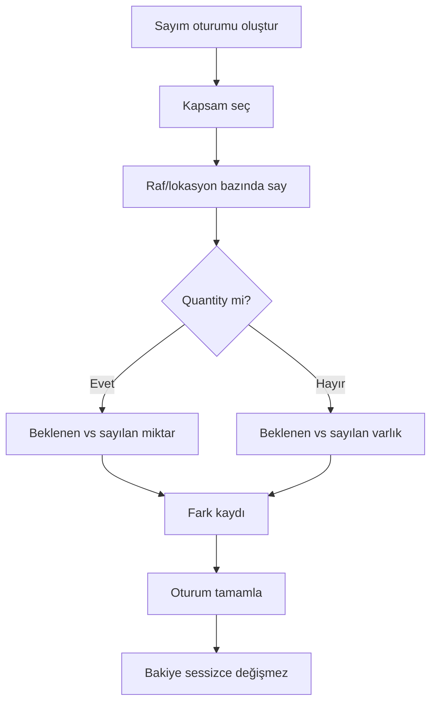
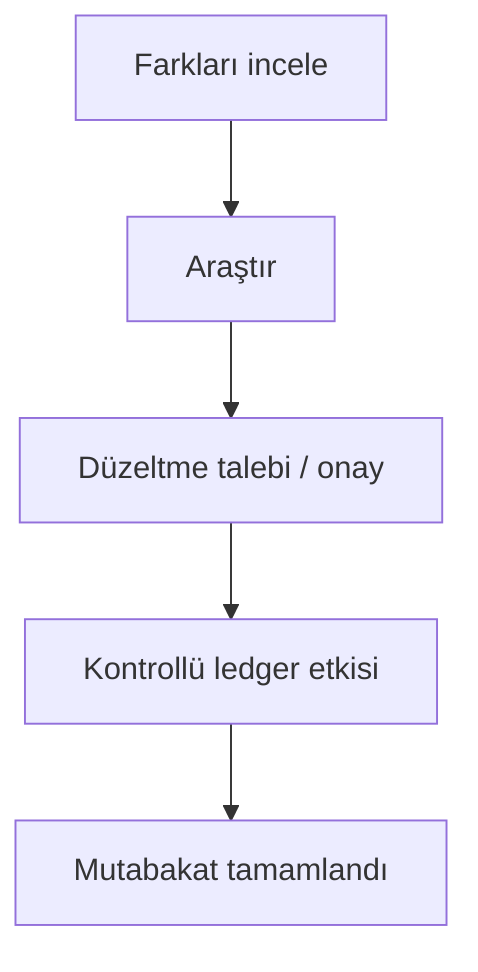

# User Flows — Elektrik Atölyesi Envanter ve Malzeme Takip Sistemi

## 1. Belge Amacı

Bu belge, `docs/00-PRODUCT.md`, `docs/01-BUSINESS-RULES.md`, `docs/02-DOMAIN-MODEL.md` ve `docs/03-DATA-MODEL.md` içindeki onaylı gereksinimleri operasyonel kullanıcı akışlarına dönüştürür. Amaç, sonraki UI, yetki, doğrulama, test ve kabul tasarımı için doğrudan girdi sağlamaktır.

Belge görsel mockup, ekran tasarımı, route, form veya uygulama kodu içermez. Onaylanmamış iş kuralları varsayımla uygulanmış gibi gösterilmez; açık `TBD` maddeleri korunur. Güncel karar durumları ve hard gate'ler için kanonik kayıt `docs/06-DECISION-REGISTER.md`dir.

## 2. Roller ve Aktörler

### Uygulama rolleri

| Rol | Kod | Özet yetki |
|---|---|---|
| Teknisyen | `TECHNICIAN` | Katalog/stok görüntüleme; olağan çıkış; uygun saha/atölye malzeme alım talebi başlatma (onay öncesi envanter etkisi yok; `DEC-020`); düzeltme talebi oluşturma; satın alma/tedarikçi teslimatı girişi ve otoritatif stok girişi yok |
| Depo Görevlisi | `STOREKEEPER` | Katalog görüntüleme; olağan giriş ve çıkış; operasyonel depo işleri (TBD); katalog ana veri yazma yok |
| Yönetici / Müdür | `ADMIN_MANAGER` | Katalog ana veri yönetimi; tam yönetim, düzeltme onayı, import ve cutover hazırlığı; baseline approval yetkisi TBD |

### Çalışan / teslim alan kişi

`Employee` (çalışan), malzemeyi teslim alan fabrika personelini temsil eder. `Application User` (uygulama kullanıcısı), sisteme giriş yapıp işlem kaydeden kişidir. Teslim alan kişi uygulama kullanıcısı olmak zorunda değildir; çıkış işleminde ad, soyad ve sicil numarası tarihsel snapshot olarak kaydedilir.

### Yetki uygulama kuralı

- UI'da yetkisiz işlemler gizlenmeli veya devre dışı bırakılmalıdır.
- Sunucu tarafı yetki kontrolü zorunludur; yalnızca UI kısıtı yeterli değildir.
- Yetkisiz istek stok, ledger veya master veriyi değiştirmemelidir.

## 3. Genel UX İlkeleri

1. **Fiziksel doğruluk önceliklidir:** Kullanıcı çıkışı kaydetmek için gereksiz adımlar azaltılabilir; zorunlu iş verisi kaldırılamaz.
2. **Quantity ve serialized ayrımı:** Aynı ekran akışı her iki takip modunu karıştırmamalıdır.
3. **Ledger disiplini:** Tamamlanmış işlem geçmişi düzenlenemez; hata düzeltme talebiyle ilerler.
4. **Anlık stok doğruluğu:** İşlem onayı öncesi güncel kullanılabilir stok gösterilir; yetersiz stokta anlaşılır hata verilir.
5. **Idempotency hazırlığı:** Envanter değiştiren işlemler `operation_id` ve server-generated `request_fingerprint` ile tekrar gönderilebilir; ikinci etki oluşmaz, conflicting payload reddedilir.
6. **Pasif/uygunsuz master veri:** Yeni operasyonlarda pasif malzeme/kondisyon veya `active && can_hold_stock` olmayan lokasyon seçilemez; geçmiş kayıtlar görüntülenebilir kalır.
7. **TBD görünür kalır:** Karar verilmemiş alanlar için placeholder veya varsayılan iş kuralı üretilmez.

## 4. Authentication Flows

### UF-AUTH-001 — Giriş

**Actors:** Tüm uygulama kullanıcıları (`TECHNICIAN`, `STOREKEEPER`, `ADMIN_MANAGER`)

**Preconditions**
- Kullanıcı hesabı oluşturulmuş ve aktif olmalıdır.
- Uygulama erişilebilir durumda olmalıdır.

**Trigger**
- Kullanıcı uygulamayı açar ve giriş ekranına gelir.

**Main Flow**
1. Kullanıcı kimlik bilgilerini girer.
2. Sistem kimlik doğrulaması yapar.
3. Başarılı girişte kullanıcı rolüne uygun ana ekrana yönlendirilir.
4. Kullanıcı yalnızca yetkili işlevlere erişebilir.

**Validation Rules**
- Kimlik bilgileri boş gönderilemez.
- Parola politikası bu belgede tanımlanmamıştır (**TBD**).

**Success Result**
- Oturum açılır; rol bazlı menü ve işlemler görünür.

**Failure / Alternate Flows**
- **Geçersiz kimlik bilgisi:** Giriş reddedilir; genel hata mesajı gösterilir; stok değişmez.
- **Pasif kullanıcı:** Giriş reddedilir; yönetici ile iletişim mesajı gösterilir.
- **Yetkisiz rol ataması:** Giriş sonrası korunan işlevler sunucu tarafında reddedilir.

**Permissions**
- Kimlik doğrulama tüm uygulama kullanıcıları için zorunludur.

**Inventory / Data Effect**
- Yok.

**Audit Effect**
- Başarısız/başarılı giriş denemelerinin audit düzeyi **TBD**; envanter ledger'ı etkilenmez.

**TBD / Open Decisions**
- SSO/LDAP, parola politikası, oturum süresi.

## 4.1 Access Management Flows (Phase 2.9B)

Onaylı politika: `DEC-022`. Bu akışlar generic IAM değildir; küçük uygulama yönetim UI'sını tanımlar.

### UF-ACC-001 — Rol ve Yetki Yönetimi

**Actors:** Django superuser veya `accounts.manage_access` taşıyan kullanıcı

**Preconditions**
- Actor oturum açmış olmalıdır.
- Actor `accounts.manage_access` yetkisine sahip olmalıdır (superuser doğal olarak sahiptir).

**Trigger**
- Actor Yönetim → Roller ve Yetkiler ekranını açar.

**Main Flow**
1. Actor rol listesini görüntüler.
2. Actor yeni custom rol oluşturabilir veya mevcut custom rolü yeniden adlandırabilir (bootstrap roller `TECHNICIAN`, `STOREKEEPER`, `ADMIN_MANAGER` yeniden adlandırılamaz).
3. Actor rol için yalnız onaylı dokuz güvenli catalog permission'ından (`view_*`/`add_*`/`change_*` for Category, UnitOfMeasure, Material) seçim yapar.
4. `add_*` veya `change_*` seçildiğinde karşılık gelen `view_*` sunucu tarafında zorunlu kalır.
5. Değişiklik kaydedildiğinde service anti-escalation kurallarını uygular; başarılı mutation ile birlikte `AuditEvent` oluşur.

**Validation Rules**
- Actor, sahip olmadığı catalog permission'ını role veremez (non-superuser).
- Actor, üye olduğu rolün adını/permission'larını değiştiremez (non-superuser).
- Actor, `accounts.manage_access` içeren rolü değiştiremez (non-superuser).
- `accounts.manage_access` yalnız superuser tarafından role verilebilir/alınabilir.
- Rol hard delete expose edilmez.

**Success Result**
- Rol oluşturulur/güncellenir; permission seti allowlist içinde kalır; audit kaydı oluşur.

**Failure / Alternate Flows**
- **Anti-escalation ihlali:** İşlem reddedilir; stok/ledger etkisi yok; başarılı mutation audit'i oluşmaz.
- **No-op:** Audit event oluşmaz.

**Permissions**
- `accounts.manage_access` zorunludur.

**Inventory / Data Effect**
- Yok.

**Audit Effect**
- Başarılı create/update/rename: `accounts.role.created` veya `accounts.role.updated`.
- Başarılı permission değişikliği: `accounts.role.permissions_changed`.
- Mutation ve audit aynı transaction içindedir.

### UF-ACC-002 — Kullanıcı Rol Ataması

**Actors:** Django superuser veya `accounts.manage_access` taşıyan kullanıcı

**Preconditions**
- Actor oturum açmış olmalıdır.
- Actor `accounts.manage_access` yetkisine sahip olmalıdır.

**Trigger**
- Actor Yönetim → Kullanıcılar ekranını açar.

**Main Flow**
1. Actor kullanıcı listesini görüntüler.
2. Actor hedef kullanıcının `User.groups` üyeliklerini günceller.
3. Direct `user_permissions` read-only görüntülenir; düzenlenmez.
4. Başarılı değişiklikte `accounts.user.roles_changed` audit event'i oluşur.

**Validation Rules**
- Actor kendi rol üyeliklerini değiştiremez (non-superuser).
- Actor superuser, `is_staff`, direct `user_permissions` taşıyan veya effective catalog permission kümesi actor'ı aşan kullanıcıyı değiştiremez (non-superuser).
- Actor `accounts.manage_access` içeren rolü atayamaz/kaldıramaz (non-superuser).
- Password, `is_active`, `is_staff`, `is_superuser` ve Employee linkage bu UI'dan yönetilmez.
- Superuser hedefinin kendisi bu UI üzerinden düzenlenmez.

**Success Result**
- Kullanıcı–rol ataması güncellenir; audit kaydı oluşur.

**Failure / Alternate Flows**
- **Anti-escalation ihlali:** İşlem reddedilir; başarılı mutation audit'i oluşmaz.

**Permissions**
- `accounts.manage_access` zorunludur.

**Inventory / Data Effect**
- Yok.

**Audit Effect**
- Başarılı rol atama değişikliği: `accounts.user.roles_changed`.

**TBD / Open Decisions**
- Kullanıcı hesabı oluşturma/parola yönetimi bu akışın dışındadır.
- Employee–ApplicationUser ilişkisi `DEC-HG-004` altında açıktır.

## 5. Stock Viewing and Search

### UF-STK-001 — Stok Görüntüleme

**Actors:** `TECHNICIAN`, `STOREKEEPER`, `ADMIN_MANAGER`

**Preconditions**
- Kullanıcı oturum açmış olmalıdır.

**Trigger**
- Kullanıcı malzeme/stok listesini veya detayını açar.

**Main Flow**
1. Kullanıcı malzeme listesini açar.
2. Arama/filtre uygular (kod, ad, kategori vb.).
3. Bir malzeme seçer.
4. Sistem takip moduna göre görünüm sunar:
   - **QUANTITY:** Lokasyon ve kondisyon bazında miktar tablosu.
   - **SERIALIZED:** Tekil varlık listesi (kimlik, kondisyon, mevcut lokasyon).
5. Minimum stok durumu gösterilir (hesap kapsamı **TBD**).
6. Son işlemler listelenir.

**Validation Rules**
- Yalnızca yetkili kullanıcılar stok verisine erişebilir.

**Success Result**
- Malzeme, güncel stok projection'ı ve geçmiş özet bilgisi görüntülenir.

**Failure / Alternate Flows**
- Sonuç bulunamadı: Boş liste ve bilgilendirme.
- Yetki yok: UF-ERR-001.

**Permissions**
- AUTH-002, AUTH-006, AUTH-009.

**Inventory / Data Effect**
- Salt okunur.

**Audit Effect**
- Salt okuma audit'i **TBD**; ledger değişmez.

**TBD / Open Decisions**
- Minimum stok aggregation kapsamı; düşük stok görünürlük eşiği.

### UF-STK-002 — Malzeme Arama

**Actors:** `TECHNICIAN`, `STOREKEEPER`, `ADMIN_MANAGER`

**Preconditions**
- Oturum açık.

**Trigger**
- Kullanıcı arama kutusuna veya filtre alanına değer girer.

**Main Flow**
1. Kullanıcı arama kriteri girer.
2. Sistem desteklenen alanlarda arar.
3. Sonuç listesi gösterilir; kullanıcı detaya gider.

**Validation Rules**
- Onaylı arama alanları: malzeme kodu, ad, marka, model, tekil varlık tanımlayıcısı.
- Teknik nitelik (`technical_specs`) araması gelecekte desteklenebilir; kesin davranış **TBD**.

**Success Result**
- Eşleşen malzeme veya tekil varlık bulunur.

**Failure / Alternate Flows**
- Sonuç yok: Bilgilendirme mesajı.
- Pasif malzeme: Görüntülenebilir; yeni işlemde seçilemez (UF-ERR-004).

**Permissions**
- Stok görüntüleme yetkisi.

**Inventory / Data Effect**
- Yok.

**Audit Effect**
- Yok.

**TBD / Open Decisions**
- JSONB teknik nitelik arama kapsamı.

## 6. Receipt Flows

### UF-RCV-001 — Stok Girişi

**Actors:** `STOREKEEPER`, `ADMIN_MANAGER`

**Preconditions**
- Malzeme aktif.
- Hedef lokasyon `active = true` ve `can_hold_stock = true`.
- Kullanıcı giriş yetkisine sahip.

**Trigger**
- Kullanıcı "Stok Girişi" işlemini başlatır.

**Main Flow**
1. Kullanıcı `RECEIPT` işlemini seçer.
2. Malzemeyi tanımlar (arama, kod veya QR).
3. Sistem takip modunu gösterir.
4. Kondisyon seçilir.
5. Hedef depolama lokasyonu seçilir.
6. **QUANTITY:** Geçerli birimde miktar girilir.
7. **SERIALIZED:** Tekil varlık tanımlanır veya seçilir (zorunlu tanımlayıcılar **TBD**).
8. Özet ekranı gösterilir.
9. Kullanıcı onaylar.
10. Sistem `operation_id` ile ledger kaydı oluşturur.
11. `stock_balances` veya `serialized_assets` projection güncellenir.
12. Başarı özeti/referans gösterilir.

**Validation Rules**
- RCV-001, RCV-004: Takip moduna uygun veri ve `active && can_hold_stock` hedef lokasyon.
- Miktar > 0 ve malzeme birimine uygun.
- Pasif malzeme/lokasyon veya stok tutma yeteneği olmayan hedef reddedilir.
- Duplicate `operation_id` ikinci stok etkisi oluşturmaz.

**Success Result**
- `RECEIPT` transaction kaydedilir; stok artar veya tekil varlık lokasyona yerleşir.

**Failure / Alternate Flows**
- Teknisyen denerse: UF-ERR-001 (AS-006).
- Geçersiz miktar, eksik serialized kimlik, pasif master veri, duplicate retry.

**Permissions**
- RCV-001; Teknisyen reddedilir (RCV-002).

**Inventory / Data Effect**
- `inventory_transactions` + satırlar; quantity için `stock_balances`; serialized için asset state.

**Audit Effect**
- Acting user, `occurred_at`, işlem detayı ledger'da.

**TBD / Open Decisions**
- Serialized zorunlu tanımlayıcılar; yeni asset oluşturma alanları.

### UF-INT-001 — Saha / Atölye Malzeme Alım Talebi

**Actors:** `TECHNICIAN`

**Preconditions**
- Kullanıcı oturum açmış ve talep başlatma yetkisine sahip olmalıdır (`AUTH-003A`).
- Senaryo satın alma/tedarikçi `RECEIPT` değildir (`RCV-002`).

**Trigger**
- Teknisyen, sahadan veya sahada kullanılan alandan atölyeye fiziksel getirilen malzeme için alım talebi başlatır.

**Main Flow**
1. Teknisyen alım talebi işlemini seçer.
2. Malzeme ve getirme bağlamı girilir (takip moduna uygun tanımlama; zorunlu alanlar workflow implementasyonunda netleşir).
3. Destekleyici bilgi/kanıt toplanır (detay **TBD**; düzeltme fotoğrafı kurallarıyla karıştırılmaz).
4. Teknisyen talebi gönderir.
5. Talep `PENDING` durumuna geçer ve Yönetici/Müdür onay kuyruğuna düşer.

**Validation Rules**
- INT-001, INT-002, INT-003: Talep gönderimi otoritatif envanter etkisi oluşturmamalıdır.
- Satın alma/tedarikçi kabulü denemesi reddedilir (`RCV-002`).

**Success Result**
- Talep kaydı oluşur; envanter projection değişmez.

**Failure / Alternate Flows**
- Yetkisiz kullanıcı: UF-ERR-001.
- Eksik/hatalı veri: Hata mesajı; stok değişmez.

**Permissions**
- AUTH-003A; Depo Görevlisi ve Yönetici/Müdür bu akışın başlatıcısı değildir (onay UF-INT-002).

**Inventory / Data Effect**
- Bekleyen talep sırasında `inventory_transactions`, `stock_balances` ve `serialized_assets` değişmez (`INT-003`).

**Audit Effect**
- Talep oluşturma actor ve zamanı kaydedilir; onaylanmış envanter etkisi henüz yoktur.

**TBD / Open Decisions**
- Talep formu, kanıt gereksinimleri ve workflow modeli implementasyon öncesi tanımlanır.
- Kavramsal senaryolar (hareket türü eşlemesi yapılmaz): tamamen kullanılmamış geri getirme; kısmen kullanılmamış geri getirme; yanlış alınmış kullanılmamış iade; kullanılmış/sökülmüş malzeme; arızalı/sökülmüş malzeme; orijinal depo `ISSUE` kaydı bilinmeyen fabrika sahası malzemesi.
- `DEC-HG-005` RETURN semantiği, uygunluk, miktar limiti, tekil kimlik, provenans ve kondisyon geçişleri açık kalır (`INT-006`).

### UF-INT-002 — Saha / Atölye Malzeme Alım Onayı

**Actors:** `ADMIN_MANAGER`

**Preconditions**
- Bekleyen bir alım talebi mevcut olmalıdır.
- Karar veren kullanıcı Yönetici/Müdür olmalıdır (`AUTH-012`).

**Trigger**
- Yönetici/Müdür onay kuyruğundan talebi açar.

**Main Flow**
1. Yönetici/Müdür talep detayını ve kanıtı inceler.
2. Onay veya red kararı verir.
3. **Onay:** Talep onaylanır; envanter etkisi yalnızca gelecekteki otoritatif envanter servisi üzerinden atomik ve idempotent olarak uygulanır (`INT-005`).
4. **Red:** Talep reddedilir; envanter etkisi oluşmaz; talep ve kanıt tarihsel iz için korunur (`INT-004`).

**Validation Rules**
- INT-002, INT-004, INT-005.
- Onay anında `RETURN`, `RECEIPT`, `TRANSFER` veya `CONTROLLED_CORRECTION` semantiğine önceden bağlanmaz.

**Success Result**
- Karar kaydedilir; bekleyen talep durumu güncellenir.

**Failure / Alternate Flows**
- Yetkisiz kullanıcı: UF-ERR-001.
- Eşzamanlı çift onay: Yalnızca bir karar geçerli olmalıdır (implementasyon detayı **TBD**).

**Permissions**
- AUTH-012; Teknisyen karar veremez.

**Inventory / Data Effect**
- **Beklemede / red:** Yok (`INT-003`, `INT-004`).
- **Onay:** Ledger/projection etkisi yalnızca yetkili envanter servisi commit'i ile oluşur; bu belge hareket türünü seçmez.

**Audit Effect**
- Karar actor'ı, zamanı ve talep ilişkisi kaydedilir.

**TBD / Open Decisions**
- Onay sonrası envanter servis çağrısı ve hareket türü eşlemesi `DEC-HG-005` ve ilgili hard gate'ler çözülene kadar implement edilmez.

## 7. Issue Flows

### UF-ISS-001 — Stok Çıkışı

**Actors:** `TECHNICIAN`, `STOREKEEPER`, `ADMIN_MANAGER`

**Preconditions**
- Kaynak lokasyonda yeterli kullanılabilir stok veya seçilen tekil varlık mevcut.
- Malzeme aktif; kaynak lokasyon `active = true` ve `can_hold_stock = true`.

**Trigger**
- Kullanıcı "Stok Çıkışı" işlemini başlatır.

**Main Flow**
1. Malzeme/tekil varlık bulunur (arama veya QR).
2. Kaynak lokasyon seçilir (quantity için stok satırı, serialized için mevcut lokasyon).
3. **QUANTITY:** Miktar girilir.
4. **SERIALIZED:** Tekil varlık seçilir.
5. Teslim alan kişi bilgileri girilir veya seçilir:
   - Ad
   - Soyad
   - Çalışan sicil numarası
6. Üretim hattı girilir.
7. Fiili kullanım yeri girilir.
8. Özet gösterilir; sistem işlem zamanı kullanıcı tarafından düzenlenemez.
9. Kullanıcı onaylar.
10. Sistem mevcut stok doğrulaması yapar.
11. `ISSUE` ledger ve `issue_contexts` kaydı oluşturulur.
12. Projection güncellenir; başarı özeti gösterilir.

**Validation Rules**
- ISS-002–ISS-009: Tüm zorunlu alanlar dolu.
- `occurred_at` sistem kaydı; normal kullanıcı değiştiremez.
- Yetersiz stok, sıfır stok, yanlış lokasyondaki serialized asset reddedilir.

**Success Result**
- Çıkış kaydedilir; stok azalır veya tekil varlık çıkarılır.

**Failure / Alternate Flows**
- Eksik alıcı/üretim hattı/kullanım yeri.
- Yetersiz stok, eşzamanlı tüketim (UF-ERR-003).
- Pasif malzeme/lokasyon, yetki reddi, duplicate retry.

**Permissions**
- ISS-001.

**Inventory / Data Effect**
- `inventory_transactions`, `inventory_transaction_lines`, `issue_contexts`; projection azalır.

**Audit Effect**
- Acting user, sistem zamanı, alıcı snapshot'ları ledger/context'te.

**TBD / Open Decisions**
- `DEC-HG-003`: Üretim hattının controlled reference list veya başka onaylı yapısı ISSUE data/UI başlamadan seçilmelidir; gerçek hatlar uydurulamaz.
- `DEC-HG-004`: Employee seçimi/manuel giriş, sicil uniqueness/reuse ve user linkage accounts/import matching öncesi çözülmelidir.
- Fiili kullanım yeri warehouse `Location`dan ayrı kalır ve iş sahibi başka model onaylayana kadar text olabilir.

### UF-ISS-002 — Hızlı Çıkış

**Actors:** Öncelikle `TECHNICIAN`; aynı yetkili roller çıkış yapabilir.

**Preconditions**
- UF-ISS-001 ile aynı iş kuralları.

**Trigger**
- QR tarama veya malzeme detayından "Hızlı Çıkış".

**Main Flow**
1. Malzeme QR ile veya listeden açılır.
2. Kaynak stok önceden filtrelenmiş gösterilir.
3. Zorunlu alanlar tek akışta toplanır (alıcı, üretim hattı, kullanım yeri).
4. Onay ve ledger kaydı UF-ISS-001 ile aynı doğrulamalara tabidir.

**Validation Rules**
- UF-ISS-001 ile aynı; hiçbir zorunlu alan kaldırılamaz.

**Success Result**
- Normal çıkış ile eşdeğer `ISSUE` kaydı.

**Failure / Alternate Flows**
- UF-ISS-001 ile aynı.

**Permissions**
- ISS-001.

**Inventory / Data Effect**
- UF-ISS-001 ile aynı.

**Audit Effect**
- UF-ISS-001 ile aynı.

**TBD / Open Decisions**
- Mobil/QR giriş zamanlaması V1 kapsamında; offline sync V1 dışı.

## 8. Return Flows

### UF-RET-001 — İade

> **HARD GATE — `DEC-HG-005`:** Bu akış iş ihtiyacını gösterir; prior ISSUE, partial quantity, returned condition authority, serialized state ve sistemde issue edilmemiş material davranışları karara bağlanmadan schema/service/UI olarak implement edilemez ve aktif menüde sunulamaz.

**Actors:** Kesin rol listesi **TBD**; muhtemel: `STOREKEEPER`, `ADMIN_MANAGER`

**Preconditions**
- İade edilebilirlik doğrulanmış olmalıdır (**TBD**).
- Hedef lokasyon ve kondisyon belirlenebilir olmalıdır.

**Trigger**
- Kullanıcı "İade" işlemini başlatır.

**Main Flow**
1. İade edilen malzeme veya tekil varlık tanımlanır.
2. Miktar veya varlık seçilir.
3. Hedef lokasyon seçilir (**TBD** kuralları).
4. Kondisyon seçilir (**TBD** etkisi).
5. Önceki çıkış ile ilişki kurulur (**TBD**).
6. Özet ve onay.
7. Hard gate çözüldükten sonra legal source/target kombinasyonuyla `RETURN` ledger kaydı oluşturulur.
8. Projection atomik güncellenir.

**Validation Rules**
- RET-001–RET-003: İade ledger üzerinden; her çıkış otomatik iade edilebilir değildir.

**Success Result**
- İade işlemi kayıtlı ve izlenebilir.

**Failure / Alternate Flows**
- İade uygun değil: Red ve açıklama.
- Yetki, pasif lokasyon, eksik veri.

**Permissions**
- **TBD** (RET-004).

**Inventory / Data Effect**
- `RETURN` transaction; stok/lokasyon/kondisyon etkisi iş kararına bağlı.

**Audit Effect**
- Ledger kaydı.

**TBD / Open Decisions**
- `DEC-HG-005`: Prior ISSUE zorunluluğu, partial return, kondisyonu belirleyen aktör, serialized current-state ve wrong-delivery/found material davranışı.
- İade yetkileri.

## 9. Transfer Flows

### UF-TRF-001 — Lokasyonlar Arası Transfer

**Actors:** Transfer yetkisi **TBD**; muhtemel: `STOREKEEPER`, `ADMIN_MANAGER`

**Preconditions**
- Kaynak != hedef.
- Kaynakta yeterli stok veya doğru serialized asset.
- Kaynak ve hedef lokasyon `active = true` ve `can_hold_stock = true`.

**Trigger**
- Kullanıcı "Transfer" işlemini başlatır.

**Main Flow**
1. Malzeme veya tekil varlık seçilir.
2. Kaynak lokasyon seçilir.
3. Hedef lokasyon seçilir.
4. Quantity için miktar girilir.
5. Özet ve onay.
6. `TRANSFER` ledger kaydı oluşturulur.
7. Kaynak azalır, hedef artar; serialized asset tek lokasyonda kalır.

**Validation Rules**
- TRF-002–TRF-004: Source her zaman azaltır, target her zaman artırır; ikisi stock-holding lokasyon olmalı, kaynak negatife düşmemeli ve source != target olmalıdır.

**Success Result**
- Tek izlenebilir transfer işlemi tamamlanır.

**Failure / Alternate Flows**
- Yetersiz kaynak, pasif hedef, aynı kaynak/hedef, yetki reddi, eşzamanlı tüketim.

**Permissions**
- **TBD** (TRF-005).

**Inventory / Data Effect**
- `TRANSFER` transaction; iki lokasyon projection güncellemesi.

**Audit Effect**
- Ledger kaydı.

**TBD / Open Decisions**
- Transfer senaryoları ve yetkili roller.

## 10. Correction Flows

### UF-COR-001 — Düzeltme Talebi

**Actors:** İşlemi yapan veya hatayı tespit eden yetkili kullanıcı (`TECHNICIAN`, `STOREKEEPER`, `ADMIN_MANAGER` — talep hakkı COR-002)

**Preconditions**
- Hedef tamamlanmış transaction mevcut.
- Kullanıcı talep oluşturma yetkisine sahip.

**Trigger**
- Kullanıcı işlem detayında "Düzeltme Talebi" seçer.

**Main Flow**
1. Özgün işlem açılır.
2. Kullanıcı açıklama girer.
3. Güncel destekleyici fotoğraf yükler.
4. Talebi gönderir.
5. Talep `PENDING` olur.

**Validation Rules**
- COR-003–COR-005: Talep eden, açıklama ve fotoğraf zorunlu.
- `PENDING` talep stok değiştirmez (COR-006).
- Sensitive fotoğraf public media URL ile sunulmaz; correction object permission'ı kontrol edilen application path üzerinden erişilir.

**Success Result**
- `correction_requests` kaydı oluşturulur; özgün işlem değişmez.

**Failure / Alternate Flows**
- Açıklama/fotoğraf eksik, yetki yok, geçersiz işlem.

**Permissions**
- COR-002, AUTH-004.

**Inventory / Data Effect**
- Yok (onay öncesi).

**Audit Effect**
- Talep, talep eden, `requested_at` kaydedilir.

**TBD / Open Decisions**
- Fotoğraf formatı, boyut, güncellik ölçütü.

### UF-COR-002 — Düzeltme Onayı / Reddi

**Actors:** `ADMIN_MANAGER`

**Preconditions**
- Talep `PENDING` durumda.

**Trigger**
- Yönetici düzeltme kuyruğunu açar.

**Main Flow**
1. Bekleyen talepler listelenir.
2. Yönetici talebi açar; özgün işlem, açıklama ve fotoğraf incelenir.
3. Onay veya ret kararı verilir.
4. **Onay:** Kontrollü düzeltme ledger etkisi oluşturulur; özgün işlem korunur.
5. **Ret:** Talep `REJECTED`; karar veren ve zaman kaydedilir.

**Validation Rules**
- COR-007–COR-009: Yalnızca Yönetici/Müdür karar verir.
- Aynı `PENDING` talep iki kez onaylanamaz (eşzamanlılık kilidi).
- Ret gerekçesi **PROPOSED** zorunluluktur; onaylı değil.

**Success Result**
- Onayda stok etkisi kontrollü şekilde uygulanır; rette stok değişmez.

**Failure / Alternate Flows**
- Yetkisiz kullanıcı, zaten karar verilmiş talep, eşzamanlı çift onay.

**Permissions**
- COR-007, AUTH-010.

**Inventory / Data Effect**
- Onay: `CONTROLLED_CORRECTION` transaction.
- Ret: Yok.

**Audit Effect**
- Karar veren, `decided_at`, talep–sonuç bağlantısı.

**TBD / Open Decisions**
- `DEC-HG-002`: Tek/cumulative approval, partial correction, original-line reference, over-correction, correction after later movement, correction-of-correction, requester=approver ve yetersiz current stock. Bu kararlar correction schema/service başlamadan çözülmelidir.
- Ret gerekçesi zorunluluğu yalnız `PROPOSED`dır.

### UF-HIS-001 — İşlem Geçmişi Görüntüleme

**Actors:** Yetkili kullanıcılar (AUTH-006)

**Preconditions**
- Oturum açık.

**Trigger**
- Kullanıcı işlem geçmişi ekranını açar.

**Main Flow**
1. Tarih, malzeme, kullanıcı, lokasyon, işlem türü filtreleri uygulanır.
2. Liste gösterilir.
3. Detay açılır: referans, tür, zaman, aktör, satırlar, issue context, düzeltme bağlantıları.
4. Normal kullanıcı düzenleme/silme yapamaz.

**Validation Rules**
- AUD-005, AUD-006.

**Success Result**
- Denetlenebilir geçmiş görüntülenir.

**Failure / Alternate Flows**
- Yetki yok; sonuç yok.

**Permissions**
- AUTH-006.

**Inventory / Data Effect**
- Yok.

**Audit Effect**
- Salt okuma.

**TBD / Open Decisions**
- Rapor dönem sınırları.

## 11. Master Data Flows

### UF-MST-001 — Malzeme Ana Veri Yönetimi

**Actors:** `ADMIN_MANAGER` (Depo Görevlisi yetkisi **TBD**)

**Preconditions**
- Yönetici yetkisi.

**Trigger**
- Malzeme oluşturma/düzenleme/pasifleştirme.

**Main Flow**
1. Yeni malzeme oluştur veya mevcut malzemeyi düzenle.
2. Kategori, birim, takip modu, minimum stok, teknik nitelikler girilir.
3. Kayıt kaydedilir veya malzeme pasifleştirilir.
4. Hard delete normal akış değildir.

**Validation Rules**
- AUTH-005: Teknisyen yapamaz.
- Inventory ledger history varsa takip modu normal edit ile değiştirilemez (`DEC-013`).
- `material_code` benzersizliği **TBD**.

**Success Result**
- Master veri güncellenir; yeni işlemler yeni tanımı kullanır.

**Failure / Alternate Flows**
- Yetki reddi, benzersizlik ihlali, geçersiz takip modu değişikliği.

**Permissions**
- AUTH-009; Teknisyen reddedilir.

**Inventory / Data Effect**
- Master tablo; mevcut ledger değişmez.

**Audit Effect**
- `audit_events` ile ana veri değişikliği.

**TBD / Open Decisions**
- Storekeeper yetkisi; tracking mode change; code uniqueness.

### UF-MST-002 — Lokasyon Yönetimi

**Actors:** Yazma: `ADMIN_MANAGER`. Görüntüleme: `locations.view_location` (varsayılan şablonlarda `TECHNICIAN`/`STOREKEEPER`/`ADMIN_MANAGER` için düşünülebilir; `setup_roles` mevcut Group'lara sessizce izin eklemez).

**Preconditions**
- Yönetim shell erişimi ve ilgili Location permission.

**Trigger**
- Lokasyon oluşturma/düzenleme/pasifleştirme/yeniden aktifleştirme.

**Main Flow**
1. Lokasyon oluştur veya düzenle.
2. Kod, ad, üst lokasyon ve explicit `can_hold_stock` capability atanır. `location_type` zorunlu değildir.
3. Dinamik recursive hiyerarşi korunur; sabit warehouse/shelf enum yoktur.
4. Pasifleştirme/yeniden aktifleştirme yapılır. Yetkili envanter varken non-zero stock pasifleştirilemez ve `can_hold_stock` True→False yapılamaz (`DEC-023`); stok önce sıfırlanmalıdır.

**Validation Rules**
- Kendine parent olamaz; descendant/cycle parenting servis katmanında engellenir.
- Kod: required, trim, blank yasak, globally unique, case-sensitive, regex/forced case yok.
- Ad: required, trim, non-unique.
- Yeni stok için lokasyon `active && can_hold_stock` olmalıdır; `can_hold_stock` leaf/child/name/depth/type'tan türetilmez. Default `False`.
- Parent status children'a cascade etmez.
- Hard delete yoktur.

**Success Result**
- Lokasyon master güncellenir.

**Failure / Alternate Flows**
- Çevrimsel hiyerarşi, stoklu pasifleştirme/capability değişikliği engeli, yetki reddi.

**Permissions**
- `locations.view_location`, `locations.add_location`, `locations.change_location` (`DEC-022` item 13, `DEC-023`). `add`/`change` `view` gerektirir. `delete` expose edilmez.

**Inventory / Data Effect**
- Master tablo; geçmiş referanslar korunur. Phase 3.0/3.1 stok logic implement etmez.

**Audit Effect**
- `locations.location.created` / `.updated` / `.deactivated` / `.reactivated`; canonical identity Location UUID.

**TBD / Open Decisions**
- Inventory entegrasyonu aynı stocked-location invariant'ını otoritatif uygulamak zorundadır. `ProductionLine` ve `Employee` bu akışta yoktur.

## 12. Physical Count and Reconciliation

> **HARD GATE — `DEC-HG-001`:** Aşağıdaki akışlar gereksinim seviyesindedir. Scoped temporary freeze, as-of snapshot + post-snapshot movement replay veya concurrent movement altında güvenliği kanıtlanmış revalidation/reconfirmation stratejilerinden biri seçilmeden count/reconciliation schema, service veya UI implementation başlayamaz.

### UF-CNT-001 — Fiziksel Sayım Oturumu

**Actors**
- Sayım yapan kullanıcı: **TBD**
- Yönetici rolleri: **TBD**

**Preconditions**
- Sayım kapsamı tanımlanabilir.
- Sayım, staging-only candidate/count reference ile hazırlanan cutover öncesi kapsamda veya yetkili sistem stoğunda yapılabilir; candidate data stok değildir.

**Trigger**
- Yeni fiziksel sayım oturumu oluşturulur.

**Main Flow**
1. Sayım oturumu açılır; kapsam (lokasyon/alan) seçilir.
2. Raf/lokasyon bazında sayım yapılır.
3. **QUANTITY:** Beklenen ve sayılan miktar girilir; fark hesaplanır.
4. **SERIALIZED:** Beklenen varlık var/yok ve gözlemlenen durum kaydedilir.
5. Oturum tamamlanır; farklar listelenir.
6. Stok projection doğrudan değiştirilmez.

**Validation Rules**
- CNT-001–CNT-003: Fark kaydedilir; sessiz overwrite yok.
- Count scope explicit olmalı ve expected value'nun hangi zamana ait olduğu hard gate kararıyla tanımlanmalıdır.

**Success Result**
- `physical_count_sessions` ve satırlar kayıtlı; farklar görünür.

**Failure / Alternate Flows**
- Yetki yok, geçersiz kapsam, eksik sayım satırı.

**Permissions**
- **TBD**.

**Inventory / Data Effect**
- Sayım satırları; ledger/bakiye değişmez.

**Audit Effect**
- Sayım aktörü ve zamanları.

**TBD / Open Decisions**
- `DEC-HG-001`: Açık session sırasında normal stock movement ile expected state ilişkisi.
- Sayım sıklığı, sorumlular, tolerans.

### UF-CNT-002 — Mutabakat

**Actors:** Yetkili yönetici rolleri **TBD**

**Preconditions**
- Tamamlanmış sayım oturumu ve kayıtlı farklar.

**Trigger**
- Mutabakat ekranı açılır.

**Main Flow**
1. Farklar incelenir.
2. Gerekirse araştırma yapılır.
3. Yetkili kullanıcı düzeltme talebi veya kontrollü düzeltme sürecini başlatır.
4. Expected current state lock altında yeniden doğrulanır; onaylı düzeltme/baseline ledger etkisi idempotent oluşturulur.
5. Oturum mutabakat durumu güncellenir.

**Validation Rules**
- CNT-004–CNT-005: Fark yalnızca yetkili düzeltme ile stok etkisine dönüşür.
- Aynı session/line iki kez reconcile edilemez; double-apply lifecycle lock ve idempotency guard ile engellenir.
- Serialized missing/unexpected/wrong-location varlıkların çözümü izlenebilir kalmalıdır.

**Success Result**
- Farklar izlenebilir biçimde çözülür.

**Failure / Alternate Flows**
- Onay yetkisi yok, düzeltme reddi, tolerans dışı fark (**TBD**).

**Permissions**
- **TBD**.

**Inventory / Data Effect**
- Onaylı düzeltme veya baseline adımı sonrası projection güncellenir.

**Audit Effect**
- Fark, talep, karar ve sonuç zinciri.

**TBD / Open Decisions**
- `DEC-HG-001` stability strategy; onay seviyeleri, tolerans, tamamlanma ölçütü.

## 13. Excel Import and Cutover

### UF-IMP-001 — Excel İçe Aktarım

**Actors:** `ADMIN_MANAGER`

**Preconditions**
- Excel dosyası hazır.
- Kullanıcı import yetkisine sahip.

**Trigger**
- "Excel İçe Aktar" işlemi.

**Main Flow**
1. Dosya yüklenir; `import_batches` oluşturulur.
2. Satırlar parse edilir (`import_rows`).
3. Doğrulama çalışır: geçerli, uyarı, hata.
4. Kullanıcı eşleme ve hataları inceler.
5. Ön izleme gösterilir.
6. Kontrollü master-data commit yapılır; doğrulanmış `Material`/`Category`/`Location` kayıtları ve outcome metadata oluşturulabilir.
7. Imported quantity yalnız `ImportRow.mapped_data` veya eşdeğer staging count-reference data olarak kalır.
8. Import commit'i `StockBalance` veya stok değiştiren `InventoryTransaction` oluşturmaz.

> **CANDIDATE INVENTORY IS NOT LEDGER DATA AND IS NOT STOCK.**

```mermaid
flowchart LR
    Excel["Excel dosyası"] --> Upload["ImportBatch"]
    Upload --> Validate["Satır doğrulama"]
    Validate --> Preview["Ön izleme"]
    Preview --> Commit["Kontrollü commit"]
    Commit --> Candidate["Staging-only candidate/count reference"]
    Candidate --> Count["Fiziksel sayım"]
    Count --> Reconcile["Mutabakat"]
    Reconcile --> Baseline["InventoryBaseline"]
    Baseline --> Initial["Scoped INITIAL_BALANCE işlemleri"]
    Initial --> Live["Yetkili stok"]
```

**Validation Rules**
- IMP-001–IMP-005: Excel doğrulanmadan yetkili kabul edilmez.
- Commit, authoritative inventory tablolarında sıfır stock etkisi üretir.

**Success Result**
- Staging kayıtları, doğrulama sonuçları, controlled master-data outcomes ve non-stock count reference data görünür.

**Failure / Alternate Flows**
- Dosya formatı hatası, satır hataları, commit yetkisi yok, duplicate batch checksum.

**Permissions**
- AUTH-009.

**Inventory / Data Effect**
- Staging ve kontrollü master data; import commit'inde `StockBalance` ve stock-changing ledger etkisi **yoktur**. Açılış stoğu yalnız baseline sonrası scoped `INITIAL_BALANCE` ile oluşur.

**Audit Effect**
- Import actor, zaman, validation summary.

**TBD / Open Decisions**
- Excel şeması, alan eşlemeleri, hata çözüm süreci.

### UF-BASE-001 — Envanter Baseline / Go-Live

**Actors:** `ADMIN_MANAGER` (onaylayan rol **TBD**)

**Preconditions**
- Import staging/count-reference data, fiziksel sayım ve mutabakat tamamlanmış veya tamamlanmak üzere; staging data stok değildir.

**Trigger**
- "Baseline oluştur / Sistemi yetkili yap" işlemi.

**Main Flow**
1. İlgili import batch ve count session incelenir.
2. Mutabakat onayı verilir (**TBD** yetkili).
3. `inventory_baselines` kaydı oluşturulur.
4. Count/cutover scope'larına göre bir veya daha çok idempotent `INITIAL_BALANCE` ledger işlemi oluşturulur ve baseline-owned linklerle bağlanır.
5. Her scope commit edildikten sonra projection-ledger doğrulaması yapılır.
6. Tüm gerekli scope'lar başarıyla tamamlandığında baseline `ESTABLISHED` olur ve sistem stoğu yetkili kaynak ilan edilir.

**Validation Rules**
- IMP-005, CNT-006: Mutabakat onayı olmadan otorite devri yapılamaz.
- Aynı cutover context için en fazla bir authoritative `ESTABLISHED` baseline olabilir.
- Scope retry'ı aynı başlangıç stoğunu ikinci kez oluşturamaz.

**Success Result**
- Go-live stok otoritesi başlar.

**Failure / Alternate Flows**
- Eksik mutabakat, yetki yok, duplicate baseline attempt.

**Permissions**
- **TBD** onay yetkisi; muhtemel `ADMIN_MANAGER`.

**Inventory / Data Effect**
- Bir `inventory_baselines` kaydı, `1..N` scoped `INITIAL_BALANCE` transaction ve downstream-owned links; projection her scope'ta ledger ile atomik güncellenir.

**Audit Effect**
- Cutover kararı, actor, zaman.

**TBD / Open Decisions**
- Baseline onaylayan rol; tamamlanma ölçütü.

## 14. QR / Barcode Flows

### UF-QR-001 — Malzeme QR

**Actors:** Yetkili kullanıcılar

**Preconditions**
- Malzeme için aktif barcode identifier tanımlı.
- Authenticated resolver neutral `identification` boundary'sinde çalışır.
- Kullanıcı tarama sonrası izinli işlevlere erişebilir.

**Trigger**
- Malzeme QR/barkod taranır.

**Main Flow**
1. Tanımlayıcı çözülür.
2. Malzeme detayı açılır.
3. Kullanıcı yetkili işlemlere devam eder (görüntüleme, çıkış, giriş vb.).

**Validation Rules**
- QR-003: Tanımlayıcı tek nesneye çözülür.
- Yetki kontrolü zorunlu; QR yetki bypass etmez.
- Resolver unrestricted enumeration endpoint olamaz; object/action authorization scan sonrasında da uygulanır.

**Success Result**
- Doğru malzeme detayı açılır.

**Failure / Alternate Flows**
- Bilinmeyen/geçersiz kod: Hata mesajı; envanter değişmez.
- Pasif malzeme: Görüntüleme mümkün; yeni işlemde UF-ERR-004.

**Permissions**
- Hedef işleve göre ilgili UF yetkileri.

**Inventory / Data Effect**
- Yok (tarama tek başına).

**Audit Effect**
- Tarama audit'i **TBD**.

**TBD / Open Decisions**
- QR payload, etiket standardı.

### UF-QR-002 — Tekil Varlık QR

**Actors:** Yetkili kullanıcılar

**Preconditions**
- Serialized asset identifier tanımlı.
- Authenticated `identification` resolver erişilebilir.

**Trigger**
- Varlık QR taranır.

**Main Flow**
1. Tanımlayıcı tekil varlığa çözülür.
2. Material, kondisyon, mevcut lokasyon, son işlemler gösterilir.
3. İzinli işlemler sunulur (transfer, çıkış vb.).

**Validation Rules**
- UF-QR-001 ile aynı çözümleme ve yetki kuralları.

**Success Result**
- Doğru varlık detayı.

**Failure / Alternate Flows**
- Geçersiz kod, yetki reddi.

**Permissions**
- İşleme bağlı.

**Inventory / Data Effect**
- Yok (tarama tek başına).

**Audit Effect**
- **TBD**.

**TBD / Open Decisions**
- Asset QR V1 zamanlaması.

### UF-QR-003 — Lokasyon QR

**Actors:** Yetkili kullanıcılar

**Preconditions**
- Lokasyon identifier tanımlı.
- Authenticated `identification` resolver erişilebilir.

**Trigger**
- Raf/lokasyon QR taranır.

**Main Flow**
1. Lokasyon çözülür.
2. O lokasyondaki stok listelenir.
3. Kullanıcı giriş, transfer veya sayım akışına devam edebilir.

**Validation Rules**
- Pasif lokasyon yeni operasyonel hareket için reddedilir.

**Success Result**
- Lokasyon stok görünümü.

**Failure / Alternate Flows**
- Geçersiz kod, pasif lokasyon, yetki reddi.

**Permissions**
- Devam edilen işleve göre.

**Inventory / Data Effect**
- Yok (tarama tek başına).

**Audit Effect**
- **TBD**.

**TBD / Open Decisions**
- Lokasyon QR etiket standardı.

## 15. Reporting Flows

### UF-RPT-001 — Düşük Stok

**Actors:** Yetkili kullanıcılar (MIN-003)

**Preconditions**
- Malzemelerde minimum stok tanımlı olabilir.

**Trigger**
- Düşük stok listesi açılır.

**Main Flow**
1. Minimum eşiğin altındaki malzemeler listelenir.
2. Kullanıcı malzeme detayına gider.

**Validation Rules**
- Aggregation semantics **TBD**; global/lokasyon/kondisyon varsayımı yapılmaz.

**Success Result**
- Düşük stok görünür.

**Failure / Alternate Flows**
- Yetki yok, tanımsız minimum değer.

**Permissions**
- Rapor erişim yetkisi **TBD**.

**Inventory / Data Effect**
- Yok.

**Audit Effect**
- Yok.

**TBD / Open Decisions**
- MIN-004 aggregation; bildirim kanalı.

### UF-RPT-002 — Raporlar

**Actors:** Yetkili kullanıcılar

**Preconditions**
- Oturum açık.

**Trigger**
- Rapor menüsü.

**Main Flow**
1. Rapor türü seçilir: haftalık giriş, haftalık çıkış, kullanım, en fazla azalan, hareket geçmişi.
2. Filtreler uygulanır (**TBD** dönem sınırları).
3. Sonuç görüntülenir.
4. Excel'e aktarım yapılır (REP-006).

**Validation Rules**
- Hafta başlangıcı ve saat dilimi **TBD**.
- Export edilen user-controlled text `=`, `+`, `-`, `@` ile başlıyorsa spreadsheet formula injection'a karşı nötralize edilir.

**Success Result**
- Rapor ve/veya Excel çıktısı.

**Failure / Alternate Flows**
- Yetki yok, boş dönem.

**Permissions**
- **TBD**.

**Inventory / Data Effect**
- Yok.

**Audit Effect**
- Export audit'i **TBD**.

**TBD / Open Decisions**
- REP-007: dönem, kullanım tanımı, azalış hesabı.

## 16. Error / Validation / Concurrency Flows

### UF-ERR-001 — Yetki Reddi

**Actors:** Tüm roller

**Preconditions**
- Kullanıcı oturum açmış; işlem yetkisi yok.

**Trigger**
- Yetkisiz işlem denemesi (UI veya API).

**Main Flow**
1. İstemci isteği gönderir.
2. Sunucu rol/yetki kontrolü yapar.
3. İşlem reddedilir.
4. Anlaşılır mesaj gösterilir.
5. Veri durumu değişmez.

**Validation Rules**
- AUTH-001; sunucu tarafı zorunlu.

**Success Result**
- Yok (işlem başarısız).

**Failure / Alternate Flows**
- N/A — bu akışın kendisi red sonucudur.

**Permissions**
- Reddedilen işleme göre değişir.

**Inventory / Data Effect**
- Yok.

**Audit Effect**
- Reddedilen kritik deneme audit'i **TBD**.

**TBD / Open Decisions**
- Audit seviyesi.

### UF-ERR-002 — Yinelenen İşlem / Retry

**Actors:** Envanter işlemi yapan kullanıcılar

**Preconditions**
- Aynı `operation_id` ile işlem daha önce başarıyla tamamlanmış olabilir.

**Trigger**
- Ağ kesintisi, çift tıklama veya gelecekte mobil retry.

**Main Flow**
1. İstemci aynı `operation_id` ile isteği tekrar gönderir.
2. Sunucu semantic command payload'u canonical biçimde üretip SHA-256 `request_fingerprint` hesaplar; client hash'ine güvenmez.
3. Aynı ID + aynı fingerprint için mevcut başarılı kayıt bulunur.
4. İkinci ledger/bakiye etkisi oluşturulmaz; önceki başarı sonucu döndürülür.
5. Aynı ID + farklı fingerprint conflict olarak reddedilir.

**Validation Rules**
- Unique `operation_id`; server-generated `request_fingerprint` karşılaştırması.
- Concurrent same-ID submission'da DB uniqueness arbiter'dır; loser winning record'ı okuyup fingerprint'i karşılaştırır.

**Success Result**
- Tek envanter etkisi; kullanıcı başarı bilgisini alır.

**Failure / Alternate Flows**
- Aynı ID, farklı payload: Güvenli conflict; envanter etkisi yok.
- Commit edilmemiş transaction oluşmadan önceki failure: Aynı command retry edilebilir.

**Permissions**
- Orijinal işlem yetkisi.

**Inventory / Data Effect**
- Tek etki.

**Audit Effect**
- İlk işlem kaydı geçerlidir.

**TBD / Open Decisions**
- Offline sync protokolü V1 dışı.

### UF-ERR-003 — Eşzamanlı Son Stok Çıkışı

**Actors:** İki veya daha fazla kullanıcı

**Preconditions**
- Kaynak lokasyonda kullanılabilir stok = 1 (quantity) veya tek bir serialized asset.

**Trigger**
- İki kullanıcı neredeyse aynı anda çıkış onaylar.

**Main Flow**
1. Kullanıcı A çıkışı gönderir; sistem PostgreSQL `READ COMMITTED` altında stok satırını kilitler, current quantity'yi yeniden okur/doğrular ve başarıyla tamamlar.
2. Kullanıcı B çıkışı gönderir; lock aldıktan sonra current quantity'yi yeniden okur ve yeterli stok bulunmadığını görür.
3. B'ye anlaşılır uyarı gösterilir: "Mevcut stok yetersiz; başka kullanıcı işlem yapmış olabilir."
4. B güncel stok görünümünü yenileyip tekrar deneyebilir.
5. Stok negatife düşmez.

**Validation Rules**
- INV-005, INV-008; **lock first, then re-read/re-validate**. Lock öncesi gösterilen miktar correctness otoritesi değildir.

**Success Result**
- Bir çıkış başarılı; sistem tutarlı kalır.

**Failure / Alternate Flows**
- İkinci kullanıcı için yumuşak başarısızlık (retry önerilir).

**Permissions**
- ISS-001.

**Inventory / Data Effect**
- Tek başarılı çıkış.

**Audit Effect**
- Başarılı işlem ledger'da; başarısız deneme audit'i **TBD**.

**TBD / Open Decisions**
- Kullanıcıya gösterilecek mesaj metni standardı.

### UF-ERR-004 — Pasif Ana Veri

**Actors:** Tüm operasyon kullanıcıları

**Preconditions**
- Material, Location, Condition veya Employee pasif.

**Trigger**
- Yeni operasyon formunda pasif kayıt seçilmeye çalışılır.

**Main Flow**
1. Sistem pasif kayıtları ve stok işlemlerinde `can_hold_stock=false` lokasyonları seçicilerde göstermez veya seçilemez işaretler.
2. Doğrudan API ile seçim denemesi reddedilir.
3. Geçmiş işlem detayında pasif kayıt referansı görüntülenebilir kalır.

**Validation Rules**
- LOC-006; master deactivate politikası; `DEC-004` stock-location eligibility.

**Success Result**
- Yeni işlem yalnızca aktif master ile yapılır.

**Failure / Alternate Flows**
- Pasif seçim denemesi: Hata mesajı.

**Permissions**
- İşleme bağlı.

**Inventory / Data Effect**
- Yok.

**Audit Effect**
- Yok.

**TBD / Open Decisions**
- İş birimi istisna tanımlar mı (**onaylı değil**).

## 17. Screen Inventory

| Ekran | Birincil aktör(ler) | İlgili akışlar |
|---|---|---|
| Login | Tüm kullanıcılar | UF-AUTH-001 |
| Dashboard | Tüm kullanıcılar | Genel giriş noktası |
| Material List | TECHNICIAN, STOREKEEPER, ADMIN_MANAGER | UF-STK-001, UF-STK-002 |
| Material Detail | Tüm görüntüleme yetkili roller | UF-STK-001, UF-ISS-002, UF-QR-001 |
| Receive Stock | STOREKEEPER, ADMIN_MANAGER | UF-RCV-001 |
| Field Intake Request | TECHNICIAN | UF-INT-001 |
| Field Intake Approval Queue | ADMIN_MANAGER | UF-INT-002 |
| Issue Stock | TECHNICIAN, STOREKEEPER, ADMIN_MANAGER | UF-ISS-001 |
| Quick Issue | TECHNICIAN (öncelikli) | UF-ISS-002 |
| Return | `DEC-HG-005` çözülene kadar kapalı | UF-RET-001 |
| Transfer | TBD | UF-TRF-001 |
| Transaction History | Yetkili kullanıcılar | UF-HIS-001 |
| Transaction Detail | Yetkili kullanıcılar | UF-HIS-001, UF-COR-001 |
| Correction Request | TECHNICIAN, STOREKEEPER, ADMIN_MANAGER | UF-COR-001 |
| Correction Approval Queue | `DEC-HG-002` çözülünce ADMIN_MANAGER | UF-COR-002 |
| Physical Count Sessions | `DEC-HG-001` çözülene kadar kapalı | UF-CNT-001 |
| Physical Count Entry | `DEC-HG-001` çözülene kadar kapalı | UF-CNT-001 |
| Reconciliation | `DEC-HG-001` çözülene kadar kapalı | UF-CNT-002 |
| Import | ADMIN_MANAGER | UF-IMP-001 |
| Import Preview | ADMIN_MANAGER | UF-IMP-001 |
| Inventory Baseline / Cutover | ADMIN_MANAGER erişim/hazırlık; approval rolü `DEC-OPEN-008` | UF-BASE-001 |
| Low Stock | Yetkili kullanıcılar | UF-RPT-001 |
| Reports | Yetkili kullanıcılar | UF-RPT-002 |
| Material Management | ADMIN_MANAGER | UF-MST-001 |
| Location Management | ADMIN_MANAGER | UF-MST-002 |
| Serialized Asset Detail | Yetkili kullanıcılar | UF-QR-002, UF-STK-001 |
| Location Stock View | Yetkili kullanıcılar | UF-QR-003 |

## 18. End-to-End Acceptance Scenarios

| ID | Senaryo | İlgili akışlar / kurallar |
|---|---|---|
| AS-001 | Depo Görevlisi miktar bazlı stok girişi yapar; bakiye artar. | UF-RCV-001, RCV-001 |
| AS-002 | Teknisyen miktar bazlı stok çıkışı yapar; zorunlu alanlar kaydedilir. | UF-ISS-001, ISS-002–007 |
| AS-003 | Teknisyen mevcut stoktan fazla çıkış yapamaz. | UF-ISS-001, ISS-008 |
| AS-004 | İki eşzamanlı çıkış negatif stok oluşturmaz. | UF-ERR-003, INV-005 |
| AS-005 | Tekil varlık transfer sonrası yalnızca bir lokasyonda görünür. | UF-TRF-001, SER-003 |
| AS-006 | Teknisyen olağan stok girişi (tedarikçi/satın alma `RECEIPT`) yapamaz. | UF-RCV-001, RCV-002 |
| AS-019 | Teknisyen saha/atölye alım talebi başlatır; onay öncesi stok değişmez. | UF-INT-001, INT-001, INT-003, DEC-020 |
| AS-020 | Yönetici/Müdür saha/atölye alım talebini reddeder; stok değişmez ve talep izlenebilir kalır. | UF-INT-002, INT-004, DEC-020 |
| AS-021 | Yönetici/Müdür saha/atölye alım talebini onaylar; envanter etkisi yalnızca otoritatif servis commit'i ile oluşur. | UF-INT-002, INT-005, DEC-020 |
| AS-007 | Hatalı işlem doğrudan düzenlenmez; düzeltme talebi açılır. | UF-COR-001, COR-001 |
| AS-008 | Fotoğrafsız düzeltme talebi gönderilemez. | UF-COR-001, COR-005 |
| AS-009 | Yönetici aynı bekleyen talebi yalnızca bir kez onaylayabilir. | UF-COR-002 |
| AS-010 | Excel import commit sonrası stok otomatik yetkili olmaz. | UF-IMP-001, IMP-005 |
| AS-011 | Fiziksel mutabakat ve baseline sonrası sistem yetkili stok olur. | UF-CNT-002, UF-BASE-001 |
| AS-012 | Pasif lokasyon yeni operasyonel stok hareketi alamaz. | UF-ERR-004, LOC-006 |
| AS-013 | QR doğru Material/Asset/Location'a çözülür. | UF-QR-001–003 |
| AS-014 | Aynı `operation_id` ikinci stok hareketi oluşturmaz. | UF-ERR-002 |
| AS-015 | Aynı `operation_id` farklı semantic payload ile conflict olur ve stok etkisi yaratmaz. | UF-ERR-002, DEC-009 |
| AS-016 | İki eşzamanlı ilk receipt, tek canonical StockBalance satırına birer kez eklenir. | UF-RCV-001, DEC-006 |
| AS-017 | `can_hold_stock=false` warehouse/area node'una receipt reddedilir. | UF-RCV-001, UF-ERR-004 |
| AS-018 | Excel'deki miktar import commit'inde sıfır stok etkisi üretir; actual opening stock scoped INITIAL_BALANCE ile bir kez oluşur. | UF-IMP-001, UF-BASE-001 |

## 19. Open Decisions

Bu bölüm legacy `UF-O-*` kimliklerini korur. Güncel status, owner ve source-ID eşlemesinin kanonik kaydı `docs/06-DECISION-REGISTER.md`dir.

### HARD GATES

| Decision | Bloke edilen alan |
|---|---|
| `DEC-HG-001` | Count/reconciliation schema, service ve UI; stock-stability modeli seçilmeden başlayamaz. |
| `DEC-HG-002` | Correction schema/service; bounds ve lineage kararı olmadan başlayamaz. |
| `DEC-HG-003` | ISSUE data/UI; production line yapısı onaylanmadan başlayamaz. |
| `DEC-HG-004` | Accounts/import matching; employee number/reuse ve user link kararı olmadan başlayamaz. |
| `DEC-HG-005` | RETURN schema/service/UI ve aktif menü; beş return kararı olmadan başlayamaz. |

### BLOCKS UI IMPLEMENTATION

| ID | Konu | Etki |
|---|---|---|
| UF-O-01 | Üretim hattı ve fiili kullanım yeri: serbest metin vs sözlük | Issue/Quick Issue form alanları |
| UF-O-02 | Alıcı Employee seçimi vs manuel giriş | Issue form UX |
| UF-O-03 | Minimum stok aggregation (global/lokasyon/kondisyon) | Low stock ekranı |
| UF-O-04 | `DEC-HG-005` Return yetkileri ve form alanları | Return ekranı |
| UF-O-05 | Transfer yetkileri | Transfer menü görünürlüğü |
| UF-O-06 | `DEC-HG-001` stability + fiziksel sayım/mutabakat rolleri | Count/Reconciliation ekranları |
| UF-O-07 | Baseline cutover onaylayan rol | Go-live ekranı |
| UF-O-08 | Serialized asset oluşturma/giriş zorunlu alanları | Receipt serialized adımı |
| UF-O-09 | Depo Görevlisi master data yetkisi | Material/Location management erişimi |
| UF-O-10 | Rapor dönem sınırları ve hafta tanımı | Reports filtreleri |

### BLOCKS BUSINESS LOGIC

| ID | Konu | Etki |
|---|---|---|
| UF-O-11 | Kondisyonun kullanılabilir stok ve iade uygunluğu | Stok hesabı, return validation |
| UF-O-12 | Return–prior issue ilişkisi | Return service |
| UF-O-13 | `DEC-HG-002` Controlled correction bounds ve lineage | Approval sonrası ledger |
| UF-O-14 | Normal change `DEC-013` ile yasak; exceptional migration policy açık | Material edit |
| UF-O-15 | Stoklu lokasyon pasifleştirme `DEC-023` ile kararlı | Location deactivate; inventory enforcement sonraki entegrasyon |
| UF-O-16 | Employee/user kardinalitesi | Receiver lookup |
| UF-O-17 | Material/employee code uniqueness | Duplicate handling (`DEC-OPEN-021` Material remainder; Location code `DEC-023`) |
| UF-O-18 | Decimal precision per unit | Quantity validation messages |
| UF-O-19 | Ret gerekçesi zorunluluğu (PROPOSED) | Reject form |

### CAN WAIT UNTIL PILOT

| ID | Konu | Etki |
|---|---|---|
| UF-O-20 | Teknik nitelik arama | Advanced search |
| UF-O-21 | QR payload ve yazıcı entegrasyonu | Label printing UX |
| UF-O-22 | Offline/mobile retry UX | Mobile flows |
| UF-O-23 | Login/export audit detayı | Security reporting |
| UF-O-24 | Retention ve arşivleme | Historical data UI |
| UF-O-25 | Minimum stok bildirim kanalı | Push/email alerts |

### Kaynak belgelerle uyum

Gate 0 remediation; candidate inventory, `INITIAL_BALANCE`, direction semantics, concurrency/idempotency ve module ownership tutarsızlıklarını düzeltmiştir. Ret gerekçesi zorunluluğu yalnızca PROPOSED kalır; hard gate iş kararları kapatılmamıştır.

## 20. Gate 0 Sonrası Uygulama Girdisi

Kanonik Phase 0 sırası: 0.1 Product Requirements → 0.2 Business Rules → 0.3 Domain Model → 0.4 Data Model → 0.5 User Flows → 0.6 Technical Architecture → 0.7 AGENTS.md → 0.8 Architecture Audit → 0.9 Gate 0 Remediation → bağımsız Gate 0 re-audit.

Re-audit başarılı olmadan Phase 1 otomatik başlamaz. Sonraki UI/permission/validation implementation aşağıdaki kullanıcı akışlarını temel almalıdır:

1. **Rol matrisi:** Her ekran ve işlem için başlangıç şablon rolleri (TECHNICIAN / STOREKEEPER / ADMIN_MANAGER) ve permission tabanlı sunucu tarafı yetkiler UF belgesinden türetilmeli; hard-coded Group adı kontrolü yeterli değildir (`DEC-021`). Phase 2.9B erişim yönetimi UF-ACC-001/002 ve `DEC-022` ile kararlıdır. Phase 3 Location izinleri `DEC-022` item 13 / `DEC-023` ile allowlist'e eklenir; `setup_roles` mevcut Group'ları reconcile etmez.
2. **Zorunlu form alanları:** Issue (alıcı snapshot, üretim hattı, kullanım yeri), Correction (açıklama, fotoğraf), Receipt (takip moduna göre miktar veya asset).
3. **Ayrı UX yolları:** Quantity stok tablosu vs serialized asset listesi; karışık tek form kullanılmamalı.
4. **Hata mesajları:** Yetersiz stok, eşzamanlı tüketim, pasif master, yetki reddi, duplicate operation için standart kullanıcı mesajları.
5. **Immutable history:** Transaction detail'de düzenleme yok; düzeltme talebi CTA'sı.
6. **Staging vs authoritative:** Import commit'i master data + staging reference üretir, stock üretmez; baseline cutover ve scoped `INITIAL_BALANCE` ayrı ekran/akış olarak korunmalı.
7. **QR giriş noktaları:** Material, asset ve location taraması yetkili işlevlere yönlendirmeli; yetki bypass etmemeli.
8. **Idempotency:** Tüm envanter değiştiren formlar `operation_id` taşır; server semantic payload'dan `request_fingerprint` üretir.
9. **TBD alanları:** `docs/06-DECISION-REGISTER.md` hard gate'leri çözülmeden ilgili feature ve formlar varsayımla tamamlanmamalı.
10. **Kabul testleri:** Bölüm 18'deki AS-001–AS-018 senaryoları UI ve E2E test planının çekirdeğidir.

Bu belge mockup/CSS üretmez ve Phase 1'i başlatmaz.
