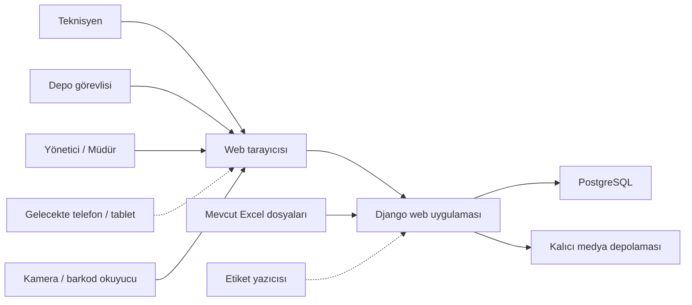
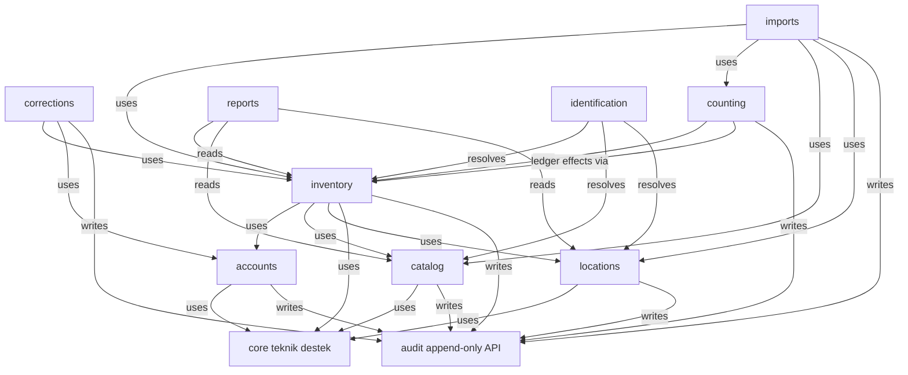
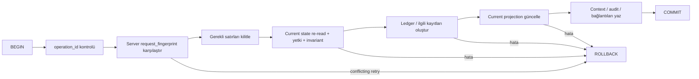
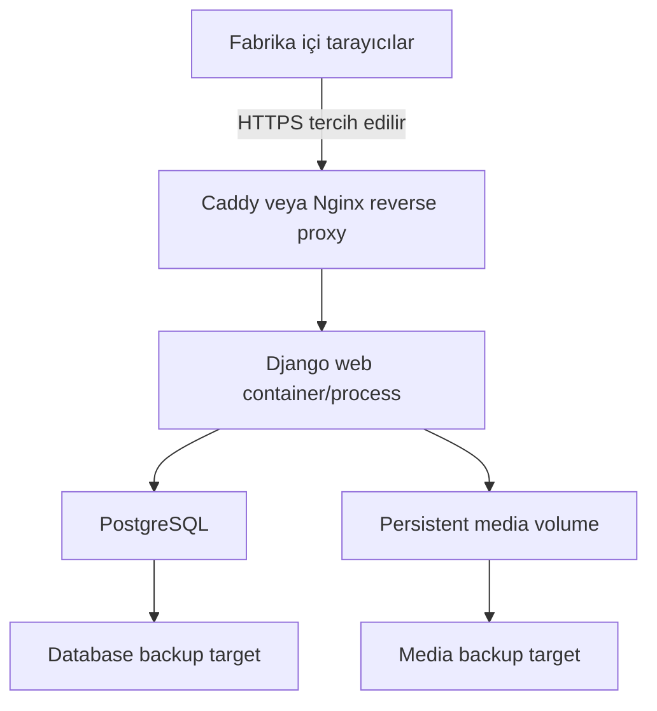

# Technical Architecture — Elektrik Atölyesi Envanter ve Malzeme Takip Sistemi

## 1. Belge Amacı

Bu belge, Elektrik Atölyesi Envanter ve Malzeme Takip Sistemi V1 için üretim odaklı teknik mimariyi tanımlar. `docs/00-PRODUCT.md`, `docs/01-BUSINESS-RULES.md`, `docs/02-DOMAIN-MODEL.md`, `docs/03-DATA-MODEL.md` ve `docs/04-USER-FLOWS.md` yetkili girdilerdir. Gate 0 karar durumları, hard gate'ler ve audit disposition'ları için kanonik kayıt `docs/06-DECISION-REGISTER.md`dir.

Mimari; stok doğruluğunu, işlem bütünlüğünü, denetlenebilirliği ve tek geliştirici tarafından AI desteğiyle sürdürülebilirliği önceler. Bu belge uygulama kodu, Django projesi, model, migration, route, template veya deployment dosyası oluşturmaz.

## 2. Architecture Drivers

Öncelik sırasına göre mimari sürücüler:

1. Sistemde mevcut görünen malzemenin belirtilen fiziksel konumda bulunabilmesi.
2. Negatif stok ve serialized varlığın çift konumda görünmesinin eşzamanlılık altında da engellenmesi.
3. Tamamlanmış stok geçmişinin sessizce değiştirilememesi.
4. Ledger ve güncel projection değişikliklerinin atomik olması.
5. Günlük atölye işlemlerinin basit ve hızlı kalması.
6. Bir geliştiricinin anlayıp işletebileceği düşük operasyonel karmaşıklık.
7. Fabrika içinde yerel barındırma.
8. QR ve tarayıcı tabanlı mobil kullanıma açık tasarım.
9. `operation_id` ile güvenli tekrar ve gelecekteki offline istemci uyumluluğu.
10. Veritabanı, medya ve yapılandırma bilgisini kapsayan test edilmiş geri yükleme hazırlığı.
11. Committed ledger için uygulama yolundan bağımsız PostgreSQL immutability guard.
12. Persisted projection'ların ledger'dan işletilebilir biçimde doğrulanabilmesi.

Nicel yük, erişilebilirlik ve yanıt süresi hedefleri henüz **TBD**'dir.

## 3. System Context

Sistem V1'de yalnızca Elektrik Atölyesi kullanıcılarına hizmet eden, fabrika içi ağda çalışması hedeflenen bir web uygulamasıdır.

Kesikli ilişkiler gelecekteki veya IT/cihaz doğrulamasına bağlı entegrasyonlardır. Çekirdek envanter işlemleri dış bulut servisine bağımlı olmamalıdır. SAP entegrasyonu V1 kapsamı dışındadır.

## 4. Architectural Style

### Karar: Modüler monolit

V1, tek deployment birimi ve tek ilişkisel veritabanı kullanan **modüler monolit** olacaktır. Modüller açık sahiplik ve bağımlılık kurallarıyla ayrılır; stok değiştiren işlemler tek kontrollü servis yolundan geçer.

### Neden

- İşlem ile projection'ın tek DB transaction içinde atomik güncellenmesini kolaylaştırır.
- Dağıtık transaction, mesajlaşma ve servisler arası tutarlılık yükü oluşturmaz.
- Tek geliştirici için yerel geliştirme, test, deployment ve hata ayıklama daha basittir.
- Fabrika içi V1 ölçeği internet ölçekli dağıtık sistem gerektirmez.
- Modül sınırları korunursa ileride ihtiyaç oluştuğunda ayrıştırmaya engel değildir.

### V1'de kullanılmayacak yaklaşımlar

- **Microservices:** Dağıtık tutarlılık, ağ hatası ve operasyon yükü stok doğruluğu riskini artırır.
- **React/Next ile ayrı frontend:** İki ayrı uygulama, API sözleşmesi, build ve state yönetimi gerektirir; V1 akışları server-rendered yapıyla karşılanabilir.
- **Genel amaçlı ayrı REST API:** Şu an ayrı istemci yoktur. Dahili service layer korunur; gerçek mobil/entegrasyon ihtiyacında dar API eklenebilir.
- **Kubernetes:** Tek yerel uygulama için gereksiz orchestration ve işletim maliyetidir.
- **Event sourcing:** Ledger tutulması event sourcing değildir; tüm application state'i event replay ile kurma ihtiyacı yoktur.
- **CQRS:** Okuma projection'ları kullanılması ayrı command/query altyapısını zorunlu kılmaz.
- **Redis/Celery:** Doğrulanmış arka plan iş veya dağıtık cache ihtiyacı yoktur. Uzun import süreleri ölçülürse sonradan değerlendirilebilir.
- **Çekirdek işlemde dış bulut bağımlılığı:** Fabrika bağlantısı kesildiğinde yerel operasyonu gereksiz yere durdurur ve veri yönetimi bağımlılığı yaratır.

## 5. Technology Stack

| Katman | Önerilen teknoloji | Durum / gerekçe |
|---|---|---|
| Dil | Python | **DECIDED**; Django ekosistemi ve bakım kolaylığı |
| Web framework | Django 5.2 LTS | **DECIDED**; auth, ORM, migration, form ve güvenlik temeli |
| UI | Django Templates + HTMX + Bootstrap 5 | **DECIDED**; server-rendered, az JavaScript, hızlı operasyonel ekranlar |
| Veritabanı | PostgreSQL | **DECIDED architecture**; row locking, constraint ve JSONB desteği; üretim izni IT'ye bağlı |
| Veri erişimi | Django ORM + migrations | **DECIDED** |
| Kimlik/yetki | Django Auth + Groups/Permissions | **DECIDED direction**; AD/LDAP ihtiyacı TBD |
| Test | pytest ve/veya Django test araçları | **DECIDED direction**; tek tutarlı test komutu uygulanmalı |
| Excel | openpyxl | **DECIDED direction**; gerçek workbook mapping'i ertelenmiştir |
| Medya | Yerel filesystem storage, Django storage abstraction arkasında | **PREFERRED**; üretim storage/volume IT'ye bağlı |
| Versiyon kontrolü | Git | **DECIDED** |
| İş zamanı | `Europe/Istanbul` sunumu; timezone-aware DB kayıtları | **DECIDED default**, fabrika aksi yönde karar verirse güncellenir |
| Deployment | Linux VM + Docker Compose + reverse proxy | **PREFERRED / IT TBD** |

Üretim sunucusu OS'i, kaynakları, Docker/PostgreSQL izni, HTTPS, backup altyapısı ve ağ erişimi doğrulanmış gerçekler değildir.

## 6. Module Boundaries

Pragmatik V1 yapısı dokuz başlangıç Django app'i, Phase 5.8 `identification` app'i ve bir teknik `core` paketi önerir. `attachments` ayrı app yapılmaz; doğrulanmış V1 kullanımı correction fotoğrafı olduğu için model sahipliği `corrections`ta, storage adaptörü `core.storage`da olur. `audit`, çapraz modül idari kayıt sahipliği nedeniyle ayrı ve küçük app olarak kalır.

| Modül | Sorumluluk ve sahip olduğu veri | İzin verilen bağımlılıklar | Yasak sorumluluklar |
|---|---|---|---|
| `accounts` | Employee, user profile, rol/grup kurulum politikası | Django auth, `audit` write API | Stok veya katalog değiştirmek |
| `catalog` | Category, UnitOfMeasure, MaterialCondition, Material | `audit` write API | StockBalance/ledger değiştirmek |
| `locations` | Location hiyerarşisi ve pasifleştirme | `audit` write API | Transfer veya stok düzeltmesi yapmak |
| `inventory` | SerializedAsset, InventoryTransaction/Line, IssueContext, StockBalance; tüm stok mutation servisleri | `accounts`, `catalog`, `locations`, `audit` | Import UI, correction kararı veya rapor sahipliği |
| `corrections` | CorrectionRequest, CorrectionEvidence; talep/karar/evidence orkestrasyonu | `accounts`, `inventory`, `core.storage`, `audit` | Ledger'ı doğrudan yazmak; inventory service çağırır |
| `counting` | PhysicalCountSession, quantity/asset count lines, discrepancy approval/disposition ve baseline session links | `accounts`, `catalog`, `locations`, `inventory`, `audit` | Farkı doğrudan StockBalance'a yazmak veya routine discrepancy'yi `CorrectionRequest`a yönlendirmek |
| `imports` | ImportBatch/Row, Excel parse/validate/preview, InventoryBaseline orkestrasyonu | `accounts`, `catalog`, `locations`, `inventory`, `counting`, `audit`, `core.storage` | Upload sonrası doğrudan yetkili bakiye yazmak |
| `reports` | Salt okunur rapor query/use-case'leri ve Excel export | `catalog`, `locations`, `inventory` | Kaynak kayıtları değiştirmek |
| `audit` | AuditEvent ve küçük append-only kayıt API'si | `accounts` kimliğine yalnız FK düzeyi | Ledger'ı kopyalamak veya iş akışı yönetmek |
| `identification` | Carrier-neutral codec, Code128/QR rendering, authenticated scanner/resolver, printable labels | `catalog`, `inventory`, `locations` | Stok mutation yapmak veya core modüllerin kendisine bağımlı olmasını istemek |
| `core` | Ortak hata tipleri, clock/correlation, storage adaptörü, teknik yardımcılar | İş modüllerine bağımlı değil | Domain entity veya iş kuralı sahipliği |

V1 first-party kimlik `catalog` içine yerleştirilemez ve `BarcodeIdentifier` tablosu olarak persist edilmez (`DEC-036`). `identification`, `catalog`, `inventory` ve `locations`a bağımlı olabilir; bu modüller core domain operasyonu için `identification`a bağımlı olmaz (`DEC-011`).

## 7. Dependency Rules

Kurallar:

1. Alt seviye master modülleri üst seviye workflow modüllerini import etmez.
2. `catalog` ve `locations`, `inventory` model veya servislerini çağırmaz.
3. Stok değiştirmek isteyen her modül yalnızca `inventory` application service/use-case arayüzünü çağırır.
4. `reports` salt okunurdur.
5. `audit` çağrıları best-effort dış işlem değil, önemli idari mutation ile aynı DB transaction içinde yazılır.
6. Model import döngülerinden kaçınmak için service arayüzleri ve kimlik/FK referansları modül sınırlarında kullanılır.
7. `InventoryTransaction`, downstream `corrections`, `counting` veya `imports` modellerine FK taşımaz. Workflow sahibi sonuç transaction bağlantısını kendi tablosu/linki üzerinde tutar; aynı ilişki iki yönde redundant FK ile saklanmaz.
8. `core` business module import etmez ve inventory/domain kuralı için dumping ground olamaz.

## 8. Service Layer

Inventory mutation için kavramsal application service/use-case'leri:

- `receive_stock`
- `issue_stock`
- `return_stock`
- `transfer_stock`
- `apply_controlled_correction`
- `establish_initial_balance`
- `reconcile_physical_count`

Gerçek Python imzaları bu belgede tanımlanmaz.

### Sorumluluk ayrımı

**View / HTMX endpoint**

- HTTP isteğini ve kullanıcı oturumunu alır.
- Formu bağlar, use-case'i çağırır.
- Başarı veya anlaşılır hata response'u döndürür.
- ORM ile StockBalance veya ledger mutation yapmaz.

**Django Form / alan doğrulaması**

- Zorunlu alan, veri biçimi, sayı parse etme, basit alanlar arası giriş doğrulaması.
- Kullanıcıya erken ve alan odaklı hata mesajı sağlar.
- Yetki, eşzamanlı stok ve ledger bütünlüğünün son otoritesi değildir.

**Service layer**

- Server-side yetkiyi kontrol eder.
- Aktif master data, takip modu, material/asset uyumu ve işlem türü kurallarını doğrular.
- DB transaction ve lock sınırını yönetir.
- Ledger, IssueContext, correction/count/import ilişkileri ve projection'ı atomik yazar.
- Domain hatalarını kararlı uygulama hata kategorilerine dönüştürür.

**Normatif yön semantiği**

- Her transaction line için source lokasyonundaki stok/state azalır.
- Her transaction line için target lokasyonundaki stok/state artar.
- İki alan doluysa source ve target farklıdır; DB row check ve service validation birlikte korur.
- Transaction type yön anlamını değiştirmez, yalnız legal source/target kombinasyonunu seçer.

**Current-state doğrulama sırası**

- Lock gerektiren state önce lock edilir, sonra yeniden okunur ve invariant'lar tekrar doğrulanır.
- Var olmayan balance row için önce composite unique constraint altında safe insert/on-conflict, sonra canonical row lock uygulanır.

**Model / database constraints**

- `quantity >= 0`, composite uniqueness, quantity/serialized XOR, unique `operation_id` gibi her koşulda geçerli yapısal invariant'ları korur.
- Cross-table iş semantiğini tek başına üstlenmez.

Django Admin dahil hiçbir yol StockBalance'ı veya completed ledger'ı serbestçe yazamaz.

## 9. Inventory Ledger Architecture

`InventoryTransaction` ve `InventoryTransactionLine`, yetkili transactional ledger'dır.

- Tamamlanmış ledger normal uygulama yollarında immutable ve no-delete'dir.
- Her stok etkisi acting user ve sistemce kaydedilen `occurred_at` ile izlenir.
- `MaterialCondition`, `TransactionType`tan ayrıdır.
- Quantity satırı pozitif miktar taşır; serialized satır tek bir asset taşır ve anonim quantity taşımaz.
- `StockBalance` tarihsel otorite değildir.
- Serialized current state ledger'dan türetilen projection/cache'dir.
- Correction, özgün transaction'ı değiştirmek yerine yeni ve bağlantılı `CONTROLLED_CORRECTION` etkisi üretir.
- Reconciled başlangıç `INITIAL_BALANCE`, yalnızca onaylı baseline üzerinden ledger'a girer.

Committed ledger immutability yalnız application convention değildir. PostgreSQL trigger-class DB guard, committed `InventoryTransaction` ve `InventoryTransactionLine` üzerinde ordinary `UPDATE`/`DELETE` işlemlerini reddeder. Bu koruma Django Admin, `queryset.update`, `bulk_update` ve raw application SQL için de geçerlidir. Exceptional migration/repair bypass explicit, privileged, documented ve audited olmalıdır; normal uygulamada kalıcı bir disable flag tasarlanmaz. Trigger implementation'ı daha sonraki Django migration/schema task'ında yapılacaktır.

Bu desen **transactional inventory ledger** desenidir; full event sourcing değildir. Tüm aggregate'ların event stream'den hydrate edilmesi, event-store altyapısı, event version migration veya replay tabanlı sistem çalışması gerektirmez.

## 10. StockBalance Architecture

Quantity balance kimliği:

> `(material_id, location_id, condition_id)`

Kurallar:

- Yalnızca `QUANTITY` material kullanır.
- Yalnız `active = true AND can_hold_stock = true` location kullanır; eligibility leaf/child/name/depth/type'tan türetilmez (`DEC-023`).
- `NUMERIC(18,3)` current recommendation'dır; birim bazlı precision kuralı TBD'dir.
- Quantity sıfırdan küçük olamaz.
- Doğrudan kullanıcı, view, form veya admin düzenlemesi yoktur.
- İlgili satır mutation öncesi kilitlenir.
- Ledger ve balance aynı transaction içinde güncellenir.
- Ledger üzerinden işletilebilir biçimde doğrulanabilir ve yeniden üretilebilir.
- Bozuk kondisyonun “available” hesaba etkisi ve minimum stok aggregation'ı TBD'dir.

Yeni balance row yoksa `SELECT FOR UPDATE` hiçbir şeyi kilitlemez. Kanonik sıra: composite `UNIQUE` altında safe insert/on-conflict → canonical row'u yeniden bul → `SELECT FOR UPDATE` → quantity'yi yeniden oku/doğrula → ledger/projection mutation. Exact ORM tekniği savepoint + `IntegrityError`, PostgreSQL `ON CONFLICT` veya eşdeğer güvenli yaklaşım olabilir; row locking tek başına yeterli değildir.

## 11. Serialized Asset State

`SerializedAsset.current_location`, `current_condition` ve current state, atomik persisted projection/cache olarak önerilir.

- Ledger otoritedir.
- Asset aynı anda en fazla bir current physical location taşır.
- Asset satırı movement sırasında row-level lock ile kilitlenir.
- Ledger satırı ve current-state update aynı DB transaction içindedir.
- Asset'ın material'ı `SERIALIZED` tracking mode kullanmalıdır.
- Transaction line material ile asset material eşleşmelidir.
- `StockBalance` hiçbir `SERIALIZED` material için var olamaz.
- Concurrent double issue/transfer'de yalnız bir işlem başarıyla state değiştirebilir.
- Material herhangi bir inventory history taşıdıktan sonra tracking mode normal uygulama yollarında değiştirilemez.
- Row-local invariant'lar ordinary DB check/constraint ile, catastrophic cross-table invariant'lar mandatory service validation ve targeted PostgreSQL integrity guard/constraint trigger ile korunur. Redundant `tracking_mode` kolonları sırf composite FK simülasyonu için eklenmez.
- Projection drift için Bölüm 10'daki quantity state ile birlikte ledger doğrulama/rebuild contract'ı uygulanır.

Serialized state kodları ve zorunlu asset identifier'ları **TBD**'dir.

### Projection verify / rebuild contract

`verify_inventory_projection` benzeri management operation:

- authoritative ledger'dan expected quantity ve serialized current state'i temporary/in-memory yapıda üretir;
- persisted projection ile karşılaştırıp farkları raporlar;
- varsayılan olarak hiçbir state'i değiştirmez.

Repair/rebuild ayrı privileged action'dır; önce dry-run, audit event ve mümkünse backup gerektirir, otomatik çalışmaz. Exact command name bağlayıcı değildir; capability inventory engine Gate'inden ve kesinlikle pilot'tan önce zorunludur.

## 12. Transaction Boundaries

Tüm mutation akışlarının ortak şablonu:

| Use case | Lock edilen durum | Atomik yazımlar |
|---|---|---|
| Receipt | Target balance; yoksa unique+conflict ile oluştur, sonra lock; serialized asset | RECEIPT ledger + target balance/asset state |
| Issue | Source balance veya serialized asset | ISSUE ledger + IssueContext + source projection |
| Transfer | Source ve target balance kararlı sırada veya asset | TRANSFER ledger + iki balance/asset state |
| Return | `DEC-028` quantity slice: original ISSUE line row ve target balance | RETURN ledger + target projection aynı transaction içinde |
| Correction approval | Pending CorrectionRequest + etkilenen balance/asset | Karar + CONTROLLED_CORRECTION ledger + projection + audit |
| Routine reconciliation | Count session/line + immutable expected snapshot + etkilenen balance/asset | Explicit approval + dedicated `COUNT_RECONCILIATION` ledger + projection + reconciliation state |
| Baseline establishment | Count session, import batch, baseline guard ve scoped balance/asset | InventoryBaseline + `1..N` scoped INITIAL_BALANCE ledger + downstream links + projection + audit |
| Import commit | ImportBatch ve commit guard | Validated master-data outcomes + staging/count reference + audit; stock ledger ve balance yok |

Herhangi bir adım başarısız olursa transaction rollback olur; kısmi inventory etkisi oluşmaz. Dosya sistemi yazımı DB ile doğal olarak aynı transaction olmadığı için Bölüm 18'deki orphan/cleanup yaklaşımı uygulanır.

### Authoritative transaction semantics

Her line için source **azalış**, target **artış** anlamına gelir. Bu anlamın type-specific istisnası yoktur:

| Type | Source | Target | Durum |
|---|---|---|---|
| `RECEIPT` | Null | Zorunlu `active && can_hold_stock` | Implement edilebilir. |
| `ISSUE` | Zorunlu `active && can_hold_stock` | Null | Usage context `IssueContext`tedir. |
| `RETURN` | Null | Zorunlu explicit `active && can_hold_stock` target | `DEC-028` unused linked quantity slice; original ISSUE line required, same material/unit/condition, cumulative cap. Runtime target lifecycle validation service fazındadır. |
| `TRANSFER` | Zorunlu stock-holding | Zorunlu, source'dan farklı stock-holding | İki projection etkisi tek transaction'dır. |
| `CONTROLLED_CORRECTION` | Azalış line'ında zorunlu | Artış line'ında zorunlu | `DEC-030`: pure quantity 1 line; identity restatement 2 line; canonical corrected-line lineage. |
| `COUNT_RECONCILIATION` | Negatif farkta zorunlu | Pozitif farkta zorunlu | Yalnız `baseline_candidate=false` routine session; `CorrectionRequest`/`CONTROLLED_CORRECTION` değildir. |
| `INITIAL_BALANCE` | Null | Zorunlu stock-holding | Yalnız baseline-owned scoped link üzerinden. |

Bir `InventoryBaseline`, downstream-owned association üzerinden `1..N PhysicalCountSession` ve `1..N` scoped `INITIAL_BALANCE` transaction'a bağlanır. Her transaction link yalnız `INITIAL_BALANCE` type kabul eder ve her scope ayrı idempotency guard taşır. Bütün required scopes complete, required not-counted rows bitmiş, gerekli unresolved items resolved/dispositioned, bütün opening effects committed ve projection verify clean olmadan baseline `ESTABLISHED` olmaz. Aynı cutover context için en fazla bir authoritative established baseline bulunur. Inventory ledger baseline/workflow modülüne reverse FK taşımaz.

## 13. Concurrency Control

Production isolation assumption PostgreSQL default **`READ COMMITTED`**dır. PostgreSQL transaction'ları ve Django transaction API'leri kullanılır.

> **LOCK FIRST → CURRENT STATE'İ RE-READ → INVARIANT'LARI RE-VALIDATE → WRITE**

Form veya lock öncesi service validation erken feedback sağlar; correctness otoritesi değildir. `SELECT FOR UPDATE` / row-level lock noktaları:

- Issue/transfer/return/correction sırasında ilgili `StockBalance`.
- Her serialized movement sırasında ilgili `SerializedAsset`.
- Karar öncesi `PENDING CorrectionRequest`.
- Reconciliation commit öncesi count session/line.
- Import commit öncesi `ImportBatch`.
- Baseline establishment öncesi count/import/baseline guard kayıtları.

Korunan yarışlar:

1. İki kullanıcı son quantity stoğu çıkarmaya çalışır: biri commit, diğeri lock sonrası yetersiz stok hatası.
2. Aynı asset iki lokasyona taşınır: asset lock sonrası yalnız ilk geçerli hareket tamamlanır.
3. İki yönetici aynı correction'ı onaylar: pending row lock ve durum tekrar kontrolüyle yalnız bir karar.
4. Count/import/baseline iki kez commit edilir: state lock + unique/idempotency guard.

5. İki valid receipt ilk kez aynı balance key'i oluşturur: composite unique + insert/on-conflict sonucu tek canonical row oluşur; her receipt bu row'u lock edip birer kez katkı yapar.

Quantity balance lock'ları `material_id → location_id → condition_id → primary key` sırasıyla alınır. Serialized operation `SerializedAsset` row'unu kilitler ve current state'i lock sonrasında yeniden kontrol eder. Correction approval `PENDING`, import `VALIDATED`, reconciliation uygulanmamış session/line ve baseline incomplete state'leri lock altında tekrar doğrulanır. Count reconciliation özel sırası `lock → re-read → immutable snapshot'a göre drift check → invariant revalidation → write`tır; drift reconciliation'ı reddeder ve recount/reconfirmation gerektirir.

DB non-negative/unique check'leri son savunmadır; anlaşılır conflict mesajı service layer'da üretilir. Deterministic order deadlock'u azaltır; beklenmeyen deadlock/transaction hatası tam rollback üretir. Kısmi ledger/projection etkisi yoktur.

## 14. Idempotency

Idempotency, application-level contract ve DB unique constraint'in birlikte uygulanmasıdır.

- Her inventory-changing command `operation_id UUID` taşır.
- Başarılı işlemde `InventoryTransaction.operation_id` unique kaydedilir.
- Sunucu semantic command payload'un canonical representation'ından SHA-256 hexadecimal `request_fingerprint` hesaplar; client fingerprint'ine güvenilmez.
- Fingerprint operation type, gerekli actor/context, material/asset, quantity, condition, source/target ve diğer business-command alanlarını içerir; `operation_id`, server timestamp, presentation-only data ve canonical sorting sonrası semantik olmayan sırayı dışlar.
- Aynı operation ID + aynı fingerprint tekrarında ikinci stok etkisi oluşmaz; önceki başarılı sonuç döndürülür.
- Aynı operation ID + farklı fingerprint güvenli conflict'tir; stok etkisi yoktur.
- Concurrent same-ID submission'da DB uniqueness arbiter'dır; loser winning row'u okuyup fingerprint'i karşılaştırır.
- Failure committed transaction yaratmadan önce oluşursa aynı command güvenle retry edilebilir.
- Import commit ayrıca kendi idempotency guard'ını taşır.
- Çift tıklama, network retry ve gelecekteki mobil/offline istemci için temel sağlar.

Canonical field serialization ayrıntısı implementation review'da belirlenir; fingerprint contract'ı artık TBD değildir. Offline queue, conflict resolution ve sync protokolü bu görevin/V1'in kapsamında değildir.

## 15. Authentication and Authorization

Django Auth, Groups ve Permissions kullanılır. `TECHNICIAN`, `STOREKEEPER`, `ADMIN_MANAGER` başlangıç rol şablonlarıdır; sistemin gelecekte sahip olabileceği tek roller değildir (`DEC-021`). Runtime authorization permission/policy tabanlı olmalıdır; hard-coded Group adı kontrolü yeterli değildir.

| İşlem | Mimari yetki (başlangıç şablonları) |
|---|---|
| Stok görüntüleme | Üç şablon rol |
| Receipt | STOREKEEPER, ADMIN_MANAGER |
| Issue | Üç şablon rol |
| Correction request | Yetkili operasyon kullanıcıları |
| Correction approve/reject | ADMIN_MANAGER |
| Material/location master data | ADMIN_MANAGER; storekeeper kapsamı TBD |
| Import | ADMIN_MANAGER |
| Return | `DEC-028` direct quantity slice: fresh STOREKEEPER ve ADMIN_MANAGER; TECHNICIAN değil. Runtime authorization permission tabanlıdır. |
| Transfer | `DEC-029` quantity first slice: fresh STOREKEEPER ve ADMIN_MANAGER; TECHNICIAN değil. Runtime authorization permission tabanlıdır. Broader TRANSFER TBD. |
| Count entry/review | `counting.view/add/change_physicalcountsession`; fresh TECHNICIAN/STOREKEEPER/ADMIN_MANAGER alır |
| Discrepancy approval | Sensitive ADMIN_MANAGER capability; safe dynamic allowlist dışı (`DEC-033`) |
| Baseline establishment | Sensitive ADMIN_MANAGER capability; safe dynamic allowlist dışı (`DEC-033`) |
| Reports/export | TBD |

Phase 2 dinamik rol yönetimi yalnızca açıkça onaylı managed permission'ları expose eder (`DEC-021`). Phase 4.1 ile `inventory.receive_stock`, Phase 4.2C ile `inventory.issue_stock`, Phase 4.4 ile `inventory.return_stock`, Phase 4.5 ile `inventory.transfer_stock` managed allowlist'e eklenmiştir. Correction/count approval izinleri ilgili rollout/gate tamamlanana kadar expose edilmez. `setup_roles` varsayılan davranışı non-destructive'tir: eksik varsayılan rol oluşturulur ve şablon izinleri atanır; mevcut rol permission'ları korunur (`DEC-021`).

Phase 2.9B erişim yönetimi politikası (`DEC-022`):

- Django `Group` rol modeli olarak kalır; runtime authorization permission tabanlıdır.
- Yönetim capability: `accounts.manage_access` (catalog permission allowlist'inin dışında, ayrı delegation capability).
- Bootstrap otorite: Django superuser; superuser olmayan access manager `manage_access` veremez/alamaz.
- Safe Phase 2 allowlist (dokuz permission): Category, UnitOfMeasure ve Material için `view_*`, `add_*`, `change_*` yalnızca; `delete_*`, audit mutation, auth model-management ve workflow permission'ları expose edilmez.
- Phase 3 Location allowlist extension (`DEC-022` item 13, `DEC-023`): `locations.view_location`, `locations.add_location`, `locations.change_location`. `delete_location` expose edilmez.
- Phase 3 Employee ve ProductionLine managed izinleri (`DEC-024`, `DEC-025`): `accounts.view_employee`, `accounts.add_employee`, `accounts.change_employee`; `inventory.view_productionline`, `inventory.add_productionline`, `inventory.change_productionline`.
- Phase 4 inventory allowlist: `receive_stock`, `issue_stock`, `return_stock`, `transfer_stock` ve transaction view. Phase 5.2 (`DEC-030`) correction `view/add` safe allowlist'e eklenir; `decide_correctionrequest` özellikle eklenmez. Phase 5.4E count `view/add/change_physicalcountsession` safe allowlist'e eklenir; `counting.decide_discrepancy` ve `imports.establish_baseline` özellikle eklenmez. Managed permission count: **28**. Reporting decision izinleri expose edilmez.
- `setup_roles` mevcut Group'ları reconcile etmez; fresh bootstrap'ta `STOREKEEPER` ve `ADMIN_MANAGER` `receive_stock` alır, `TECHNICIAN` almaz.
- Write/view invariant: `add_*`/`change_*`, karşılık gelen `view_*` olmadan yapılandırılamaz; sunucu tarafı service validation otoritedir.
- User-role boundary: yalnız `User.groups`; password, privilege flag'leri, Employee linkage ve direct `user_permissions` yönetilmez.
- Anti-escalation: non-superuser access manager kendi üyeliklerini, `manage_access` taşıyan rol/kullanıcıları, superuser/`is_staff`/direct-permission kullanıcıları ve actor kümesini aşan hedefleri değiştiremez.
- Onay: ikinci manager onayı yok; `accounts.manage_access` + anti-escalation + immutable `AuditEvent` (`DEC-020` inventory onayı değişmez).
- Audit identity: Group/User için UUIDv5 (`ROLE_NAMESPACE` / `USER_NAMESPACE` + integer PK); rename identity değiştirmez.
- Audit events: `accounts.role.created`, `accounts.role.updated`, `accounts.role.permissions_changed`, `accounts.user.roles_changed`; mutation ve audit aynı transaction.
- Admin boundary: audited management sonrası writable `auth.Group` ve privilege `accounts.User` Admin yüzeyleri kaldırılır.
- UI: Yönetim → Roller ve Yetkiler / Kullanıcılar; generic IAM, rol delete, direct-permission editor ve approval engine yok.

Template/HTMX response içinde buton görünürlüğü kullanıcı deneyimidir; her state-changing endpoint ayrıca server-side permission kontrolü yapar. Permission check tek başına yeterli değildir: correction, count, attachment ve benzeri kayıtlarda gerekli object/state-level authorization service/view sınırında uygulanır. Bir teknisyen başka kullanıcının correction evidence'ına sırf ID bildiği için erişemez. QR taramak yetki vermez.

`Employee` ve `ApplicationUser` ayrıdır (`DEC-024`). Nullable one-to-one link ownership Employee tarafında; delete `SET_NULL`. AD/LDAP gereksinimi **IT dependency**'dir.

### Feature hard gates

- **`DEC-033` Physical Count / Reconciliation / Pilot Baseline:** `DEC-HG-001`, `DEC-OPEN-007` ve `DEC-OPEN-008` kapalıdır. No-freeze immutable session-start snapshot, drift refusal, one-subtree scope, blind count, zero tolerance, separation of duties, dedicated `COUNT_RECONCILIATION`, `1..N` count-session baseline ve QUANTITY+SERIALIZED pilot cutover kararlıdır. Phase 5.4A ayrıca başlatılmalıdır; bu dokümantasyon kararı implementation değildir.
- **`DEC-030` Quantity Corrections:** First slice partial/repeated signed effect, canonical original-line lineage, no correction-of-correction, requester≠decider ve current-stock lock/revalidation ile kararlıdır. V1 photographic evidence `DEC-034` ile kapanmıştır. Serialized/non-stock correction ve count/baseline interaction deferred kalır.
- **`DEC-HG-003` ProductionLine foundation:** **DECIDED** (`DEC-025`). `ProductionLine` dynamic master-data entity (`inventory` app); recursive hierarchy; exact usage place ayrı free text. Quantity ISSUE Phase 4.2A–4.2C COMPLETE.
- **`DEC-HG-004` Employee foundation:** **DECIDED** (`DEC-024`). `accounts.Employee` ayrı entity; sicil/User link/lifecycle kararlı. Phase 3.2 implementation COMPLETE. Retention pilot öncesi kararları açık kalır; receiver snapshot korunur.
- **`DEC-HG-005` Return:** `DEC-028` ile yalnız unused linked QUANTITY RETURN slice kararlıdır: one ISSUE line ↔ one RETURN line, partial/multiple, cumulative cap, same material/unit/condition, null source ve explicit target. Broader serialized/used/defective/condition-changing/unknown-provenance/supplier/unlinked/correction-count/technician approval senaryoları hard-gated kalır.

## 16. Web / UI Architecture

Django Templates + HTMX + Bootstrap 5:

- Tam sayfalar server-rendered olur.
- Arama, filtre, satır/özet yenileme ve form validation gibi sınırlı etkileşimlerde HTMX partial kullanılır.
- Kritik işlemler standart HTTP ile de çalışabilecek progressive enhancement yaklaşımını korur.
- JavaScript minimumda tutulur; kamera QR tarama gibi gerekçeli alanlarda kullanılır.
- Ayrı SPA state'i veya zorunlu frontend build mimarisi yoktur.
- Ekranlar hızlı malzeme bulma, hızlı issue, belirgin location/condition, anlaşılır conflict ve touch-friendly kullanım için tasarlanır.

HTMX request de normal request ile aynı authentication, permission, CSRF ve service-layer kurallarına tabidir.

## 17. Machine-Readable Identification Architecture

Neutral `identification` boundary (`DEC-036`) Code128 ve QR için aynı compact `TZ1M|A|L:<22-char-base64url-uuid>` payload'u üretir ve tek resolver ile `Material`, `SerializedAsset` veya `Location` nesnesine çözer. Payload persist edilmez.

Akış:

1. Kamera (yerel ZXing, Code128 + QR), USB HID/klavye-wedge veya elle giriş aynı metni üretir.
2. Authenticated POST resolver codec ile parse eder.
3. Object-view permission kontrol edilir.
4. Kullanıcı canonical detay sayfasına yönlenir.
5. Sonraki action için normal server-side permission ve inventory validation uygulanır.

Bilinmeyen/geçersiz kod stok etkisi oluşturmadan hata verir. Resolve endpoint authenticated'tır, permission bypass veya unrestricted identifier enumeration endpoint olamaz. Risk doğrulanırsa Redis gerektirmeyen application/proxy rate limiting değerlendirilir. Standart etiket Code128, kompakt etiket QR'dır. DataMatrix V1'de yoktur. Mimari donanım üreticisine kilitlenmez; yazıcı sürücüsü/SDK V1 dışıdır.

## 18. File / Attachment Architecture

V1'de onaylanmış dosya kullanımı correction request destekleyici fotoğrafıdır (`DEC-034`, Phase 5.5 COMPLETE).

- Metadata PostgreSQL'de `corrections_correctionevidence` tablosunda tutulur.
- Binary dosya `core.storage` Django storage abstraction arkasındaki private filesystem'de tutulur (`PRIVATE_MEDIA_ROOT`); `MEDIA_ROOT`/`MEDIA_URL` kanıt erişim yolu değildir.
- Büyük fotoğraf binary'si ilişkisel DB'ye konmaz.
- Internal/randomized storage key kullanılır (`corrections/evidence/<uuid>.<ext>`); kullanıcı dosya adı path olarak kullanılmaz.
- Path traversal engellenir.
- Magic bytes/gerçek içerik, uzantı ve boyut doğrulanır; uzantı otoriter değildir.
- Kabul: JPEG, PNG, WebP. Red: HEIC/HEIF (dönüştürme yok), GIF, SVG, PDF, arbitrary binary.
- Dosya başına en fazla 10 MiB. V1'de toplam-case limiti yoktur.
- Dosya çalıştırılabilir içerik olarak servis edilmez.
- Sensitive evidence public `MEDIA_URL` üzerinden verilmez; authenticated `/corrections/evidence/<uuid>/` path `corrections.view_correctionrequest` ile korunur.
- Backup hem metadata'yı hem private media volume'u kapsar.
- V1 otomatik retention silme yoktur; onaylanan ve reddedilen kanıt historical record ile tutulur.

DB transaction ile filesystem atomik değildir. Kanonik sıra: file'ı validate/upload et → persistent storage'da finalize et → DB metadata/reference commit et. DB commit başarısız olursa orphan file kalabilir; V1'de otomatik cleanup worker yoktur. Bunun tersi olan “metadata commit edildi fakat file hiç oluşmadı” durumundan kaçınılır. Ayrı Celery gerekmez.

## 19. Excel Import Architecture

Kurallar:

- Upload, `StockBalance` veya authoritative ledger'ı doğrudan değiştiremez.
- Parsing ve row validation staging kayıtlarında gerçekleşir.
- Error/warning ve mapping kullanıcıya preview edilir.
- Commit yalnızca validated batch için, lock ve idempotency ile bir kez yapılır.
- Commit kontrollü master-data outcomes ve staging/count reference data üretebilir; imported quantity stok değildir.
- Commit `StockBalance` veya stock-changing `InventoryTransaction` oluşturamaz.
- **CANDIDATE INVENTORY IS NOT LEDGER DATA AND IS NOT STOCK.**
- Fiziksel sayım/reconciliation sonrası açılış stoğu yalnız baseline-owned scoped `INITIAL_BALANCE` ile bir kez oluşur.
- Gerçek workbook görülmeden mapping, sütun adı ve temizleme kuralı kesinleştirilmez.

İlk import veri hacmi ölçülene kadar synchronous request veya kontrollü management use-case yeterli olabilir. Request timeout'u aşan gerçek ihtiyaç oluşursa DB-backed job yaklaşımı değerlendirilebilir; Redis/Celery peşinen eklenmez.

## 20. Physical Count / Reconciliation

Physical count birinci sınıf workflow'dur:

> `PhysicalCountSession → quantity/asset lines → discrepancy → review → authorized ledger effect → projection`

- Quantity count, material + location + condition için numeric expected/counted değer taşır.
- Serialized count, asset identity ve expected/actual presence taşır.
- Count entry yalnız count tablolarını değiştirir; StockBalance'ı overwrite etmez.
- Routine reconciliation farkı public inventory service üzerinden dedicated `COUNT_RECONCILIATION` ledger etkisine dönüşür; `CorrectionRequest`/`CONTROLLED_CORRECTION` kullanılmaz.
- Count session ve adjustment/baseline commit eşzamanlı double commit'e karşı kilitlenir.
- Her session tek Location subtree'sidir; overlapping subtree'lerde overlapping open session yoktur.
- Counter kör sayım yapar; expected/discrepancy reviewer/approver'a görünür. Missing row zero değildir ve tolerance sıfırdır.
- Untouched expected satır `PENDING_COUNT` olarak actor/time olmadan saklanır; explicit `NOT_COUNTED` NULL quantity ile actor/time taşır; fiziksel explicit zero gerçek counted değerdir. Routine physical-count completion fiziksel sayım veya explicit `NOT_COUNTED` disposition kabul eder. Baseline-candidate completion required satırlarda yalnız fiziksel sayımı kabul eder.
- Counter/performer kendi discrepancy'sini onaylayamaz; açıklama trim edilmiş 10–2000 karakterdir.
- Routine positive effect target-only, negative effect source-only'dur. Cutover session `COUNT_RECONCILIATION` oluşturmaz.
- One authoritative pilot cutover QUANTITY ve SERIALIZED inventory'yi birlikte kapsar; serialized count Phase 5.3 state modelini genişletmez.

**DECIDED — `DEC-033`:** Stock freeze yoktur; session-start expected snapshot immutable'dır. Approval sırasında current state kilitlenip yeniden okunur; snapshot'tan drift varsa write yapılmaz ve recount/reconfirmation gerekir. Zero-balance rows snapshot dışıdır. Existing QUANTITY Material + condition unexpected stock'u `expected_quantity=0` ile sayılabilir; unknown catalog item resolved veya explicitly abandoned olana kadar stock yaratamaz. `DEC-OPEN-010` OPEN kalır; yeni unit conversion/rounding semantiği yoktur.

Phase 5.4B counting service kilit sırası `PhysicalCountSession → Material → Location → MaterialCondition → StockBalance`dır. Open-scope kararları counting'e özel PostgreSQL transaction advisory lock ile serialize edilir. Snapshot transaction'ı bütün QUANTITY Material satırlarını deterministic sırada kilitler; ardından Location tablosunu `SHARE` mode ile hiyerarşi parent değişikliklerine karşı kısa süreli sabitler, subtree Location ve MaterialCondition satırlarını deterministic sırada kilitler ve pozitif in-scope `StockBalance` satırlarını tek statement ile yeniden okuyup expected satırlarını oluşturur. Bu kilitler session ömrü boyunca tutulmaz; transaction commit'i sonrasında inventory hareketleri devam eder.

Phase 5.4C routine QUANTITY approval toplam sırası `PhysicalCountSession → PhysicalCountQuantityLine → operation_id reservation → Material → Location → MaterialCondition → StockBalance`dır. Inventory public boundary counting modeli import etmez; semantic count/session/line kimliklerini fingerprint'e alır. Counting modülü sonucu one-to-one link ile sahiplenir. Deferred PostgreSQL constraint trigger, her `COUNT_RECONCILIATION` header'ının tam bir approved count owner'a ve count basis ile aynı tek ledger line'ına sahip olmasını commit'te doğrular. Approved basis ve link DB trigger ile immutable'dır. `counting.decide_discrepancy` model-level custom permission olarak tanımlanmıştır; Phase 5.4E fresh ADMIN_MANAGER şablonuna eklenmiş, safe allowlist dışında kalmıştır.

Phase 5.4D-A serialized physical-count backend COMPLETE'tir. Counting-owned `PhysicalCountSerializedLine` mevcut START adımında in-scope `SerializedAsset` expected snapshot'ını alır; bir oturum QUANTITY ve SERIALIZED sayım kanıtını birlikte taşıyabilir. Expected satırlar authoritative `SerializedAsset` snapshot referansıdır; mevcut authoritative asset beklenmeyen konumda gözlemlenebilir; fiziksel bulunan candidate item counting-owned staging olarak kaydedilir ve counting sırasında authoritative `SerializedAsset` oluşturmaz. Untouched expected asset explicit missing değildir; routine session `NOT_COUNTED` kabul eder, baseline-candidate completion serialized `NOT_COUNTED` reddeder. Counting establishment öncesi non-authoritative kalır.

Phase 5.4 — Physical Count + Combined Quantity/Serialized Baseline backend COMPLETE. Phase 5.4D-B: `imports` owned `InventoryBaseline` prepare/establish, session ownership, scoped `INITIAL_BALANCE` result links, combined QUANTITY+SERIALIZED cutover, candidate serialized promotion, authoritative serialized identity DB normalization, no-freeze scope-wide drift, prior-ledger-history protection, separation of duties, establishment idempotency, projection verification before `ESTABLISHED` ve atomic rollback. Phase 5.4E: count/baseline default-role permission rollout; operational count permissions safe-managed; sensitive `counting.decide_discrepancy` ve `imports.establish_baseline` safe allowlist dışında. Count/baseline UI, serialized controlled correction, serialized `COUNT_RECONCILIATION` ve custody uygulanmamıştır. Phase 5.6 serialized ISSUE/linked unused RETURN/in-stock TRANSFER backend `DEC-035` ile commit `1947b8ab374510c8bafb5f58f160decc455969d6` üzerinde uygulanmıştır. Phase 5.7 state-aware movement web workflow/UI wiring'i commit `22c29deacb9247b3921a6f36a802ebe63ad9c341` üzerinde tamamlanmıştır. Phase 5.8 Machine-Readable Identification `DEC-036` ile commit `c53a34a4b33e060e5f6365a9f191a1f24b1f17f0` (`feat: add machine-readable identification`) üzerinde COMPLETE'tir. `DEC-OPEN-010` OPEN kalır.

## 21. Reporting Architecture

V1 raporları ilişkisel sorgularla şu kaynaklardan üretilir:

- `InventoryTransaction`
- `InventoryTransactionLine`
- `IssueContext`
- `StockBalance`
- `SerializedAsset`
- `Material`
- `Location`

Raporlar:

- düşük stok,
- haftalık receipt,
- haftalık issue,
- material usage,
- en fazla stok azalışı,
- movement history,
- Excel export.

`reports` modülü salt okunurdur ve `openpyxl` ile export üretir. User-controlled text cell `=`, `+`, `-` veya `@` ile başlarsa spreadsheet formula injection'a karşı nötralize edilir. Pagination, uygun filtre indeksleri ve query plan gözlemi kullanılır. V1'de data warehouse, Elasticsearch, BI stack, Redis cache veya materialized view eklenmez. Hafta sınırları, usage tanımı, aggregation ve report permission'ları **TBD**'dir.

## 22. Audit Architecture

İki kayıt türü ayrılır:

1. **Inventory ledger:** Stok değiştiren işlemlerin yetkili geçmişi.
2. **Administrative AuditEvent:** Master data, permission/admin, correction kararı, import action, baseline/cutover ve ileride gerekirse security event.

Her ledger transaction ikinci kez generic audit'e kopyalanmaz. Correction kararı gibi ledger dışı anlamlı karar audit'e yazılır ve ilgili entity kimliğiyle bağlanır. Audit event append-only/no-delete yönünü korur; retention **TBD**'dir.

## 23. Error Handling

| Kategori | Kullanıcı davranışı | Transaction davranışı |
|---|---|---|
| Validation error | Alan/iş kuralı açık mesajı | Mutation başlamaz veya rollback |
| Permission denied | “Bu işlem için yetkiniz yok” | Değişiklik yok |
| Insufficient stock | Güncel stok uyarısı | Rollback |
| Stale/concurrent state | Başka işlem sonrası yenile/retry mesajı | Rollback |
| Duplicate operation | Önceki sonuç veya “zaten işlendi” | İkinci etki yok |
| Conflicting operation ID | Güvenli conflict mesajı | Değişiklik yok |
| Unknown QR | “Kod bulunamadı/geçersiz” | Değişiklik yok |
| File upload failure | Dosya doğrulama/yükleme mesajı | Talep submit edilmez |
| Import validation failure | Satır bazlı error/warning | Authority/balance etkisi yok |
| Unexpected server error | Genel correlation/reference mesajı | Inventory transaction rollback |

Kullanıcı mesajları teknik stack trace, SQL, dosya yolu, secret veya hassas oturum bilgisi sızdırmaz. Domain hata kodları UI mesajlarından ayrılmalı ve test edilebilir olmalıdır.

## 24. Logging

Başlangıç logging kapsamı:

- application exception'ları ve correlation/request ID,
- security-relevant permission/auth failure özetleri,
- import parse/validation/commit failure'ları,
- inventory conflict/rollback kategorileri,
- deployment/backup süreç logları implementation fazında.

Loglanmamalı:

- parola ve secret,
- session/cookie tam içeriği,
- fotoğraf binary'si,
- gereksiz tam kişisel payload,
- database credential.

V1 için structured standard logging yeterlidir; karmaşık observability platformu zorunlu değildir. Log retention ve merkezi toplama IT ile **TBD**'dir.

## 25. Configuration / Secrets

Environment-based configuration kullanılmalıdır:

- `SECRET_KEY`
- `DEBUG`
- `ALLOWED_HOSTS`
- `DATABASE_URL` veya ayrı DB bileşenleri
- `MEDIA_ROOT`
- `PRIVATE_MEDIA_ROOT`
- `STATIC_ROOT`
- CSRF trusted origins
- HTTPS/reverse-proxy ayarları
- upload limitleri
- `TIME_ZONE=Europe/Istanbul`

Secret değerler Git'e commit edilmez. İleride `.env.example` yalnız anahtar adları ve güvenli örnekler içerir. Production'da `DEBUG=false` olmalıdır. Ortama özgü ayarlar koddan ayrılır.

## 26. Security

- Django CSRF tüm state-changing web/HTMX isteklerinde etkin.
- Server-side authorization her korunan endpoint ve service use-case'te.
- Production'da HTTPS mevcutsa secure cookie, HSTS ve proxy header'ları doğru yapılandırılır; HTTPS availability IT **TBD**'dir.
- Session cookie `HttpOnly`, uygun `SameSite` ve HTTPS varsa `Secure`.
- Django ORM parameterization kullanılır; raw SQL gerekirse parametreli ve review edilmiş olur.
- Django template escaping varsayılan olarak korunur.
- Upload content/type/size doğrulanır; arbitrary execution engellenir.
- Secret repository'de tutulmaz.
- Django Admin erişimi kısıtlanır.
- Ledger ve projection için serbest admin edit yoktur.
- Her `ModelForm` explicit allowed `fields` listesi kullanır; privileged/state alanları automatic inclusion ile expose edilmez.
- Correction/count/attachment gibi nesnelerde gerekli object/state-level authorization uygulanır; role check tek başına yeterli değildir.
- Excel import; max file size, row/sheet/dimension sınırları, gerçek workbook/content validation, mümkün olduğunda read-only parse ve decompression/memory/time exhaustion'a karşı bounded processing uygular.
- Excel export, user-controlled `=`, `+`, `-`, `@` başlangıçlı hücreleri formula injection'a karşı nötralize eder.
- Sensitive attachment ID guessing/IDOR ile erişilemez; permission-checked path kullanır.
- Dependency güncellemeleri kontrollü, testli ve güvenlik duyuruları izlenerek yapılır.
- Yetki değişikliği ve önemli admin işlemleri audit edilir.

## 27. Testing Strategy

Test katmanları:

1. **Unit/service tests:** Business invariant ve hata durumları.
2. **Model/constraint tests:** Unique/check/FK/deactivation davranışları.
3. **Permission tests:** Her role ve endpoint/use-case için izin/red.
4. **Transaction/integration tests:** Ledger + projection + related records atomikliği.
5. **Concurrency tests:** Gerçek PostgreSQL üzerinde row locking ve yarışlar.
6. **User-flow tests:** `UF-*` akışları ve validation sonuçları.
7. **End-to-end smoke tests:** Production-benzeri deployment'ta kritik `AS-*` senaryoları.

Zorunlu kritik coverage:

- negatif stok,
- concurrent last-stock issue,
- `operation_id` idempotency/conflict,
- serialized single-location/double movement,
- Technician receipt reddi,
- completed history immutability,
- correction photo zorunluluğu ve pending'in stok değiştirmemesi,
- correction double approval,
- count'un balance'ı sessizce değiştirmemesi,
- import'un reconciliation'ı bypass edememesi,
- inactive location rejection,
- baseline duplicate establishment.
- concurrent first-balance row receipt;
- deterministic lock ordering/deadlock prevention;
- transaction rollback after ledger insert/before projection update;
- same-ID same-fingerprint ve different-fingerprint conflict;
- PostgreSQL ledger immutability guard karşısında ORM bulk update/delete;
- ledger-derived projection ile persisted projection consistency;
- import commit'in sıfır `StockBalance` ve sıfır stock-ledger etkisi;
- scoped baseline retry/idempotency;
- count stability/reconciliation race testleri, `DEC-HG-001` çözüldükten sonra;
- malformed/oversized/decompression-risk workbook ve spreadsheet export formula injection.

Test önceliği: **business invariant > transaction integrity > permission > user flow > görsel ayrıntı**.

## 28. Django Admin Usage

Django Admin kontrollü master/administrative görevlerde kullanılabilir:

- kategori, birim ve kondisyon referans yönetimi,
- yetkili material master yönetimi,
- kullanıcı/grup yönetimi,
- read-only audit/ledger inceleme.

Location writable Django Admin yüzeyi yoktur; Location mevcut Yönetim shell üzerinden yönetilir (`DEC-023`).

Admin'de doğrudan editable olmayacak:

- `StockBalance.quantity`,
- completed `InventoryTransaction`,
- `InventoryTransactionLine`,
- arbitrary `SerializedAsset.current_location/current_condition`,
- correction kararını bypass eden alanlar,
- reconciled baseline.

Protected model admin'lerinde ordinary `has_add_permission`, `has_change_permission` ve `has_delete_permission` kapalıdır; readonly alanlar explicit tanımlanır. Transaction-line inline editing ve destructive bulk action (`delete_selected` dahil) yoktur. Stok değiştiren admin action/model save de yasaktır; ilgili application service/workflow çağrılmalıdır.

Admin lockdown DB-level guard'ın yerine geçmez. Shell, dbshell, `loaddata` ve management command Admin koruması dışında olsa da ledger immutability ve cross-table DB invariant guard'larını aşamaz. Exceptional repair ayrı privileged/audited prosedürdür.

## 29. Deployment Architecture

Tercih edilen topology yalnızca IT onayı halinde:

Tercih edilen Docker Compose servisleri:

- `web`
- `postgres`
- reverse proxy (`caddy` veya `nginx`)

Persistent DB/media volumes kullanılır. Redis, Celery, worker, object storage veya ayrı API servisi doğrulanmış V1 ihtiyacı olmadan eklenmez.

**TBD:** Server OS, CPU/RAM/disk, Docker izni, PostgreSQL izni, internal HTTPS, DNS/hostname, backup target, telefon/tablet intranet erişimi.

IT Docker'ı yasaklarsa native process/service packaging; PostgreSQL barındırmayı yasaklarsa IT tarafından desteklenen PostgreSQL erişim modeli değerlendirilir. Core domain ve business kuralları değişmez. SQLite production fallback önerilmez.

## 30. Backup / Restore

Backup kapsamı:

- PostgreSQL veritabanı,
- correction fotoğrafları ve diğer onaylı medya,
- deployment/configuration dokümantasyonu ve gerekli secret yeniden oluşturma prosedürü.

Gereksinimler:

- Backup sıklığı, retention, encryption, off-host kopya ve sorumlular IT ile **TBD**.
- File persistence DB metadata commit'inden önce tamamlanır. Erken V1'de file deletion/retention cleanup aktif değilken backup sırası consistent PostgreSQL backup/snapshot, sonra media backup'tır. Böylece restored DB'nin referans verdiği file sonraki media kopyasında bulunur; daha yeni orphan extra file zararsızdır.
- Gelecekte file deletion/retention başladığında coordinated snapshot veya maintenance/quiesce strategy kullanılmalıdır.
- Backup işlemleri izlenmeli ve failure görünür olmalıdır.
- Bir backup stratejisi restore edilerek test edilmeden tamamlanmış sayılmaz.
- Deployment/pilot öncesi yazılı restore prosedürü ve restore drill zorunludur.
- Restore drill; ledger integrity, projection consistency, attachment row→file existence, missing/orphan media report ve mümkünse bağımsız son transaction reference/time kontrolü yapar.

## 31. Performance Strategy

V1 internet ölçekli değildir. Önce:

- veri modelindeki practical index'ler,
- pagination,
- filtreli sorgular,
- Django `select_related` / `prefetch_related`,
- N+1 sorgu önleme,
- query plan ve yavaş sorgu ölçümü,
- Excel/report memory kullanımını sınırlama.

Cache altyapısı, materialized view, Elasticsearch veya ayrı analytics sistemi ancak ölçülmüş sorun ve kabul hedefiyle eklenir. Kullanıcı/veri hacmi ve performans SLO'ları **TBD**'dir.

## 32. Future Mobile / Offline Compatibility

V1 online, web-first'tür. Geleceğe hazırlık:

- UI'dan bağımsız inventory service use-case'leri,
- UUID stable domain identifier'ları,
- unique `operation_id`,
- server-side validation ve permission,
- carrier-neutral identification codec/resolver,
- responsive/touch-friendly browser ekranları.

V1'de uygulanmayacak:

- PWA offline queue,
- sync engine,
- conflict resolution protokolü,
- native Android/iOS app,
- offline-first mimari.

Gelecekte API gerektiğinde service layer yeniden kullanılabilir; şimdi varsayımsal API oluşturulmaz.

## 33. Architecture Decision Summary

| ADR | Decision | Reason | Consequences | Status |
|---|---|---|---|---|
| ADR-001 | Modular Monolith | Atomik tutarlılık ve düşük operasyon yükü | Tek deployment; modül sınırlarına disiplin gerekir | ACCEPTED |
| ADR-002 | Django + HTMX server-rendered UI | Hızlı V1, az JavaScript, tek codebase | SPA esnekliği sınırlı; mevcut ihtiyaç için yeterli | ACCEPTED |
| ADR-003 | PostgreSQL | Locking, constraints, JSONB, production güvenilirliği | IT hosting/izin bağımlılığı | ACCEPTED, IT DEPENDENCY |
| ADR-004 | Immutable Inventory Ledger | Audit ve history bütünlüğü | Hata düzeltme yeni bağlantılı işlem gerektirir | ACCEPTED |
| ADR-005 | Persisted StockBalance Projection | Hızlı current quantity sorguları | Ledger ile atomik güncelleme ve drift doğrulama gerekir | ACCEPTED |
| ADR-006 | Serialized Current-State Projection | Tekil varlık lookup/locking kolaylığı | Ledger otoritesini koruyan atomik update gerekir | ACCEPTED |
| ADR-007 | Service-Layer Inventory Mutations | Tek invariant ve transaction kapısı | View/admin doğrudan ORM mutation yapamaz | ACCEPTED |
| ADR-008 | PostgreSQL Transaction + Row Locking | Negatif stok ve yarışları engellemek | Lock ordering ve concurrency test gerekir | ACCEPTED |
| ADR-009 | `operation_id` Idempotency | Double-click/retry ve gelecek offline hazırlığı | Unique key ve conflicting payload sözleşmesi gerekir | ACCEPTED |
| ADR-010 | JSONB Flexible Technical Attributes | Heterojen malzeme nitelikleri | Schema validation ve indexing ihtiyaca göre | ACCEPTED |
| ADR-011 | Filesystem via Storage Abstraction | Yerel ve basit medya işletimi | Media backup/orphan cleanup gerekir | PREFERRED, IT DEPENDENCY |
| ADR-012 | Staged Excel Import | Hatalı Excel'in authority'yi bozmasını önler | Preview/validation workflow gerekir | ACCEPTED |
| ADR-013 | Physical Reconciliation Before Authority | Fiziksel doğruluk ana hedefi | Go-live öncesi count/baseline zorunlu | ACCEPTED |
| ADR-014 | No Microservices/Event Sourcing in V1 | Gereksiz dağıtık karmaşıklığı önler | Ölçek ihtiyacı çıkarsa yeniden değerlendirilir | ACCEPTED |
| ADR-015 | READ COMMITTED + lock/conflict contract | Nonexistent row ve last-stock yarışlarını güvenli çözmek | Lock-first revalidation ve deterministic order gerekir | ACCEPTED, DEC-006–008 |
| ADR-016 | PostgreSQL Committed-Ledger Guard | ORM/Admin/raw application SQL ile history rewrite'ı önlemek | Trigger-class guard migration'da uygulanmalı | ACCEPTED, DEC-005 |
| ADR-017 | Server Request Fingerprint | Conflicting idempotency-key reuse'ı ayırmak | Canonical payload serialization gerekir | ACCEPTED, DEC-009 |
| ADR-018 | Explicit `can_hold_stock` | Hierarchy derinliğinden bağımsız fiziksel stok uygunluğu | Service + uygun DB guard gerekir | ACCEPTED, DEC-004 |
| ADR-019 | Downstream Workflow Links + Identification Boundary | Circular dependency ve redundant FK'leri önlemek | Workflow linkleri downstream'de; QR app feature fazında | ACCEPTED, DEC-010/011 |
| ADR-020 | Projection Verify / Protected Rebuild | Ledger-projection drift'i tespit etmek | Pilot öncesi management capability ve tests | ACCEPTED, DEC-014 |
| ADR-021 | Staging-Only Import + Scoped Baseline | Double opening stock ve dev cutover transaction'ı önlemek | Baseline `1..N` INITIAL_BALANCE linki taşır | ACCEPTED, DEC-001/002/015 |
| ADR-022 | File/DB Backup Consistency Contract | Missing evidence ve doğrulanamayan restore riskini azaltmak | File-before-DB; DB snapshot then media; restore drill | ACCEPTED, DEC-018 |
| ADR-023 | Dynamic Configuration Where Safe | Operasyonel esneklik; envanter doğruluğunu koruma | UI-managed master data/roles; hard inventory invariants code-controlled | ACCEPTED, DEC-021 |

Toplam **23** architecture decision kaydedilmiştir. Gate 0 kararlarının kanonik status ve audit disposition kaydı `docs/06-DECISION-REGISTER.md`dir.

## 34. Open Decisions and Dependencies

### A. MUST RESOLVE BEFORE IMPLEMENTING RELATED FEATURE

Bu legacy özet tüm projeyi bloke etmez. Güncel status, owner, source mapping ve hard gate'lerin kanonik kaydı `docs/06-DECISION-REGISTER.md`dir.

| Konu | İlgili feature/modül | Kaynak |
|---|---|---|
| Employee number ve material code uniqueness/reuse | accounts, catalog, imports | Employee number `DEC-024`; Location code `DEC-023`; Material code remainder `DEC-OPEN-021` |
| Serialized identifier ve ilk state kodu | Phase 5.3 foundation + RECEIVE; Phase 5.6 movements | `DEC-032` identity; `DEC-035` V1 `IN_STOCK`/`ISSUED`; serialized correction/custody/QR deferred |
| Kondisyonun available/minimum stok etkisi | inventory, low stock, return | DM-B04 |
| Minimum stok aggregation | reports/low stock | DM-B05 |
| Birim bazlı decimal precision/kısmi miktar | quantity mutation | DM-B06 |
| Production line / usage location veri modeli | issue | DM-B07 |
| Employee–ApplicationUser ilişkisi | accounts, receiver lookup | `DEC-024` (nullable one-to-one, ownership Employee) |
| Location hierarchy/code, `can_hold_stock` ve stoklu pasifleştirme `DEC-023` ile kararlı; inventory enforcement sonraki entegrasyon | locations, counting | DM-B09 |
| Exceptional tracking-mode migration istenirse dönüşüm politikası; normal edit `DEC-013` ile yasak | catalog | DM-B10 |
| `DEC-HG-005` Return semantics ve permission | return | DM-B11 |
| Transfer senaryosu ve permission | transfer | DM-B12 |
| `DEC-030` quantity correction semantics; broader/serialized correction deferred | corrections | DM-B13 |
| `DEC-033` Count stability, tolerance/approver ve baseline cardinality/completion | counting/cutover | DM-B14, DM-B15 |
| StockBalance first-row standardı `DEC-006`–`DEC-008` ile kapatıldı | inventory concurrency | DM-B16 |
| Storekeeper operasyonel yetki ayrıntıları | ilgili warehouse feature'ları | OD-009 |

### B. SAFE TO DEFER UNTIL FEATURE PHASE

- Kategoriye özgü technical specs ve JSON schema: gerçek workbook/material örnekleri gelene kadar.
- QR payload, semboloji, etiket formatı ve yazıcı entegrasyonu: QR feature fazına kadar.
- Report week boundaries, usage/decrease tanımı ve report permission: reports feature'ına kadar.
- Ret gerekçesinin zorunluluğu: correction reject formuna kadar; şimdilik nullable ve PROPOSED.
- Authentication/security event audit kapsamı: güvenlik hardening fazına kadar.
- Material/location eski ad-kod snapshot gereksinimi: tarihsel rapor kabul çalışmasına kadar.
- Gelişmiş technical attribute araması ve GIN index: gerçek arama ihtiyacına kadar.
- Audit/import/photo retention: pilot öncesi; bu sırada silme yapılmaz.
- Correction evidence/photo `DEC-034` ile V1 quantity controlled correction için kapanmıştır; serialized correction deferred kalır.
- Performance hedefleri ve cache: ölçüm yapılana kadar.

### C. IT / DEPLOYMENT DEPENDENCIES

| Dependency | Status |
|---|---|
| Production server OS | TBD |
| CPU, RAM, disk ve büyüme kapasitesi | TBD |
| Docker / Docker Compose çalıştırma izni | TBD |
| PostgreSQL çalıştırma veya yönetilen iç servis izni | TBD |
| Internal DNS/hostname ve HTTPS/certificate | TBD |
| Backup target, sıklık, retention ve sorumlu ekip | TBD |
| Media volume ve dosya erişim/yedekleme modeli | TBD |
| Telefon/tablet fabrika ağı erişimi | TBD |
| AD/LDAP/SSO zorunluluğu | TBD |
| Log toplama/retention standardı | TBD |

## 35. Documentation Consistency Findings

Task 0.9 remediation, aşağıdaki kayıtlı tutarsızlıkları ilgili belgelerde düzeltmiştir:

| ID | Bulgu | Etki / sonraki bakım |
|---|---|---|
| DOC-001 | `docs/04-USER-FLOWS.md` yanlış “Faz 0.6 = UI/permission/validation” referansı | **RESOLVED:** 0.1–0.9 ve re-audit sırası yazıldı. |
| DOC-002 | Source != target DB/service çelişkisi | **RESOLVED:** Type'tan bağımsız row check + service validation. |
| DOC-003 | Attachment ownership terminolojisi | **RESOLVED:** Correction metadata `corrections`, binary abstraction `core`; ayrı app yok. |
| DOC-004 | Domain type listesinde eksik `INITIAL_BALANCE` | **RESOLVED:** Baseline-only kontrollü teknik ledger type olarak eklendi. |
| DOC-005 | Belgelerde Türkçe/İngilizce karışık adlandırma (`Location/Lokasyon`, `Condition/Kondisyon`, `Audit`, `Import`, `StockBalance`) vardır. | Kod tutarlılığı için entity/code adları İngilizce, kullanıcı dili Türkçe standardı Task 0.7'de kaydedilmeli. |
| DOC-006 | Bazı önceki “Faz X İçin Girdi” bölümleri gerçek roadmap görevi yerine beklenen içerik türünü adlandırmaktadır. | **RESOLVED:** Domain/Data/User Flow forward references Gate 0 sonrası implementation/re-audit olarak düzeltildi. |
| DOC-007 | Data Model PostgreSQL/Django yönünü “assume” ederek kullanır; Product dokümanında PostgreSQL izni altyapı TBD'sidir. | İş gereksinimi çelişkisi değildir: PostgreSQL mimari tercihtir, production kullanılabilirliği IT dependency olarak kalır. |

DOC-005 naming standardı `AGENTS.md` tarafından, DOC-007 PostgreSQL deployment availability ise `docs/06-DECISION-REGISTER.md` IT dependency kayıtlarıyla yönetilir. Açık business TBD'ler sessizce kapatılmamıştır.

## 36. Task 0.9 ve Gate 0 Re-audit Girdisi

Task 0.9 `AGENTS.md` / repository rules içinde aşağıdaki mimari korumaları kalıcı geliştirme kuralları yapmalı ve ardından bağımsız Gate 0 re-audit yapılmalıdır:

1. Modüler monolit ve Bölüm 6'daki modül sahipliği/bağımlılık yönleri.
2. Tüm inventory mutation'ların yalnız `inventory` service/use-case katmanından geçmesi.
3. View, form, admin, import ve count kodunun StockBalance/ledger'ı doğrudan değiştirememesi.
4. Ledger'ın completed durumda immutable/no-delete olması.
5. Ledger + projection + related context'in aynı DB transaction içinde yazılması.
6. READ COMMITTED, lock-first/revalidate, deterministic order ve nonexistent balance için unique+conflict+lock.
7. Her inventory command için unique `operation_id`, server `request_fingerprint` ve conflicting payload rejection.
8. Quantity ve serialized yolların karıştırılmaması; condition/type ayrımı.
9. Server-side permission'ın zorunlu olması.
10. Import commit'in stock oluşturmaması; count → reconciliation → scoped INITIAL_BALANCE sırasının bypass edilememesi.
11. Correction'ın özgün işlemi değiştirmemesi ve pending talebin stok etkisi oluşturmaması.
12. Django Admin'de ledger, transaction line, StockBalance ve serialized current-state serbest edit yasağı.
13. Secret commit etmeme, upload güvenliği ve database + media backup/restore drill gereksinimi.
14. Business invariant testlerinin visual ayrıntılardan öncelikli olması.
15. `can_hold_stock`, DB-level ledger guard, workflow-owned FK ve neutral `identification` boundary.
16. Projection verify/protected rebuild, object-level security, Excel formula injection ve DB/media restore contract.
17. Count, correction, production line, employee identity ve return hard gate'leri.
18. Canonical roadmap'in 0.9 remediation sonrası bağımsız Gate 0 re-audit ile bitmesi.

Re-audit başarılı olmadan Phase 1 otomatik başlamaz.

Phase 1 (1.1–1.8) tamamlandı → **Gate 1 PASS** (tarihsel kayıt; bkz. `docs/06-DECISION-REGISTER.md` §4.3) → Phase 2 başladı → Phase 2 tamamlandı → **Gate 2 PASS** (2026-09-11; bkz. `docs/06-DECISION-REGISTER.md` §4.4) → **Phase 2: CLOSED** → Phase 3 + quantity-only RECEIPT slice tamamlandı → **Gate 3 PASS** (2026-09-12; bkz. `docs/06-DECISION-REGISTER.md` §4.5).

**Phase 3.0:** Location foundation decisions — COMPLETE (`DEC-023`).

**Phase 3.1:** Location foundation implementation — COMPLETE.

**Phase 3.2-0:** Employee + ProductionLine decision pack — COMPLETE (`DEC-024`, `DEC-025`, 2026-09-11).

**Phase 3.2:** Employee foundation implementation — COMPLETE (2026-09-12).

**Phase 3.3:** ProductionLine foundation implementation — COMPLETE (2026-09-12).

**Inventory Core preflight:** PASS FOR NEXT IMPLEMENTATION (`DEC-026`, 2026-09-12). Onaylı ilk mutation: quantity **RECEIPT**. Plain successful inventory ledger mutation generic `AuditEvent` duplicate etmez.

**Phase 4.0A:** MaterialCondition foundation — COMPLETE (2026-09-12).

**Phase 4.0B:** Quantity Inventory Kernel — COMPLETE (2026-09-12).

**Phase 4.0C:** First Mutation — quantity RECEIPT service — COMPLETE (2026-09-12).

**Phase 4.1:** Quantity RECEIPT UI + permission rollout — COMPLETE (2026-09-12).

Quantity RECEIPT, ISSUE, `DEC-028` unused linked RETURN ve `DEC-029` quantity TRANSFER uçtan uca implement edilmiştir. Phase 5.1 current-stock visibility `44f1d30b7b8a72b768293de3ecbff32769e3f454` commit'inde COMPLETE'tir. `DEC-030` Phase 5.2 quantity controlled correction COMPLETE'tir; son doğrulama 1242 test ile geçmiştir. Phase 5.3 serialized identity/current projection + serialized RECEIVE `f4c4146efe5709c88ecfc3f9ae0db90c628d39ec` üzerinde COMPLETE'tir. `DEC-033` kapsamında Phase 5.4A schema/guard, Phase 5.4B physical-count workflow foundation, Phase 5.4C routine QUANTITY discrepancy approval/rejection ve `COUNT_RECONCILIATION` kernel'i, Phase 5.4D-A serialized physical-count backend ve Phase 5.4D-B `InventoryBaseline`/`INITIAL_BALANCE` combined cutover uygulanmıştır. Counting establishment öncesi non-authoritative kalır. Serialized `COUNT_RECONCILIATION` ve count/baseline UI uygulanmamıştır. Phase 5.4E permission rollout COMPLETE. Phase 5.6 serialized ISSUE/linked unused RETURN/in-stock TRANSFER backend `DEC-035` ile commit `1947b8ab374510c8bafb5f58f160decc455969d6` üzerinde uygulanmıştır; Phase 5.7 web workflow/UI entegrasyonu review için uncommitted durumdadır ve COMPLETE işaretlenmemiştir. **Gate 3 PASS** (2026-09-12; bkz. `06` §4.5) yalnız tarihsel audited scope'u doğrular.

## 37. Dynamic Configuration Architecture

Onaylı mimari ilke (`DEC-021`):

> Envanter doğruluğunu tehlikeye atmadan güvenle yönetici tarafından yönetilebilecek her şey dinamik/yapılandırılabilir olmalıdır; hard-coded olmamalıdır.

### Dinamik alanlar

İlgili faz geldiğinde UI ile yönetilecek referans/master veriler:

- Category hiyerarşisi
- `UnitOfMeasure`
- `Material`
- Location hiyerarşisi (`DEC-023`; Phase 3.1 COMPLETE)
- `ProductionLine` (`DEC-025`; Phase 3.3 COMPLETE)
- `Employee` (`DEC-024`; Phase 3.2 COMPLETE)
- Onaylı reason/reference listeleri
- Technical-field tanımları (`DEC-OPEN-019`)
- Yapılandırılabilir eşikler

Normal eklemeler kod veya migration gerektirmemelidir. Seed değerleri başlangıç varsayılanlarıdır; kapalı whitelist veya korumalı iş kaydı değildir.

### Hard invariant boundary

Aşağıdakiler yönetici tarafından devre dışı bırakılabilir configuration haline gelemez:

- Negatif stok yasağı
- Immutable `InventoryTransaction` ledger (`DEC-005`)
- Immutable `AuditEvent`
- Yalnız inventory-service mutation (`ADR-007`)
- Atomik stok mutation ve projection güncellemesi
- Idempotency (`DEC-009`)
- Decimal quantity semantics
- Doğrudan `StockBalance` edit yasağı
- Serialized identity integrity (`DEC-012`)
- `DEC-020` pending Teknisyen intake'in otoritatif stok etkisi olmaması
- Diğer onaylı inventory hard gate'ler

Movement semantic type'lar code-controlled kalır. Movement mathematics generic configuration ile oluşturulamaz. Condition label/reference metadata gelecekte dinamik olabilir; availability effect ve allowed transition'lar code/policy controlled kalır.

### Catalog master data concurrency

Phase 2 catalog master data için optimistic locking/`state_version` zorunlu değildir; geçici davranış last-write-wins kalır. Bu, stok mutation concurrency'sine uygulanmaz.

### Technical specifications

`Material.technical_specs` unrestricted raw JSON editor olarak expose edilmez. Kategori-özel teknik alanlar controlled `TechnicalFieldDefinition`-style metadata ile yönetilir; exact model `DEC-OPEN-019` gate'ine bırakılır. **Phase 2.8B disposition: `DEFER`** (2026-09-11); `DEC-OPEN-019` `OPEN` kalır. Gate yeniden açılana kadar `technical_specs` write yolu yok; mevcut değerler korunur. Ayrıntılar `docs/06-DECISION-REGISTER.md` §4.1.

### Configuration mutation audit

Her başarılı dynamic configuration mutation: `permission → service → transaction → mutation + AuditEvent`. No-op veya başarısız/reddedilen işlem başarılı configuration mutation audit event'i üretmez. `setup_roles` deployment/bootstrap provisioning'dir ve `AuditEvent` üretmez; yönetici kaynaklı rol/izin değişiklikleri Phase 2.9B'de bu audit yolunu kullanır.

### Access management (Phase 2.9B)

Onaylı politika (`DEC-022`):

- Rol modeli: Django `Group`; bootstrap şablonları runtime identity değildir.
- Management permission: `accounts.manage_access` — rol yönetimi, onaylı rol permission'ları, kullanıcı–rol atamaları.
- Safe allowlist: Phase 2 catalog, Phase 3 Location/Employee/ProductionLine, Phase 4 inventory operasyon/view izinleri ve Phase 5.2 correction view/add. Toplam managed permission count: **25**. `corrections.decide_correctionrequest` ve `accounts.manage_access` allowlist dışındadır. `setup_roles` mevcut Group'ları reconcile etmez.
- Rol lifecycle: hard delete yok; custom rename mümkün; bootstrap roller canonical ad ile korunur; `setup_roles` non-destructive.
- Privilege safety: non-superuser actor için self-modification, `manage_access` escalation ve hedef kümesi aşımı engellenir.
- Audit UUID: `uuid5(ROLE_NAMESPACE, str(group.pk))` ve `uuid5(USER_NAMESPACE, str(user.pk))`; namespace sabitleri kaynak kodda fixed.
- UI sınırı: küçük uygulama yönetim ekranları; generic IAM değil.

## 38. Phase 2 Implementation Roadmap

Kanonik sıra (`DEC-021`):

| Görev | Kapsam |
|---|---|
| 2.5B | Dynamic Configuration Architecture decision (bu belge/register) |
| 2.5C | Non-destructive role bootstrap hardening |
| 2.6 | UnitOfMeasure UI |
| 2.7 | Material list/search/detail |
| 2.8A | Material base writes |
| 2.8B | Technical-specification gate — **DEFER** (`DEC-OPEN-019` OPEN; bkz. `06` §4.1) |
| 2.9A | Yönetim/configuration shell |
| 2.9B-0 | Access management policy decision (`DEC-022`) |
| 2.9B | Dynamic roles/permissions/user assignment |
| 2.9C | Technical-field configuration — **SKIPPED** (`DEC-OPEN-019` OPEN; Phase 2.8B DEFER otoritatif; bkz. `06` §4.2) |
| 2.10 | Gate 2 — **PASS** (2026-09-11; bkz. `06` §4.4) |

**Phase 2:** CLOSED (2026-09-11).

## 39. Phase 3 Implementation Roadmap

| Görev | Kapsam |
|---|---|
| 3.0 | Location foundation decisions — **COMPLETE** (`DEC-023`, 2026-09-11) |
| 3.1 | Location foundation implementation — **COMPLETE** |
| 3.2-0 | Employee + ProductionLine decision pack — **COMPLETE** (`DEC-024`, `DEC-025`, 2026-09-11) |
| 3.2 | Employee foundation implementation — **COMPLETE** (2026-09-12) |
| 3.3 | ProductionLine foundation implementation — **COMPLETE** (2026-09-12) |

## 40. Phase 4 Implementation Roadmap

Inventory Core preflight disposition kanonikleşmiştir (`DEC-026`; `PASS FOR NEXT IMPLEMENTATION`).

| Görev | Kapsam |
|---|---|
| 4.0A | MaterialCondition foundation — **COMPLETE** (2026-09-12) |
| 4.0B | Quantity Inventory Kernel — **COMPLETE** (2026-09-12) |
| 4.0C | First Mutation: quantity RECEIPT service — **COMPLETE** (2026-09-12; commit `4546739e`) |
| 4.1 | Receipt UI + permission rollout — **COMPLETE** (2026-09-12; commit `927e83b2`) |
| 4.2A | Quantity ISSUE kernel/schema extension — **COMPLETE** (`bc77b50`) |
| 4.2B | Quantity issue service — **COMPLETE** (`e99a6c3`) |
| 4.2C | ISSUE UI + `inventory.issue_stock` permission rollout — **COMPLETE** (`077e9d5`) |
| 4.4 | Quantity RETURN first slice: kernel + service + UI + permission rollout — **COMPLETE** (`DEC-028`, 2026-09-12) |
| 4.5 | Quantity TRANSFER first slice: kernel + service + UI + permission rollout — **COMPLETE** (`DEC-029`, 2026-09-12) |
| 5.3 | Serialized inventory foundation + serialized RECEIVE — **COMPLETE** (`DEC-032`) |
| 5.6 | Serialized ISSUE + linked unused RETURN + in-stock TRANSFER backend — implemented at `1947b8a` (`DEC-035`) |
| 5.7 | State-aware serialized movement web workflows — implemented, uncommitted pending review; not COMPLETE |

**Onaylı ilk mutation:** quantity RECEIPT — uçtan uca implement edilmiştir (`DEC-026`).

**İkinci mutation:** quantity ISSUE first slice — `DEC-027`; Phase 4.2A → 4.2B → 4.2C COMPLETE.

**Quantity RETURN:** `DEC-028` unused linked QUANTITY first slice kernel, service/projection, UI ve role rollout ile uygulanmıştır. Broader RETURN (used/removed, condition-changing, unknown-origin) deferred kalır. Serialized unused linked RETURN analogu `DEC-035` Phase 5.6 backend'indedir; Phase 5.7 state-aware web workflow'u uygulanmış, uncommitted review beklemektedir.

**Quantity TRANSFER:** `DEC-029` quantity first slice kernel, service/projection, UI ve role rollout ile uygulanmıştır. Serialized in-stock TRANSFER analogu `DEC-035` Phase 5.6 backend'indedir; Phase 5.7 state-aware web workflow'u uygulanmış, uncommitted review beklemektedir. Condition-changing, multi-source/target, FIFO/FEFO, custody ve QR/offline TRANSFER senaryoları deferred kalır.

**Ledger/projection contract:** `InventoryTransaction` + `InventoryTransactionLine` immutable business ledger; `StockBalance` quantity projection. Plain successful inventory ledger mutation generic `AuditEvent` duplicate etmez.

**Quantity RECEIPT implementation (Phase 4.0C–4.1):** idempotent `receive_stock` service; PostgreSQL concurrency koruması; receipt create/detail UI; `inventory.receive_stock` managed permission rollout; `operation_id` double-submit koruması.

**Serialized RECEIVE first slice (Phase 5.3, `DEC-032`):** asset UUID + mandatory global internal code + optional per-material manufacturer serial; genesis `IN_STOCK`/location/condition projection; serialized ledger line asset FK with null quantity/unit; asset + RECEIVE + projection one atomic command; existing `inventory.receive_stock` permission.

**Serialized ISSUE/RETURN/TRANSFER (Phase 5.6 backend + Phase 5.7 web integration, `DEC-035`):** V1 states `IN_STOCK` + `ISSUED`; same transaction types; no fake quantity 1; no StockBalance; IssueContext owns ISSUE recipient/line/usage history; linked unused serialized RETURN once per original ISSUE line; TRANSFER only while IN_STOCK. Permissions reuse `inventory.issue_stock`, `inventory.return_stock`, `inventory.transfer_stock`. Phase 5.7 asset-fixed routes, dedicated quantity-free forms, operation-id preservation/PRG, stale-state error mapping ve kanonik state-aware asset action surface ekler; mutation yalnız Phase 5.6 services içindedir. Serialized correction deferred. Phase 5.7 review/commit öncesi COMPLETE işaretlenmez.

**Quantity ISSUE implementation (Phase 4.2A–4.2C, `DEC-027`):** tek material/source/condition/quantity/line; explicit condition bucket; mandatory IssueContext; `inventory.issue_stock`; DB-backed IssueContext guards.

**Phase 5.2 başlangıç full-suite baseline:** 1206 passed (`44f1d30b7b8a72b768293de3ecbff32769e3f454`)

**Managed permission count:** 25. `inventory.return_stock` ve `inventory.transfer_stock` fresh STOREKEEPER ve ADMIN_MANAGER şablonlarında bulunur; TECHNICIAN şablonunda bulunmaz.

**Gate 3:** **PASS** (2026-09-12; audited HEAD `4cf895250bea37e42da4af9fac8d68c28253048e`; fresh PostgreSQL migration-from-zero; fresh-schema full suite 823 passed / 0 skipped; bkz. `06` §4.5). `DEC-OPEN-004` daha sonra `DEC-032` ile Phase 5.3 first slice için kapatılmıştır. Diğer inventory hard gate'ler (`DEC-HG-001`, `DEC-HG-002`, `DEC-HG-005`, `DEC-OPEN-010`, `DEC-OPEN-019`, `DEC-OPEN-021` Material remainder) korunur. Gate 3 yalnız tarihsel quantity RECEIPT slice'ını doğrular.
